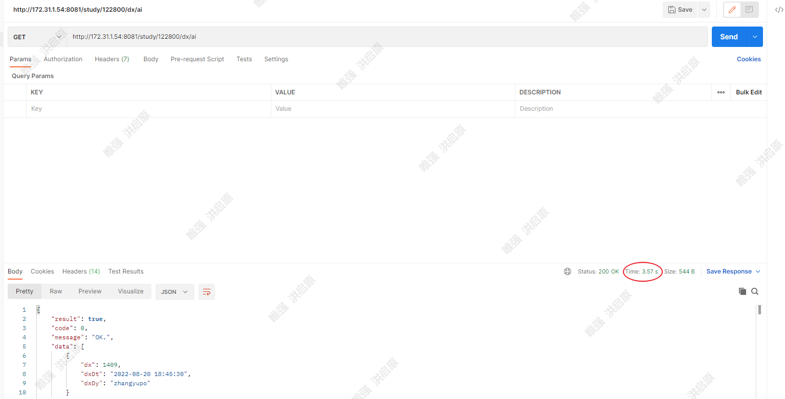
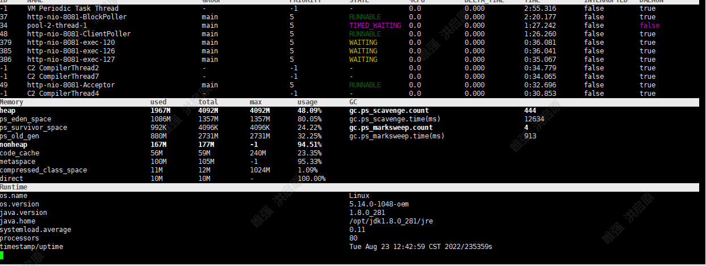
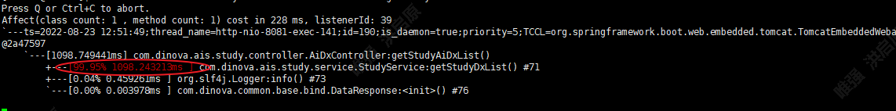
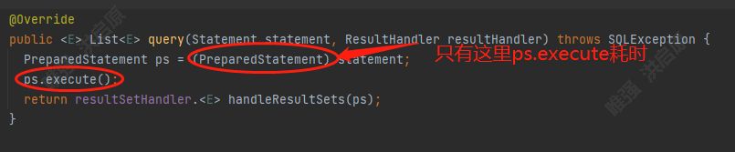
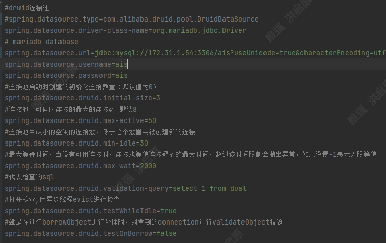
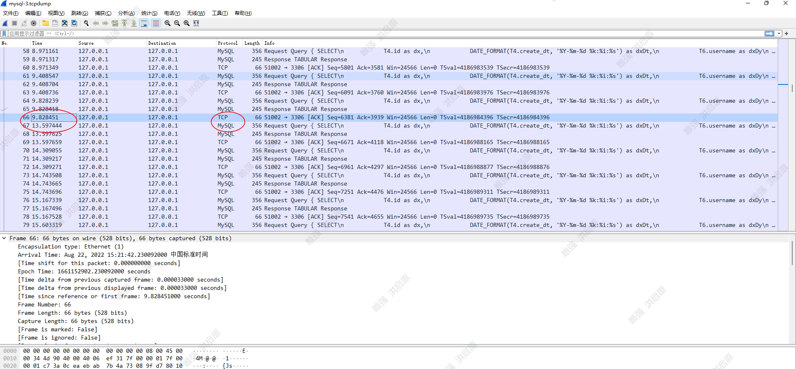
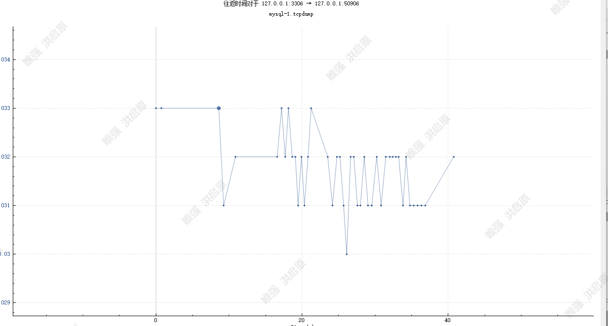
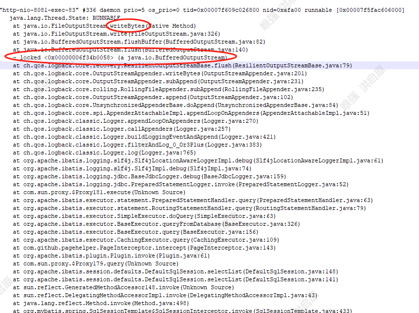
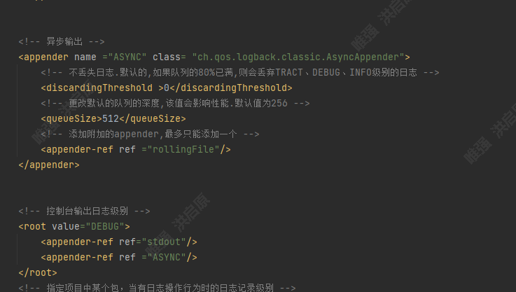

# 局域网下前端调用服务端接口存在延迟想象，大概延迟了2-3S

> 同一个jar包，局域网下有三台服务器，16、32跑此jar包不存在延迟问题，54跑此jar包存在此问题。
>
> 16、32、54服务器资源全部一致，包括数据库、系统等。
>
> 手动调用接口，所有54服务端接口都存在偶尔请求延时问题。
>
> 压测54，吞吐量低。
>
> 压测16,32 吞吐量比54高出很多。
>
> 


**注意： 网络没有任何问题**


## 排查过程

### 1. 怀疑发生了gc

>  因为jar包是通过java -jar直接启动，没有配任何内存参数，怀疑是否发生gc。导致stw。登录54服务器进行排查
>
> - 通过jmap发现内存不是特别足
> - jstat查看gc情况和gc日志， 发现刚启动的程序 full gc已经发生了五次 并且每次full gc时长超过1s
> - 进行jstack 查看线程快照（这里没有仔细看线程快照，导致有个问题没有发现）线程都很空闲，没有发生死锁
>
> 通过上面情况，增大堆内存 ``-Xmx4096m -Xms4096m``
>
> 重启应用 查看gc情况，发现gc非常正常。
>
> 再次请求服务端接口，问题依然存在。


### 2.怀疑慢sql或mysql本身问题

> 不是发生gc， 那就怀疑mysql是否本身存在问题
>
> - 开启mysql慢日志和druid慢sql过滤器。均没有日志产生
> - 查看数据库连接数，发现正常。没有压测情况下，druid与mysql也就建立以两个连接，mysql非常空闲。
> - 查看代码 发现连接数据库使用的是`localhost` ，怀疑是否是mysql反`dns`的问题，之后通过`ping localhost` 发现没有延迟，并且修改mysql连接为`172.0.0.1` ，还是存在延迟问题。
>
> 到此，可以确人mysql没有问题。


### 3. 阿里巴巴Arthas跟踪问题

> 确人资源没有问题后，只好采用阿里巴巴`Arthas`线上跟踪问题。
>
> 启动`Arthas` 包后，`dashboard`查看资源情况如下：
>
> 
>
> 可以看出资源都很空闲没有问题。
>
> 之后采用`trace` 跟踪接口
>
> ```shell
> trace com.dinova.ais.study.controller.AiDxController getStudyAiDxList '#cost > 100'
> ```
>
> 
>
> 继续跟进到
>
> 
>
> 可以发现已经执行到mybatis执行 preparestatment的逻辑
>
> 查看源码
>
> 
>
> 在jdbc里面`PrepareStatment`是个规范、接口，这里具体的实现是druid实现，查看druid源码对`PrepareStatment`的实现的`execute`方法
>
> 即`DruidPooledPreparedStatement`
>
> 通过`trace`继续跟踪 即trace  com.alibaba.druid.pool.DruidPooledPreparedStatement execute  '#cost > 100' 
>
> 发现没有任何超过100ms的请求。到这里之后没有什么头绪了~
>
> 之后本地debug发现mybatis是调用druid的`PrepareStatment` 采用的动态代理方式，交给`PreparedStatementLogger`
>
> 但是最后采用的还是`DruidPooledPreparedStatement`
>
> 因此怀疑是druid的问题某些配置的问题
>
> 查看druid连接池配置 发现没有任何问题，配置如下
>
> 
>
> 
>
> 之后剔除`druid`，重新打包启动程序，发现还是存在问题。


### 4. tcpdump

> 实在查找不到问题后，打算查看一下tcpdump一下查看mysql情况，查看是不是因为在linux上tcp连接中的`sendbuf` 缓存区太小，并且mysql rtt时间太长，导致`sendbuf` 的包还未ack掉
>
> 登录到54
>
> ```shell
> sudo tcpdump -i lo -n -nn -tttt -s 65535   port 3306   -A  -w  ./mysql-4.tcpdump
> ```
>
> 通过wareshark分析tcpdump
>
> 
>
> 通过可以看的出66-67 客户端即java程序已经想mysql发出了TCP报文请求，但是隔了3s左右 客户端才想mysql发出sql请求，通过`arthar`跟踪也知道`preparestatement.execute()`方法必然是已经拿到数据库连接池连接，并且解析好了sql的。所以不可能是解析sql和获取连接导致请求延迟现象。
>
> 
>
> **查看rtt曲线图**
>
> 
>
> rtt曲线图也没有问题


### 5. jstack排查线程

> 排查了一天了还是没有头绪，但是自己还是怀疑druid的问题。
>
> 最后去百度查找博客，有一篇文章给了思路： https://blog.csdn.net/wf_feng/article/details/121665572
>
> 该博客博主也遇到了类似卡顿延迟问题，我按照他的问题进行排查发现druid版本没有问题。
>
> 但是自己失误忘记看卡顿的时候线程栈跑到哪里去了，一激灵重新调用接口并且马上在服务端执行jstack pid > jstack.log 打印出线程堆栈信息。
>
> 堆栈如下
>
> 
>
> 明显可以看到卡主的时候 线程正在执行写日志的操作
>
> 查看`logback`源码可以知道，`logback` 写日志的时候会锁住资源。因此尝试去掉`logback` 的写文件的配置，重新打包发布，发现延迟现象没了。想起运维说过54服务器做了镜像服务，因此怀疑镜像服务在某个时间会和logback竞争资源导致的问题。


## 解决问题

> 既然怀疑是`logback` 写日志导致的问题
>
> 去掉`logback` 让测试同事进行压测，发现接口不会延时，并且吞吐量明显提高
>
> 但是日志肯定必须配置，不知道镜像服务的重要性，自己也对镜像服务不太懂，因此把同步写日志改成异步写
>
> logback配置如下
>
> **修改之前**
>
> 
>
> **修改之后**
>
> 
>
> 即增加append AsyncAppender
>
> 重新打包启动，发现延迟问题已解决。
>
> 但是再压测高并发的情况下还是存在部分延迟问题，可能线程资源不太够用。
>
> 但是这个项目没有并发量可言，因此异步写日志已经可以解决问题