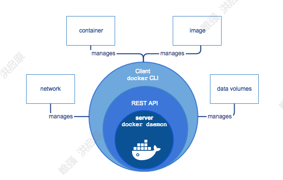
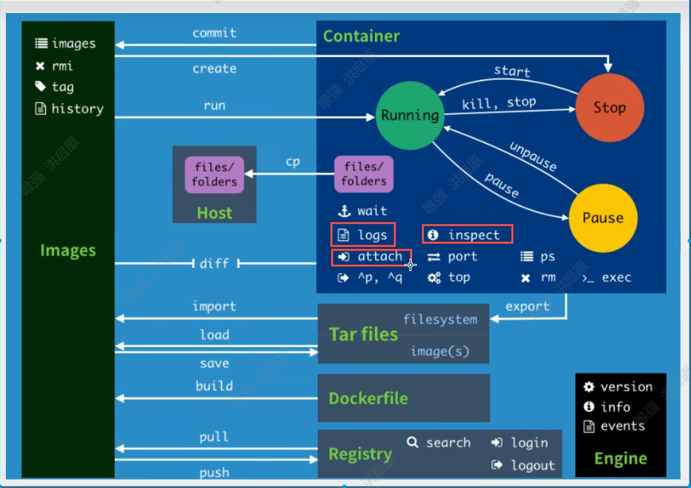
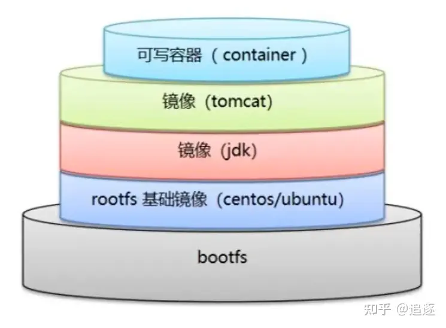
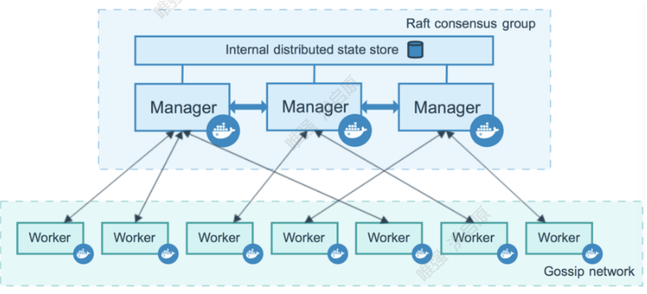
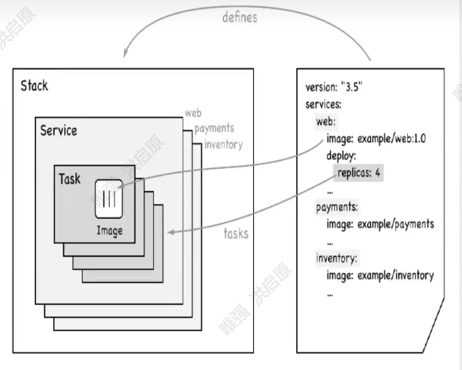

# Docker

>Docker 是一个开源的应用容器引擎，让开发者可以打包他们的应用以及依赖包到一个可移植的[镜像](https://baike.baidu.com/item/%E9%95%9C%E5%83%8F/1574)中，然后发布到任何流行的 [Linux](https://baike.baidu.com/item/Linux)或[Windows](https://baike.baidu.com/item/Windows/165458)操作系统的机器上，也可以实现[虚拟化](https://baike.baidu.com/item/%E8%99%9A%E6%8B%9F%E5%8C%96/547949)。容器是完全使用[沙箱](https://baike.baidu.com/item/%E6%B2%99%E7%AE%B1/393318)机制，相互之间不会有任何接口






## 1.Docker install in linux

### Centos 安装docker

```shell
#卸载所有docker相关
yum remove docker

yum - y install gcc
yum - y install gcc-c++

#先安装必须的包yum-utils，没有vpn就更换Docker的仓库地址为阿里镜像库,并更新yum安装包
yum install -y yum-utils

#更换镜像地址为阿里云
yum-config-manager --add-repo http://mirrors.aliyun.com/docker-ce/linux/centos/docker-ce.repo

#更新yum 索引安装包
yum makecache fast

#安装Docker可能会出错，多试几次,安装完查看Docker版本，然后启动Docker服务

#可能会出错，多试几次
yum install docker-ce docker-ce-cli containerd.io

#查看Docker版本
  docker --version

#启动docker服务
systemctl start docker


#配置镜像加速
sudo mkdir -p /etc/docker
sudo tee /etc/docker/daemon.json <<-'EOF'
{
  "registry-mirrors": ["https://plrmcwfk.mirror.aliyuncs.com"]
}
EOF
sudo systemctl daemon-reload
sudo systemctl restart docker

```


## 2.Dockerfile





```shell
FROM 			#基础镜像 一切从这里开始构建

MAINTAINER		#镜像时谁写的， 一般姓名+邮箱

RUN 			#镜像构建的时候需要运行的命令

ADD 			#添加内容

WORKDIR			#镜像的工作目录

VOLUME			#挂载的目录

EXPOST			#暴露的端口

CMD 			#指定容器启动的时候要运行的命令,只有最后一个会生效，可被替代

ENTRYPOINT		#指定容器启动的时候要运行的命令，可以追加命令

ONBUILD  		#当构建一个被继承DockerFile 这个时候就会运行ONBUILD指令

COPY			#拷贝文件

ENV				#构建的时候设置环境变量

```

### Dockerfile example

```dockerfile
FROM centos
MAINTAINER hongqy<759428167@qq.com>

COPY README.txt /usr/local/README.txt

ADD jdk-8u291-linux-x64.tar.gz /usr/local/java
ADD apache-tomcat-9.0.65.tar.gz /usr/local/apache-tomcat

#RUN yum -y install vim

ENV MYPATH /usr/local

WORKDIR $MYPATH

ENV JAVA_HOME /usr/local/java/jdk1.8.0_291
ENV CLASSPATH $JAVA_HOME/lib/dt.jar:$JAVA_HOME/lib/tools.jar
ENV CATALINA_HOME /usr/local/apache-tomcat/apache-tomcat-9.0.65
ENV CATALINA_BATH /usr/local/apache-tomcat/apache-tomcat-9.0.65
ENV PATH $PATH:$JAVA_HOME/bin:$CATALINA_HOME/lib:$CATALINA_HOME/bin

EXPOSE 8080

CMD /usr/local/apache-tomcat/apache-tomcat-9.0.65/bin/startup.sh && tail -F /usr/local/apache-tomcat/apache-tomcat-9.0.65/bin/logs/catalina.out
```


## 3.Docker Compose

### 官方简介

>Docker Compose is a tool for running multi-container applications on Docker defined using the [Compose file format](https://compose-spec.io/). A Compose file is used to define how the one or more containers that make up your application are configured. Once you have a Compose file, you can create and start your application with a single command: `docker compose up`.

### 快速启动

1. Define your app's environment with a `Dockerfile` so it can be reproduced anywhere.
2. Define the services that make up your app in `docker-compose.yml` so they can be run together in an isolated environment.
3. Lastly, run `docker compose up` and Compose will start and run your entire app.

> 安装与下载 https://github.com/docker/compose/releases

> 直接放在/url/local/bin

### docker-compose.yml

```yaml
# 3层！
version: '' #版本
services: #服务
  foo:
    image: foo
  bar:
    image: bar
    profiles:
      - test
	
#其他配置 网络/卷挂在
volumes: 
network:

```


``` yaml
version: '3.8'
services:
  db:
    image: mysql:8.0.27 
    volumes:
      - db_data:/var/lib/mysql
    restart: always
    environment:
      - MYSQL_ROOT_PASSWORD=somewordpress
      - MYSQL_DATABASE=wordpress
      - MYSQL_USER=wordpress
      - MYSQL_PASSWORD=wordpress
    expose:
      - 3306
      - 33060
  wordpress:
    image: wordpress:latest
    ports:
      - 80:80
    restart: always
    environment:
      - WORDPRESS_DB_HOST=db
      - WORDPRESS_DB_USER=wordpress
      - WORDPRESS_DB_PASSWORD=wordpress
      - WORDPRESS_DB_NAME=wordpress
volumes:
  db_data:
```


## 4.Docker Swarm

**swarm**

> 集群的管理和编排， 一个简易版的k8s



**Node**

> 就是一个docker节点，多个节点就组成了一个网络集群（manager，worker）

**service**

> 任务，可以在管理节点或者工作节点来运行。

**Task**

> 容器内的命令，细节任务！




### 快速开始


初始化一个节点 `docker swarm init`

```shell
#docker swarm join 加入一个节点

#获取令牌
docker swarm join-token manager
#docker swarm join --token SWMTKN-1-4fdel7voq25kozcotklugfvcbn090m9cuu0j48tv7ndh4quyin-5gl79ibedvyd019u3g8tta91g 182.61.52.214:2377

docker swarm join-token worker
#docker swarm join --token SWMTKN-1-4fdel7voq25kozcotklugfvcbn090m9cuu0j48tv7ndh4quyin-7kbt5oxd9hl31tdqkcl2nsxbs 182.61.52.214:2377

docker node ls


```


### Raft协议

一致性协议，保证大多数节点存活才可以用


### Docker service

```shell
#创建一个服务
docker service create -p 8080:80 --name mynginx nginx
#查看服务
docker service ps mynginx
#动态扩缩容
docker service update --replicas 4 mynginx
docker service scale mynginx=4
#移除一个服务
docker service rm docker service rm 	


```

拓展:网络模式 "publishMode": "ingress"

Swarm

overlay

ingress：特殊的overlay网络！具有均衡功能

> docker network inspect ingress

>  发现通过不同厂家云服务器进行连接时 注册是内网ip无法访问因此通过 `zerotier` 搭建内网

https://my.zerotier.com


## 5.Server install in docker

### **Mysql**

```shell
docker run --restart=always --name mysql8.0.16 -v /usr/local/mysql/cnf:/etc/mysql  -v /usr/local/mysql/data:/var/lib/mysql  -v /usr/local/mysql/log:/var/log  -v /usr/local/mysql/mysql-files:/var/lib/mysql-files -p 3306:3306  -e MYSQL_ROOT_PASSWORD='hongqy@2021' -d mysql:8.0.16
```

### **nacos**

```shell
docker run \
-p 8848:8848 -p 9848:9848 -p 9849:9849 \
--restart=always \
--name nacos \
--env-file=/usr/local/nacos/env/nacos-hostname.env \
-v /usr/local/nacos/logs:/home/nacos/logs \
-v /usr/local/nacos/init.d/custom.properties:/home/nacos/init.d/custom.properties \
-d nacos/nacos-server:2.0.3
```

### **3.elasticsearch和kibana**

```shell
# elasticsearch-server
docker run --name elasticsearch -p 9200:9200 -p 9300:9300 \
-e "discovery.type=single-node" \
-e ES_JAVA_OPTS="-Xms128m -Xmx384m" \
-v /usr/local/elasticsearch/config/elasticsearch.yml:/usr/share/elasticsearch/config/elasticsearch.yml \
-v /usr/local/elasticsearch/data:/usr/share/elasticsearch/data \
-v /usr/local/elasticsearch/plugins:/usr/share/elasticsearch/plugins \
-d elasticsearch:7.14.0


# kibana

vim /usr/local/kibana/config/kibana.yml

配置以下内容：

server.name: kibana

server.host: "0"

elasticsearch.hosts: [ "http://192.168.22.33:9200" ]

xpack.monitoring.ui.container.elasticsearch.enabled: true

(192.168.22.33为自己的虚拟机ip地址，根据自己的地址进行修改。）

docker run -d --name=kibana --restart=always -p 5601:5601 -v /usr/local/kibana/config/kibana.yml:/usr/share/kibana/config/kibana.yml kibana:7.14.0

```


