# Kubernetes

## 1. 什么是Kubernetes？

>  `Kubernetes`是容器集群管理系统，是一个开源的平台，可以实现容器集群的自动化部署、自动扩缩容、维护等功能。
>
>  使用`Kubernetes`可以：
>
>  - 自动化容器的部署和复制
>
>
>  - 随时扩展或收缩容器规模
>
>
>  - 将容器组织成组，并且提供容器间的负载均衡
>
>
>  - 很容易地升级应用程序容器的新版本
>
>
>  - 节省资源，优化硬件资源的使用
>
>
>  - 提供容器弹性，如果容器失效就替换它，等等...


### 1.1 Kubernetes特点

> * 便携性：支持公有云、私有云、混合云、多重云(multi-cloud)
> * 可扩展：模块化、插件化、可组合、可挂载
> * 自修复：自动部署，自动重启，自动复制，自动伸缩扩展


### 1.2 Kubernetes特性

> Kubernetes是一种用于在一组主机上运行和协同容器化应用程序的系统，旨在提供可预测性、可扩展性与高可用的性的方法来完全管理容器化应用程序和服务的生命周期的平台。
> 它具有以下几个重要的特性：
>
> 1. 自动装箱：构建于容器之上，基于资源依赖及其他约束自动完成容器部署且不影响其可用性，并通过调度机制混合关键型应用和非关键型应用的工作负载于同一节点以提升资源利用率。
> 2. 自我修复：支持容器故障后自动重启、节点故障候重行调度容器，以及其他可用节点、健康状态检查失败后关闭容器并重新创建等自我修复机制。
> 3. 水平扩展：支持通过简单命令或UI手动水平扩展，以及基于CPU等资源负载率的自动水平扩展机制。
> 4. 服务器发现和负载均衡：Kubernetes通过其附加组件之一的KubeDNS（或CoreDNS）为系统内置了服务发现功能，它会为每个Service配置DNS名称，并允许集群内的客户端直接使用此名称发出访问请求，而Service则通过iptables或ipvs内建了负载均衡机制。
> 5. 自动发布和回滚：Kubernetes支持“灰度”更新应用程序或其配置信息，它会监控更新过程中应用程序的健康状态，以确保它不会在同一时刻杀掉所有的实例，而此过程中一旦有故障发生，就会立即自动执行回滚操作。
> 6. 秘钥和配置管理：Kubernetes允许存储和管理敏感信息，例如密码，Oauth令牌和ssh秘钥。可以部署和更新密码和应用程序配置，而无需重建容器，也不会再堆栈配置中暴露机密。
> 7. 存储编排：Kubernetes支持Pod对象按需自动挂载不同类型的存储系统，这包括节点本地存储、公有云服务商的云存储（如AWS和GCP等），以及网络存储系统（例如，NFS、ISCSI、GlusterFS、Ceph、Cinder和Flocker等）
> 8. 批量处理执行：除了服务型应用，Kubernetes还支持批处理作业及CI（持续集成），如果需要，一样可2以实现容器故障后修复。


## 2. Kubernetess基础架构和术语

> Kubernetes使用共享网络将多个物理机或虚拟机汇集到一个集群中，在各服务器之间进行通信，该集群是配置Kubernetes的所有组件、功能和工作负载的物理平台。集群中一台服务器（或高可用部署中的一组服务器）用作Master，负责管理整个集群，余下的其他机器用作Worker Node,它们是使用本地和外部资源接收和运行工作负载的服务器。集群中的这些主机可以是物理服务器，也可以是虚拟机（包括IaaS云端的VPS）


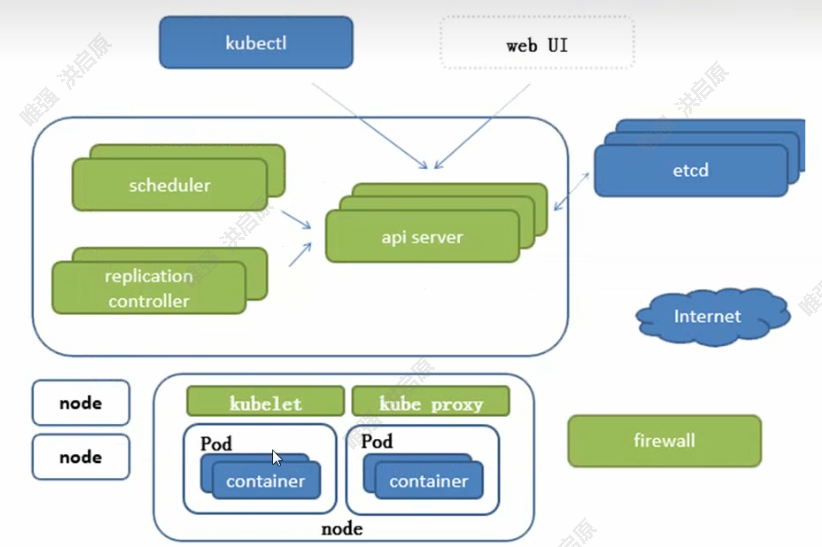

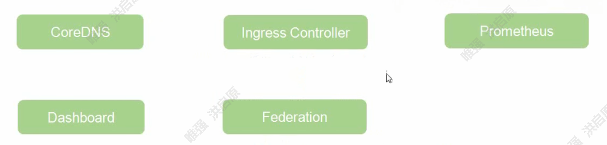

 


**Master**

> Master是集群的网关和中枢，负责诸如为用户和客户端暴露API、跟踪其它服务器的健康状态、以最优方式调度工作负载，以及编排其他组件之间的通信等任务，它是用户或客户端与集群之间的核心联络点，并负责Kubernetes系统的大多数集中式管控逻辑。单个Master节点即可完成其所有的功能，但出于冗余及负载均衡等目的，生产环境中通常需要协同部署多个此类主机。Master节点类似于蜂群中的蜂王。


**Node**

> Node是Kubernetes集群的工作节点，负责接收来自Master的工作指令并根据指令相应的创建或删除Pod对象，以及调整网络规则以合理地路由和转发流量等。理论上讲，Node可以是任何形式的计算设备，不过Master会统一将其抽象为Node对象进行管理。Node类似于蜂群中的工蜂，生产环境中，它们通常数量众多。


------


> Kubernetes将所有Node的资源集结于一处形成一台更强大的“服务器”，如下图，在用户将应用部署于其上时，Master会使用调度算法将其自动指派某个特定的Node运行，在Node加入集群或从集群中移除时，Master也会按需重行编排影响到的Pod（容器）。于是，用户无需关心其应用究竟运行于何处。


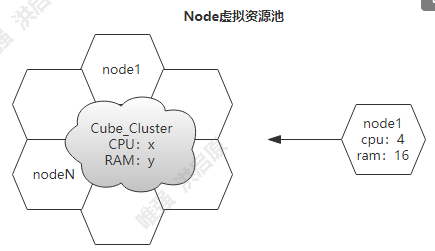


> 从抽象的角度来讲，Kubernetes还有着众多的组件来支撑其内部的业务逻辑，包括运行应用、应用编排、服务暴露、应用恢复等，它们在Kubernetes中被抽象为Pod、Service、Controller等资源类型。


### 2.1 常用的资源对象

**pod**

> Kubernetes并不直接运行容器，而是使用一个抽象的资源对象来封装一个或者多个容器，这个抽象即为Pod，它是Kubernetes的最小调度单元。同一Pod中的容器共享网络名称空间和存储资源，这些容器可经由本地回环接口lo直接通信，但彼此之间又在Mount、User及PID等名称空间上保持了隔离。尽管Pod中可以包含多个容器，但是作为最小调度单元，它应该尽可能地保持“小”，即通常只应该包含一个主容器，以及必要的辅助型容器（sidecar）


**资源标签**

> 标签（Label）是将资源进行分类的标识符，资源标签其实就是一个键值型（key/values）数据。标签旨在指定对象（如Pod等）辨识性的属性，这些属性仅对用户存在特定的意义，对Kubernetes集群来说并不直接表达核心系统语意。标签可以在对象创建时附加其上，并能够在创建后的任意时间进行添加和修改。一个对象可以拥有多个标签，一个标签也可以附加于多个对象（通常是同一类对象）之上。

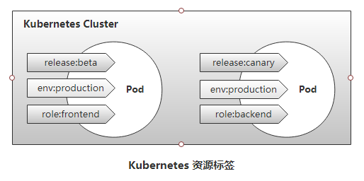

**标签选择器**

>标签选择器（Selector）全称为”Label Selector“，它是一种根据Label来过滤符合条件的资源对象的机制。例如，将附有标签”role：backend“的所有Pod对象挑选出来归为一组就是标签选择器的一种应用，如下图所示，通常使用标签对资源对象进行分类，而后使用标签选择器挑选出它们，例如将其创建未某Service的端点。


**Pod控制器**

> 尽管Pod是kubernetes的最小调度单元，但用户通常并不会直接部署及管理Pod对象，而是要借助于另一类抽象——控制器（Controller）对其进行管理。用于工作负载的控制器是一种管理Pod生命周期的资源抽象，它们是kubernetes上的一类对象，而非单个资源对象，包括ReplicationController，ReplicaSet、Deployment、StatefulSet、Job等。已下图所示的Deployment控制器为例，它负责确保指定的Pod对象的副本数量精确符合定义，否则“多退少补”。使用控制器之后就不再需要手动管理Pod对象了，只需要声明应用的期望状态，控制器就会自动对其进行进程管理

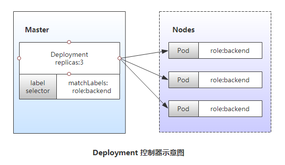

**服务资源（Service）**

> Service是建立在一组Pod对象之上的资源抽象，它通过标签选择器选定一组Pod对象，并为这组Pod对象定义一个统一的固定访问入口（通常是一个IP地址），若Kubernetes集群存在DNS附件，它就会在Service创建时为其自动配置一个DNS名称以便客户端进行服务发现。到达Service IP的请求将被负载均衡至其后的端点——各个Pod对象之上，因此Service从本质上来讲是一个四层代理服务。另外，service还可以将集群外部流量引入到集群中来。


**存储卷**

> 存储卷（Volume）是独立于容器文件系统之外的存储空间，常用于扩展容器的存储空间并为它提供持久存储能力。Kubernetes集群上的存储卷大体可以分为临时卷、本地卷和网络卷。临时卷和本地卷都位于Node本地，一旦Pod被调度至其他Node，此种类型的存储卷将无法访问到，因此临时卷和本地卷通常用于数据缓存，持久化的数据则需要放置于持久卷（persistent volume）之上。


**Name和Namespace**

> 名称（Name）是Kubernetes集群中资源对象的标识符，它们的作用域通常是名称空间（Namespace），因此名称空间是名称的额外的限定机制。在同一名称空间中，同一类型资源对象的名称必须具有唯一性。名称空间通常用于实现租户或项目的资源隔离，从而形成逻辑分组。


**Annotation**

> Annotation（注释）是另一种附加在对象之上的键值类型的数据，但它拥有更大的数据容量。Annotation常用于将各种非标识型元数据（metadata）附加到对象上，但它不能用于标识和选择对象，通常也不会被Kubernetes直接使用，其主要目的是方便工具或用户的阅读和查找等。


**Ingress**

> Kubernetes将Pod对象和外部网络环境进行了隔离，Pod和Service等对象间的通信都使用其内部专用地址进行，如若需要开放某些Pod对象提供给外部用户访问，则需要为其请求流量打开一个通往Kubernetes集群内部的通道，除了Service之外，Ingress也是这类通道的实现方式之一。


## 3. Kubernetes集群组件

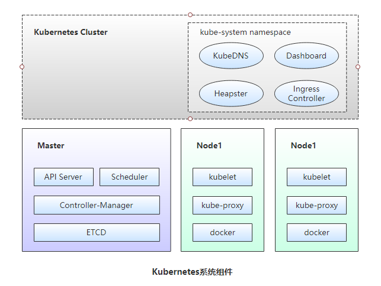


### **3.1Master组件**

`Kubernetes`的集群控制平面由多个组件组成，这些组件可统一运行于单一Master节点，也可以以多副本的方式同时运行于多个节点，以为Master提供高可用功能，甚至还可以运行于Kubernetes集群自身之上。Master主要包括以下几个组件。


**API Server**

> Api Server负责输出RESTful风格的Kubernetes API，它是发往集群的所有REST操作命令的接入点，并负责接收、校验并响应所有的REST请求，结果状态被持久存储于etcd中。因此，API Server是整个集群的网关。


**ETCD**

> Kubernetes集群的所有状态信息都需要持久存储于存储系统etcd中，不过，etcd是由CoreOS基于Raft协议开发的分布式键值存储，可用于服务发现、共享配置以及一致性保障（例如数据库主节点选择、分布式锁等）。因此，etcd是独立的服务组件，并不隶属于Kubernetes集群自身。生产环境中应该以etcd集群的方式运行以确保其服务可用性。
>
> etcd不仅能够提供键值数据存储，而且还为其提供了监听（watch）机制，用于监听和推送变更。Kubernetes集群系统中，etcd中的键值发生变化时会通知到API Server，并由其通过watch API向客户端输出。基于watch机制，Kubernetes集群的各组件实现了高效协同。


**Controller Manager**

> Kubernetes中，集群级别的大多数功能都是由几个被称为控制器的进程执行实现的，这几个进程被集成与kube-controller-manager守护进程中。由控制器完成的功能主要包括生命周期功能和API业务逻辑，具体如下
>
> - 生命周期功能：包括Namespace创建和生命周期、Event垃圾回收、Pod终止相关的垃圾回收、级联垃圾回收及Node垃圾回收等。
>
>
> - API业务逻辑：例如，由ReplicaSet执行的Pod扩展等。


**Scheduler**

> Kubernetes是用于部署和管理大规模容器应用的平台，根据集群规模的不同，其托管运行的容器很可能会数以千计甚至更多。API Server确认Pod对象的创建请求之后，便需要由Scheduler根据集群内各节点的可用资源状态，以及要运行的容器的资源需求做出调度决策


### 3.2 Node组件

Node负责提供运行容器的各种依赖环境，并接收Master的管理。每个Node主要由以下几个组件构成

**kubelet**

> kubelet是运行于工作节点之上的守护进程，它从API Server接收关于Pod对象的配置信息并确保它们处于期望的状态（desired state，也可以说目标状态）kubelet会在API Server上注册当前工作节点，定期向Master汇报节点资源使用情况，并通过cAdvisor监控容器和节点的资源占用情况。


**kube-proxy**

> 每个工作节点都需要运行一个kube-proxy守护进程，它能够按需为Service资源对象生成iptables或ipvs规则，从而捕获访问当前Service的ClusterIP的流量并将其转发至正确的后端Pod对象。


### 3.3 核心附件

Kubernetes集群还依赖于一组称为"附件"(add-ons)的组件以提供完整的功能，它们通常是由第三方提供的特定应用程序，且托管运行于Kubernetes集群之上。


**KubeDNS** 

> 在Kubernetes集群中调度运行提供DNS服务的Pod，同一集群中的其他pod可使用此DNS服务解决主机名。Kubernetes从1.11版本开始默认使用CoreDNS项目为集群提供服务注册和服务发现的动态名称解析服务，之前的版本中用到的是kube-dns项目，而SKyDNS则是更早一代的项目。


**Kubernetes Dashboard** 

> Kubernetes集群的全部功能都要基于Web的UI，来管理集群中应用甚至是集群自身


**Heapster** 

> 容器和节点的性能监控与分析系统，它收集并解析多种指标数据，如资源利用率、生命周期事件等。新版本的Kubernetes中，其功能会逐渐由Prometheus结合其他组件所取代。


**Ingress Controller** 

> Service是一种工作于传输层的负载均衡器，而Ingress是在应用层实现的HTTP(s)负载均衡机制。不过，Ingress资源自身不能进行“流量穿透”，它仅是一组路由规则的集合，这些规则需要通过Ingress控制器（Ingress Controller）发挥作用。目前，此类的可用项目有Nginx、Traefik、Envoy及HAProxy等。


# Kubeadm init k8s

## 1. kubeadm介绍

> `kubeadm`是`Kubernetes`项目自带的及集群构建工具，负责执行构建一个最小化的可用集群以及将其启动等的必要基本步骤，`kubeadm`是`Kubernetes`集群全生命周期的管理工具，可用于实现集群的部署、升级、降级及拆除。`kubeadm`部署`Kubernetes`集群是将大部分资源以`pod`的方式运行，例如（`kube-proxy`、`kube-controller-manager`、`kube-scheduler`、`kube-apiserver`、`flannel`)都是以`pod`方式运行。
>
> `Kubeadm`仅关心如何初始化并启动集群，余下的其他操作，例如安装`Kubernetes Dashboard`、监控系统、日志系统等必要的附加组件则不在其考虑范围之内，需要管理员自行部署。
>
> `Kubeadm`集成了`Kubeadm init`和`kubeadm join`等工具程序，其中`kubeadm init`用于集群的快速初始化，其核心功能是部署Master节点的各个组件，而`kubeadm join`则用于将节点快速加入到指定集群中，它们是创建`Kubernetes`集群最佳实践的“快速路径”。另外，`kubeadm token`可于集群构建后管理用于加入集群时使用的认证令牌（t`oken`)，而`kubeadm reset`命令的功能则是删除集群构建过程中生成的文件以重置回初始状态。


[kubeadm项目地址](https://github.com/kubernetes/kubeadm)


[kubeadm官方文档](https://kubernetes.io/docs/reference/setup-tools/kubeadm/)


## 2. Kubeadm部署Kubernetes集群

### 2.1 架构图


### 2.2 环境准备

**说明：下面初始化环境工作master节点和node节点都需要执行**


**异地云服务器通过zeroTier构建局域网**

```shell
# moon主服务器配置
https://www.likecs.com/show-204925398.html

# 客服端 服务器配置
curl -s https://install.zerotier.com | sudo bash
systemctl start zerotier-one
zerotier-cli join 233ccaac2786d11b #后面为zero控制台显示的id
cd /var/lib/zerotier-one
mkdir moons.d
cd moons.d/
systemctl restart zerotier-one

```


**安装依赖包**

```shell
yum install -y contrack ntpdate ntp ipvsadm ipset jq iptables curl sysstat libseccomp wget vim net-tools git 
```


**设置防火墙为Iptables并设置空规则**

```shell
systemctl stop firewalld && systemctl disable firewalld

yum -y install iptables-services && systemctl start iptables && systemctl enable iptables && iptables -F && service iptables save 
```


**关闭`selinux` 和 `swap`**

```shell
swapoff -a && sed -ri 's/.*swap.*/#&/' /etc/fstab
setenforce 0 && sed -i 's/enforcing/disabled/' /etc/selinux/config
```


**调整内核参数，对于k8s**

```shell
cat > kubernetes.conf << EOF
net.bridge.bridge-nf-call-iptables=1
net.bridge.bridge-nf-call-ip6tables=1
net.ipv4.ip_forward=1
net.ipv4.tcp_tw_recycle=0
vm.swappiness=0
vm.overcommit_memory=1
vm.panic_on_oom=0 
fs.inotify.max_user_instances=8192
fs.inotify.max_user_watches=1048576
fs.file-max=52706963
fs.nr_open=52706963
net.ipv6.conf.all.disable_ipv6=1
net.netfilter.nf_conntrack_max=2310720
EOF

cp kubernetes.conf /etc/sysctl.d/kubernetes.conf
sysctl -p /etc/sysctl.d/kubernetes.conf
```

**调整系统时区**

```shell
timedatectl set-timezone Asia/Shanghai
 #将当前的 UTC 时间写入硬件时钟
timedatectl set-local-rtc 0
 #重启依赖于系统时间的服务
systemctl restart rsyslog 
systemctl restart crond
```

**关闭系统不需要服务**

```shell
systemctl stop postfix && systemctl disable postfix
```

**设置rsyslogd和systemd journald** 

```shell
# 持久化保存日志的目录
mkdir /var/log/journal
mkdir /etc/systemd/journald.conf.d
cat > /etc/systemd/journald.conf.d/99-prophet.conf << EOF
[Journal]
# 持久化保存到磁盘
Storage=persistent
# 压缩历史日志
Compress=yes

SyncIntervalSec=5m
RateLimitInterval=30s
RateLimitBurst=1000

# 最大占用空间 10g
SystemMaxUse=10G

# 单日志文件最大 200M
SystemMaxFileSize=200M

# 日志保存时间2周
MaxRetentionSec=2week

# 不将日志转发到 syslog
ForwardToSyslog=no
EOF

systemctl restart systemd-journald 
```

**升级系统内核**

```shell
rpm -Uvh http://www.elrepo.org/elrepo-release-7.0-3.el7.elrepo.noarch.rpm 

yum --enablerepo=elrepo-kernel install -y kernel-lt

#查看安装的内核
awk -F\' '$1=="menuentry " {print $2}' /etc/grub2.cfg

grub2-set-default "CentOS Linux (5.4.209-1.el7.elrepo.x86_64) 7 (Core)"

reboot
```

**Kube-proxy开启ipvs的前置条件**

```shell
modprobe br_netfilter

cat > /etc/sysconfig/modules/ipvs.modules <<EOF
#!/bin/bash
modprobe -- ip_vs
modprobe -- ip_vs_rr
modprobe -- ip_vs_wrr
modprobe -- ip_vs_sh
modprobe -- nf_conntrack_ipv4
EOF

chmod 755 /etc/sysconfig/modules/ipvs.modules && bash /etc/sysconfig/modules/ipvs.modules && lsmod | grep -e ip_vs -e nf_conntract_ipv4


# 如果高内核版本修改不成功
# modprobe: FATAL: Module nf_conntrack_ipv4 not found.
则改为
cat > /etc/sysconfig/modules/ipvs.modules <<EOF
#!/bin/bash
modprobe -- ip_vs
modprobe -- ip_vs_rr
modprobe -- ip_vs_wrr
modprobe -- ip_vs_sh
modprobe -- nf_conntrack
EOF

chmod 755 /etc/sysconfig/modules/ipvs.modules && bash /etc/sysconfig/modules/ipvs.modules && lsmod | grep -e ip_vs -e nf_conntract
```


**所有节点安装ipset**

> iptables是Linux服务器上进行网络隔离的核心技术，内核在处理网络请求时会对iptables中的策略进行逐条解析，因此当策略较多时效率较低；而是用IPSet技术可以将策略中的五元组(协议，源地址，源端口,目的地址，目的端口)合并到有限的集合中，可以大大减少iptables策略条目从而提高效率。测试结果显示IPSet方式效率将比iptables提高100倍

```shell
yum install ipset -y

# 为了方面ipvs管理，这里安装一下ipvsadm。

yum install ipvsadm -y


```


> kubernetes 1.20以上版本不再支持`docker`， 具体原因查看下面文章
>
> - https://cloud.tencent.com/developer/article/1758588
> - https://kubernetes.io/zh-cn/blog/2020/12/02/dont-panic-kubernetes-and-docker/


### 2.3 Containerd 安装

> 在安装containerd前，我们需要优先升级`libseccomp`	
>
> 在centos7中yum下载`libseccomp`的版本是2.3的，版本不满足我们最新containerd的需求，需要下载2.4以上的

```shell
rpm -qa | grep libseccomp
libseccomp-2.3.1-4.el7.x86_64
#卸载原来的
rpm -e libseccomp-2.3.1-4.el7.x86_64 --nodeps
#下载高于2.4以上的包
wget http://rpmfind.net/linux/centos/8-stream/BaseOS/x86_64/os/Packages/libseccomp-2.5.1-1.el8.x86_64.rpm
#安装
rpm -ivh libseccomp-2.5.1-1.el8.x86_64.rpm 

```


**下载安装containerd**

github地址:<https://containerd.io/downloads/>

Containerd安装我们使用`1.6.1`版本号

> containerd-1.6.1-linux-amd64.tar.gz 只包含containerd
> `cri-containerd-cni-1.6.4-linux-amd64.tar.gz` 包含containerd以及cri runc等相关工具包，建议下载本包
>
> ```shell
> #下载tar.gz包
> #containerd工具包，包含cri runc等
> wget https://github.com/containerd/containerd/releases/download/v1.6.4/cri-containerd-cni-1.6.4-linux-amd64.tar.gz
> #备用下载地址
> wget https://d.frps.cn/file/kubernetes/containerd/cri-containerd-cni-1.6.4-linux-amd64.tar.gz
>
> tar zxvf cri-containerd-cni-1.6.4-linux-amd64.tar.gz -C / #我们直接让它给我们对应的目录给替换掉
> #创建配置文件目录
> mkdir /etc/containerd -p
>
> #生成默认配置文件
> containerd config default > /etc/containerd/config.toml
>
> 配置systemd作为容器的cgroup driver
> sed -i 's/SystemdCgroup = false/SystemdCgroup = true/' /etc/containerd/config.toml
>
> #设置开机启动
> systemctl daemon-reload
> systemctl enable containerd --now
> ```


**高可用k8s集群安装**


> 以前做法：多个master服务器，然后使用keepalived监控master节点的可用性和故障转移，使用haproxy对master进行均衡负载。
> 新的解决方案：利用K8S原生的kube-vip实现master高可用。
> 建议使用kube-vip解决方案，这样，不存在VIP节点的问题，其中心思想也是vip架构，但是通过公平选举诞生的。


**负载均衡安装设置(kube-vip)**

> ```shell
> # 设置VIP地址（仅在master01上部署先）
>
>   mkdir -p /etc/kubernetes/manifests/
>   export VIP=192.168.191.6
>   export INTERFACE=ztr4nuy7j4
>   ctr image pull ghcr.io/kube-vip/kube-vip:v0.3.8
>   ctr run --rm --net-host ghcr.io/kube-vip/kube-vip:v0.3.8 vip \
>   /kube-vip manifest pod \
>   --interface $INTERFACE \
>   --vip $VIP \
>   --controlplane \
>   --services \
>   --arp \
>   --leaderElection | tee  /etc/kubernetes/manifests/kube-vip.yaml
>
> ```
>
> 


### 2.4 kubeadm初始化

`说明：下面初始化环境工作master节点和node节点都需要执行`


**配置`kubenetes`的`yum`仓库（这里使用阿里云仓库**

```shell
cat << EOF > /etc/yum.repos.d/kubernetes.repo
[kubernetes]
name=Kubernetes
baseurl=http://mirrors.aliyun.com/kubernetes/yum/repos/kubernetes-el7-x86_64/
enabled=1
gpgcheck=0
repo_gpgcheck=0
gpgkey=http://mirrors.aliyun.com/kubernetes/yum/doc/yum-key.gpg http://mirrors.aliyun.com/kubernetes/yum/doc/rpm-package-key.grp
EOF

yum -y install kubelet-1.23.5 kubeadm-1.23.5 kubectl-1.23.5

systemctl enable kubelet.service
```


```shell
#无法翻墙方案解决
# 查看kubeadm 需要的镜像 kubeadm config images list
docker pull  registry.cn-hangzhou.aliyuncs.com/google_containers/kube-apiserver:v1.23.5

docker pull registry.cn-hangzhou.aliyuncs.com/google_containers/kube-controller-manager:v1.23.5

docker pull registry.cn-hangzhou.aliyuncs.com/google_containers/kube-scheduler:v1.23.5

docker pull registry.cn-hangzhou.aliyuncs.com/google_containers/kube-proxy:v1.23.5

docker pull registry.cn-hangzhou.aliyuncs.com/google_containers/pause:3.6

docker pull registry.cn-hangzhou.aliyuncs.com/google_containers/etcd:3.5.1-0

docker pull registry.cn-hangzhou.aliyuncs.com/google_containers/coredns:v1.8.6

#重新打tag
docker tag registry.cn-hangzhou.aliyuncs.com/google_containers/kube-apiserver:v1.23.5 k8s.gcr.io/kube-apiserver:v1.23.5

docker tag registry.cn-hangzhou.aliyuncs.com/google_containers/kube-controller-manager:v1.23.5 k8s.gcr.io/kube-controller-manager:v1.23.5

docker tag registry.cn-hangzhou.aliyuncs.com/google_containers/kube-scheduler:v1.23.5 k8s.gcr.io/kube-scheduler:v1.23.5

docker tag registry.cn-hangzhou.aliyuncs.com/google_containers/kube-proxy:v1.23.5 k8s.gcr.io/kube-proxy:v1.23.5

docker tag registry.cn-hangzhou.aliyuncs.com/google_containers/pause:3.6 k8s.gcr.io/pause:3.6

docker tag registry.cn-hangzhou.aliyuncs.com/google_containers/etcd:3.5.1-0 k8s.gcr.io/etcd:3.5.1-0

docker tag registry.cn-hangzhou.aliyuncs.com/google_containers/coredns:v1.8.6 k8s.gcr.io/coredns/coredns:v1.8.6 
```


```shell
wget https://d.frps.cn/file/kubernetes/image/k8s_all_1.23.5.tar
ctr -n k8s.io i import k8s_all_1.23.5.tar

#删除k8s.io
 ctr -n k8s.io i rm $(ctr -n k8s.io i ls -q)

for i in master1 master2 master3 worker1 worker2 worker3;do
    scp k8s_all_1.23.5.tar root@$i:/usr/local/kubernetes/
    ssh root@$i ctr -n k8s.io i import k8s_all_1.23.5.tar
done
```


```shell
kubectl get pod -o wide -n kube-system|grep etcd

kubectl exec -ti etcd-master1 -n kube-system sh
export ETCDCTL_API=3
etcdctl --cacert="/etc/kubernetes/pki/etcd/ca.crt" --cert="/etc/kubernetes/pki/etcd/server.crt" --key="/etc/kubernetes/pki/etcd/server.key" member list


```


```shell
kubeadm config print init-defaults > kubeadm-config.yaml
kubeadm config print init-defaults --component-configs KubeletConfiguration > kubeadm.yaml

localAPIEndpoint:
  advertiseAddress: 192.168.191.93
kubernetesVersion: v1.15.2
networking:
  podSubnet: "10.244.0.0/16"
  serviceSubnet: 10.96.0.0/12
  
---
apiVersion: kubeproxy.config.k8s.io/v1alpha1
kind: KubeProxyConfiguration
featureGates:
  SupportIPVSProxyMode: true
mode: ipvs


#指定Kubernetes工作节点内网IP¶
#所以我们需要对应修改或创建 /etc/default/kubelet :
KUBELET_EXTRA_ARGS="--node-ip=192.168.191.3"


kubeadm init --config kubeadm-init.yaml --upload-certs --node-name master1


kubeadm join k8s.hongqy1024.cn:6443 --token abcdef.0123456789abcdef \
	--discovery-token-ca-cert-hash sha256:341ff8d56b811e27a757377e7d22dc3d0373092fbc11803027277a96cce973a8 \
	--control-plane --certificate-key 50baa00c00e1c682a60da5a83c780bfc54c71932bcc985aea13b0cdef0d5ae14 --cri-socket /run/containerd/containerd.sock  --node-name master3  --apiserver-advertise-address=192.168.191.3

kubeadm join k8s.hongqy1024.cn:6443 --token 2rqxy6.q2sci6osacmggpes --discovery-token-ca-cert-hash sha256:341ff8d56b811e27a757377e7d22dc3d0373092fbc11803027277a96cce973a8 --node-name worker1 --cri-socket /run/containerd/containerd.sock
	

export KUBECONFIG=/etc/kubernetes/kubelet.conf
```


**重新初始化集群**

```shell
kubeadm reset -f
rm -rf /etc/kubernetes/*
rm -rf ~/.kube/*
rm -rf /var/lib/etcd/*
rm -rf /etc/cni/net.d
ipvsadm --clear

lsof -i :6443|grep -v "PID"|awk '{print "kill -9",	$2}'|sh   
lsof -i :10259|grep -v "PID"|awk '{print "kill -9",$2}'|sh
lsof -i :10257|grep -v "PID"|awk '{print "kill -9",$2}'|sh
lsof -i :10250|grep -v "PID"|awk '{print "kill -9",$2}'|sh
lsof -i :2379|grep -v "PID"|awk '{print "kill -9",$2}'|sh
lsof -i :2380|grep -v "PID"|awk '{print "kill -9",$2}'|sh

```


**部署网络**

```shell
# Flannel 为每个使用 Kubernetes 的机器提供一个子网，也就是说 Kubernetes 集群中的每个主机都有自己一个完整的子网。

# 同理可以使用calico.

kubectl  apply -f 
https://raw.githubusercontent.com/coreos/flannel/master/Documentation/kube-flannel.yml

kubectl create -f kube-flannel.yaml

#如果不会用eth0网卡，flannel 和 calico都可以指定网卡


#calico指定网卡
spec:
  containers:
  - env:
    - name: DATASTORE_TYPE
      value: kubernetes
    - name: IP_AUTODETECTION_METHOD  # DaemonSet中添加该环境变量
      value: interface=eth0    # 指定内网网卡
    - name: WAIT_FOR_DATASTORE
      value: "true"

#flannel  在deploy的args中指定网卡
containers:
      - name: kube-flannel
        image: quay.io/coreos/flannel:v0.10.0-amd64
        command:
        - /opt/bin/flanneld
        args:
        - --ip-masq
        - --kube-subnet-mgr
        - --iface=eth0 # 指定内网网卡

```

```shell
#获取连接主节点的命令
kubeadm token create --print-join-command
#查看节点数目
kubectl get node
#查看pod详细信息
kubectl get pod -n kube-system -o wide
#启动一个pod
kubectl run common-collect-service --image=registry.cn-shenzhen.aliyuncs.com/hqy-parent-all/collector-service:1.0-dev --replicas=1
#删除pod 必须先删除 deployment
kubectl delete deployment common-collect-service
#查看rs
kubectl get rs
#动态扩容
kubectl scale --replicas=2 deployment/common-collect-service
#暴露端口 并且使用svc进行负载
kubectl expose deployment common-collect-service --port=8888 --target-port=8888
#查看svc 
kubectl get svc
#修改svc 把type改成NodePort
kubectl edit svc common-collect-service
#查看日志
kubectl logs --tail 200 -f common-collect-service-8557844c57-ztwc7


sudo yum remove docker docker-client docker-client-latest docker-common docker-latest docker-latest-logrotate docker-logrotate docker-engine
```


```shell
cat<<EOF | kubectl delete -f -
apiVersion: apps/v1
kind: Deployment
metadata:
  name: nginx
spec:
  selector:
    matchLabels:
      app: nginx
  template:
    metadata:
      labels:
        app: nginx
    spec:
      containers:
      - image: nginx:alpine
        name: nginx
        ports:
        - containerPort: 80
---
apiVersion: v1
kind: Service
metadata:
  name: nginx
spec:
  selector:
    app: nginx
  type: NodePort
  ports:
    - protocol: TCP
      port: 80
      targetPort: 80
      nodePort: 30001
---
apiVersion: v1
kind: Pod
metadata:
  name: busybox
  namespace: default
spec:
  containers:
  - name: busybox
    image: abcdocker9/centos:v1
    command:
      - sleep
      - "3600"
    imagePullPolicy: IfNotPresent
  restartPolicy: Always
EOF

for i in master2 master3 worker1 worker2 worker3
do
   ssh root@$i curl -s 10.104.83.201   #nginx svc ip
   ssh root@$i curl -s 10.244.182.3   #pod ip
done


```


# 资源清单

## 1. Kubernetes常用资源对象

> 依据资源的主要功能作为分类标准，`Kubernetes`的`API`对象大体可分为五个类别，如下：

| 类型                    | 名称                                       |
| --------------------- | ---------------------------------------- |
| 工作负载(Workload)        | Pod、ReplicaSet、Deployment、StatefulSet、DaemonSet、Job、Cronjob |
| 负载均衡(Discovery &LB)   | Service、Ingress                          |
| 配置和存储(Config&Storage) | Volume、CSI、ConfigMap、Secret、DownwardAPI  |
| 集群(Cluster)           | Namespace、Node、Role、ClusterRole、RoleBinding、ClusterRoleBinding |
| 元数据(metadata)         | HPA、PodTemplate、LimitRange               |


## 2. 对象资源格式

>  `Kubernetes API` 仅接受及响应`JSON`格式的数据（`JSON`对象），同时，为了便于使用，它也允许用户提供`YAML`格式的`POST`对象，但`API Server`需要实现自行将其转换为`JSON`格式后方能提交。`API Server`接受和返回的所有`JSON`对象都遵循同一个模式，它们都具有`kind`和`apiVersion`字段，用于标识对象所属的资源类型、`API`群组及相关的版本。
>
>  大多数的对象或列表类型的资源提供元数据信息，如名称、隶属的名称空间和标签等；`spec`则用于定义用户期望的状态，不同的资源类型，其状态的意义也各有不同，例如`Pod`资源最为核心的功能在于运行容器；而`status`则记录着活动对象的当前状态信息，它由`Kubernetes`系统自行维护，对用户来说为只读字段。


获取对象的`JSON`格式的配置清单可以通过"`kubectl get TYPE/NAME -o yaml`"命令来获取。

```shell
kubectl get pod nginx-67685f79b5-8rjk7 -o yaml    #获取该pod的配置清单


apiVersion: v1
kind: Pod
metadata:
  creationTimestamp: "2019-08-30T07:00:30Z"
  generateName: nginx-67685f79b5-
  labels:
    pod-template-hash: 67685f79b5
    run: nginx
  name: nginx-67685f79b5-8rjk7
  namespace: default
  ownerReferences:
  - apiVersion: apps/v1
    blockOwnerDeletion: true
    controller: true
    kind: ReplicaSet
    name: nginx-67685f79b5
    uid: 6de479a9-52f6-4581-8e06-884a84dab593
  resourceVersion: "244953"
  selfLink: /api/v1/namespaces/default/pods/nginx-67685f79b5-8rjk7
  uid: 0b6f5a87-4129-4b61-897a-6020270a846e
spec:
  containers:
  - image: nginx:1.12
    imagePullPolicy: IfNotPresent
    name: nginx
    resources: {}
    terminationMessagePath: /dev/termination-log
    terminationMessagePolicy: File
    volumeMounts:
    - mountPath: /var/run/secrets/kubernetes.io/serviceaccount
      name: default-token-s8mbf
      readOnly: true
  dnsPolicy: ClusterFirst
  enableServiceLinks: true
  nodeName: k8s-node1
  priority: 0
  restartPolicy: Always
  schedulerName: default-scheduler
  securityContext: {}
  serviceAccount: default
  serviceAccountName: default
  terminationGracePeriodSeconds: 30
  tolerations:
  - effect: NoExecute
    key: node.kubernetes.io/not-ready
    operator: Exists
    tolerationSeconds: 300
  - effect: NoExecute
    key: node.kubernetes.io/unreachable
    operator: Exists
    tolerationSeconds: 300
  volumes:
  - name: default-token-s8mbf
    secret:
      defaultMode: 420
      secretName: default-token-s8mbf
status:
  conditions:
  - lastProbeTime: null
    lastTransitionTime: "2019-08-30T07:00:30Z"

```


**创建资源的方法**

- `apiserver`仅接受`JSON`格式的资源定义


- `yaml`格式提供资源配置清单，`apiserver`可自动将其转为`json`格式，而后再提交


**大部分资源的配置清单由以下5个字段组成**

```shell
apiVersion: 指明api资源属于哪个群组和版本，同一个组可以有多个版本 group/version
	# kubectl api-versions  命令可以获取

kind:       资源类别，标记创建的资源类型，k8s主要支持以下资源类别
    Pod、ReplicaSet、Deployment、StatefulSet、DaemonSet、Job、Cronjob

metadata:   用于描述对象的属性信息，主要提供以下字段：
  name:          指定当前对象的名称，其所属的名称空间的同一类型中必须唯一
  namespace:     指定当前对象隶属的名称空间，默认值为default
  labels:        设定用于标识当前对象的标签，键值数据，常被用作挑选条件
  annotations:   非标识型键值数据，用来作为挑选条件，用于labels的补充

spec:       用于描述所期望的对象应该具有的状态（disired state），资源对象中最重要的字段。

status:     用于记录对象在系统上的当前状态（current state），本字段由kubernetes自行维护
```

`kubernetes`存在内嵌的格式说明，定义资源配置清单时，可以使用`kubectl explain`命令进行查看


**spec常用字段说明：**

```shell
spec
    containers  <[]Object> -required-   # 必选参数
        name    <string> -required-     # 指定容器名称，不可更新
        image   <string> -required-     # 指定镜像
        imagePullPolicy <string>        # 指定镜像拉取方式
            # Always: 始终从registory拉取镜像。如果镜像标签为latest，则默认值为Always
            # Never: 仅使用本地镜像
            # IfNotPresent: 本地不存在镜像时才去registory拉取。默认值
        env     <[]Object>              # 指定环境变量，使用 $(var) 引用,参考: configmap中模板
        command <[]string>              # 以数组方式指定容器运行指令，替代docker的ENTRYPOINT指令
        args    <[]string>              # 以数组方式指定容器运行参数，替代docker的CMD指令
        ports   <[]Object>              # 指定容器暴露的端口
            containerPort <integer> -required-  # 容器的监听端口
            name    <string>            # 为端口取名，该名称可以在service种被引用
            protocol  <string>          # 指定协议，默认TCP
            hostIP    <string>          # 绑定到宿主机的某个IP
            hostPort  <integer>         # 绑定到宿主机的端口
        readinessProbe <Object>         # 就绪性探测，确认就绪后提供服务
            initialDelaySeconds <integer>   # 容器启动后到开始就绪性探测中间的等待秒数
            periodSeconds <integer>     # 两次探测的间隔多少秒，默认值为10
            successThreshold <integer>  # 连续多少次检测成功认为容器正常，默认值为1。不支持修改
            failureThreshold <integer>  # 连续多少次检测成功认为容器异常，默认值为3
            timeoutSeconds   <integer>  # 探测请求超时时间
            exec    <Object>            # 通过执行特定命令来探测容器健康状态
                command <[]string>      # 执行命令，返回值为0表示健康，不自持shell模式
            tcpSocket <Object>          # 检测TCP套接字
                host <string>           # 指定检测地址，默认pod的IP
                port <string> -required-# 指定检测端口
            httpGet <Object>            # 以HTTP请求方式检测
                host    <string>        # 指定检测地址，默认pod的IP
                httpHeaders <[]Object>  # 设置请求头
                path    <string>        # 设置请求的location
                port <string> -required-# 指定检测端口
                scheme <string>         # 指定协议，默认HTTP
        livenessProbe   <Object>        # 存活性探测，确认pod是否具备对外服务的能力
            # 该对象中字段和readinessProbe一致
        lifecycle       <Object>        # 生命周期
            postStart   <Object>        # pod启动后钩子，执行指令或者检测失败则退出容器或者重启容器
                exec    <Object>        # 执行指令，参考readinessProbe.exec
                httpGet <Object>        # 执行HTTP，参考readinessProbe.httpGet
                tcpSocket <Object>      # 检测TCP套接字，参考readinessProbe.tcpSocket
            preStop     <Object>        # pod停止前钩子，停止前执行清理工作
                # 该对象中字段和postStart一致
    hostname    <string>                # 指定pod主机名
    nodeName    <string>                # 调度到指定的node节点
    nodeSelector    <map[string]string> # 指定预选的node节点
    hostIPC <boolean>                   # 使用宿主机的IPC名称空间，默认false
    hostNetwork <boolean>               # 使用宿主机的网络名称空间，默认false
    serviceAccountName  <string>        # Pod运行时的服务账号
    imagePullSecrets    <[]Object>      # 当拉取私密仓库镜像时，需要指定的密码密钥信息
        name            <string>        # secrets 对象名
```


**镜像中的命令和pod中定义的命令关系说明：**

- 如果`pod`中没有提供`command`或者`args`，则使用`docker`中的`CMD`和`ENTRYPOINT`。


- 如果`pod`中提供了`command`但不提供`args`，则使用提供的`command`，忽略`docker`中的`Cmd`和`Entrypoint`。


- 如果`pod`中只提供了`args`，则`args`将作为参数提供给`docker`中的`Entrypoint`使用。


- 如果`pod`中同时提供了`command`和`args`，则`docker`中的`cmd`和`Entrypoint`将会被忽略，`pod`中的`args`将最为参数给`cmd`使用。


## 3. 标签和标签选择器

### 3.1 标签

> 标签是`Kubernetes`极具特色的功能之一，它能够附加于`Kubernetes`的任何资源对象之上。简单来说，标签就是“键值”类型的数据，可以在资源创建时直接指定，也可以随时按需添加到活动对象中。而后即可由标签选择器进行匹配度检查从而完成资源挑选。一个对象可拥有不止一个标签，而同一个标签也可以被添加到至多个资源之上。


```shell
key=value
    key：字母、数字、_、-、.  只能以字母或者数字开头
    value：可以为空，只能以字母或者数字开头及结尾，中间可以使用字母、数字、_、-、.
    在实际环境中，尽量做到见名知意，且尽可能保持简单
    

# get pods --show-labels     #查看pod信息时，并显示对象的标签信息

# kubectl label  给已有的pod添加标签

# kubectl label --overwrite 
```


### 3.2 标签选择器

> 标签选择器用于选择标签的查询条件或选择标准，`kubernetes API`目前支持两个选择器：基于等值关系以及基于集合关系。例如，`env=production`和`env!=qa`是基于等值关系的选择器，而`tier in(frontend,backend)`则是基于集合关系的选择器。使用标签选择器时还将遵循以下逻辑：
>
> 1）同时指定的多个选择器之间的逻辑关系为“与”操作
>
> 2）使用空值的标签选择器意味着每个资源对象都将被选中
>
> 3）空的标签选择器将无法选出任何资源。
>
> - 等值关系标签选择器：
>
>    "="、“==”和“!=”三种，其中前两个意义相同，都表示等值关系；最后一个表示不等关系。
>
> - 集合关系标签选择器：
>
>    KEY in(VALUE1,VALUE2,...)：指定的健名的值存在于给定的列表中即满足条件
>
>    KEY notin(VALUE1,VALUE2,...)：指定的键名的值不存在与给定的列表中即满足条件
>
>    KEY：所有存在此健名标签的资源。
>
>    !KEY：所有不存在此健名标签的资源


> `kubernetes`的诸多资源对象必须以标签选择器的方式关联到`pod`资源对象，例如`Service`、`Deployment`和`ReplicaSet`类型的资源等，它们在`spec`字段中嵌套使用嵌套的`“selector”`字段，通过`“matchlabels”`来指定标签选择器，有的甚至还支持使用`“matchExpressions”`构建复杂的标签选择器机制。
>
> - matchLabels：通过直接给定键值对来指定标签选择器
>
>
> - matchExpressions：基于表达式指定的标签选择器列表，每个选择器都形如“{key:KEY_NAME, operator:OPERATOR, values:[VALUE1,VALUE2,...]}”


### 3.3 节点选择器

> `pod`节点选择器是标签及标签选择器的一种应用，它能够让`pod`对象基于集群中工作节点的标签来挑选倾向运行的目标节点。


### 3.4 资源注解

> 除了标签（label）之外，Pod与其他各种资源还能使用资源注解（annotation）。与标签类似，注解也是“键值”类型的数据，不过它不能用于标签及挑选Kubernetes对象，仅可用于资源提供“元数据”信息。另外，注解中的元数据不受字符数量的限制，它可大可小，可以为结构化或非结构化形式，也支持使用在标签中禁止使用的其他字符。


# Pod状态和生命周期

## 1. Pod中如何管理多个容器

> `Pod`中可以同时运行多个进程（作为容器运行）协同工作。同一个`Pod`中的容器会自动的分配到同一个`node`上。同一个`Pod`中的容器共享资源、网络环境和依赖，它们总是被同时调度。
>
> 注意在一个`Pod`中同时运行多个容器是一种比较高级的用法。只有当你的容器需要紧密配合协作的时候才考虑用这种模式。例如，你有一个容器作为`web`服务器运行，需要用到共享的`volume`，有另一个`“sidecar”`容器来从远端获取资源更新这些文件，如下图所示：
>
> 
>
> `Pod`中可以共享两种资源：网络和存储
>
> **网络**：每个`pod`都会被分配一个唯一的`IP`地址。`Pod`中的所有容器共享网络空间，包括`IP`地址和端口。`Pod`内部的容器可以使用`localhost`互相通信。`Pod`中的容器与外界通信时，必须分配共享网络资源（例如使用宿主机的端口映射）。
>
> **存储**：可以为一个`Pod`指定多个共享的`Volume`。`Pod`中的所有容器都可以访问共享的`volume`。`Volume`也可以用来持久化`Pod`中的存储资源，以防容器重启后文件丢失。


## 2. 使用Pod

> 你很少会直接在`kubernetes`中创建单个`Pod`。因为`Pod`的生命周期是短暂的，用后即焚的实体。当`Pod`被创建后（不论是由你直接创建还是被其它`Controller`），都会被`Kubernetes`调度到集群的`Node`上。直到`Pod`的进程终止、被删掉、因为缺少资源而被驱逐、或者`Node`故障之前这个`Pod`都会一直保持在那个`Node`上。
>
> `Pod`不会自愈。如果`Pod`运行的`Node`故障，或者是调度器本身故障，这个`Pod`就会被删除。同样的，如果`Pod`所在`Node`缺少资源或者`Pod`处于维护状态，`Pod`也会被驱逐。`Kubernetes`使用更高级的称为`Controller`的抽象层，来管理`Pod`实例。虽然可以直接使用`Pod`，但是在`Kubernetes`中通常是使用`Controller`来管理`Pod`的。
>
> `Controller`可以创建和管理多个`Pod`，提供副本管理、滚动升级和集群级别的自愈能力。例如，如果一个`Node`故障，`Controller`就能自动将该节点上的`Pod`调度到其他健康的`Node`上。
>
> 注意：重启`Pod`中的容器跟重启`Pod`不是一回事。`Pod`只提供容器的运行环境并保持容器的运行状态，重启容器不会造成`Pod`重启。


## 3. Pod对象的生命周期

[官方文档](https://kubernetes.io/zh/docs/concepts/workloads/pods/pod-lifecycle/)

[中文文档](https://jimmysong.io/kubernetes-handbook/concepts/pod-state-and-lifecycle.html)

> `Pod`对象自从其创建开始至其终止退出的时间范围称为其生命周期。在这段时间中，`Pod`会处于多种不同的状态，并执行一些操作；其中，创建主容器（`main container`）为必需的操作，其他可选的操作还包括运行初始化容器（`init container`）、容器启动后钩子（`post start hook`）、容器的存活性探测（`liveness probe`）、就绪性探测（`readiness probe`）以及容器终止前钩子（`pre stop hook`）等，这些操作是否执行则取决于`Pod`的定义。如下图所示

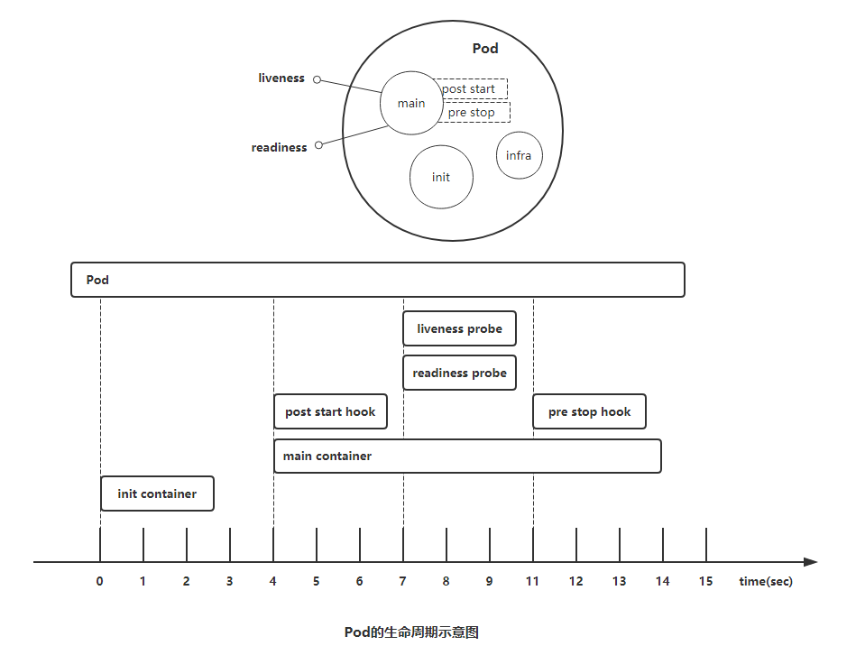

### 3.1 Pod phase

> `Pod`的`status`字段是一个`PodStatus`的对象，`PodStatus`中有一个`phase`字段。
>
> 无论是手动创建还是通过`Deployment`等控制器创建，`Pod`对象总是应该处于其生命进程中以下几个相位（`phase`）之一。
>
> - 挂起（`Pending`）：`API Server`创建了`pod`资源对象已存入`etcd`中，但它尚未被调度完成，或者仍处于从仓库下载镜像的过程中。
>
>
> - 运行中（`Running`）：`Pod`已经被调度至某节点，并且所有容器都已经被`kubelet`创建完成。
>
>
> - 成功（`Succeeded`）：`Pod`中的所有容器都已经成功终止并且不会被重启
>
>
> - 失败（`Failed`）：`Pod`中的所有容器都已终止了，并且至少有一个容器是因为失败终止。即容器以`非0`状态退出或者被系统禁止。
> - 未知（`Unknown`）：`Api Server`无法正常获取到`Pod`对象的状态信息，通常是由于无法与所在工作节点的`kubelet`通信所致。


### 3.2 Pod的创建过程

> `Pod`是`kubernetes`的基础单元，理解它的创建过程对于了解系统运作大有裨益。如下图描述了一个`Pod`资源对象的典型创建过程。
>
> 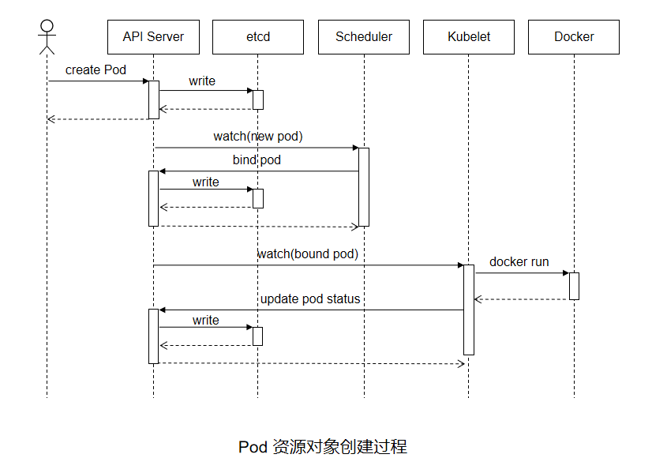
>
> 1. 用户通过`kubectl`或其他`API`客户端提交了`Pod Spec`给`API Server`。
> 2. `API Server`尝试着将`Pod`对象的相关信息存入`etcd`中，待写入操作执行完成，`API Server`即会返回确认信息至客户端。
> 3. `API Server`开始反映`etcd`中的状态变化。
> 4. 所有的`kubernetes`组件均使用`“watch”`机制来跟踪检查`API Server`上的相关的变动。
> 5. `kube-scheduler`（调度器）通过其`“watcher”`觉察到`API Server`创建了新的`Pod`对象但尚未绑定至任何工作节点。
> 6. `kube-scheduler`为`Pod`对象挑选一个工作节点并将结果信息更新至`API Server`。
> 7. 调度结果信息由`API Server`更新至`etcd`存储系统，而且`API Server`也开始反映此`Pod`对象的调度结果。
> 8. `Pod`被调度到的目标工作节点上的`kubelet`尝试在当前节点上调用`Docker`启动容器，并将容器的结果状态返回送至`API Server`。
> 9. `API Server`将`Pod`状态信息存入`etcd`系统中。
> 10. 在`etcd`确认写入操作成功完成后，`API Server`将确认信息发送至相关的`kubelet`，事件将通过它被接受。


### 3.3  Pod生命周期中的重要行为

**1）初始化容器**

> 初始化容器（`init container`）即应用程序的主容器启动之前要运行的容器，常用于为主容器执行一些预置操作，它们具有两种典型特征。
>
> 1）初始化容器必须运行完成直至结束，若某初始化容器运行失败，那么`kubernetes`需要重启它直到成功完成。（注意：如果`pod`的`spec.restartPolicy`字段值为“`Never`”，那么运行失败的初始化容器不会被重启。）
>
> 2）每个初始化容器都必须按定义的顺序串行运行。


**2）容器探测**

> 容器探测（`container probe`）是`Pod`对象生命周期中的一项重要的日常任务，它是`kubelet`对容器周期性执行的健康状态诊断，诊断操作由容器的处理器（`handler`）进行定义。`Kubernetes`支持三种处理器用于`Pod`探测：
>
> - `ExecAction`：在容器内执行指定命令，并根据其返回的状态码进行诊断的操作称为`Exec`探测，状态码为`0`表示成功，否则即为不健康状态。
>
>
> - `TCPSocketAction`：通过与容器的某`TCP`端口尝试建立连接进行诊断，端口能够成功打开即为正常，否则为不健康状态。
>
>
> - `HTTPGetAction`：通过向容器`IP`地址的某指定端口的指定`path`发起`HTTP GET`请求进行诊断，响应码为`2xx`或`3xx`时即为成功，否则为失败。
>
> 任何一种探测方式都可能存在三种结果：`“Success”（成功）`、`“Failure”（失败）`、`“Unknown”（未知）`，只有`success`表示成功通过检测。


> 容器探测分为两种类型：
>
> - **存活性探测（livenessProbe）**：用于判定容器是否处于“运行”（`Running`）状态；一旦此类检测未通过，`kubelet`将杀死容器并根据重启策略（`restartPolicy`）决定是否将其重启；未定义存活检测的容器的默认状态为“`Success`”。
>
>
> - **就绪性探测（readinessProbe）**：用于判断容器是否准备就绪并可对外提供服务；未通过检测的容器意味着其尚未准备就绪，端点控制器（如`Service`对象）会将其`IP`从所有匹配到此`Pod`对象的`Service`对象的端点列表中移除；检测通过之后，会再将其`IP`添加至端点列表中。


**什么时候使用存活（liveness）和就绪（readiness）探针？**

> 如果容器中的进程能够在遇到问题或不健康的情况下自行崩溃，则不一定需要存活探针，`kubelet`将根据`Pod`的`restartPolicy`自动执行正确的操作。
>
> 如果希望容器在探测失败时被杀死并重新启动，那么请指定一个存活探针，并指定`restartPolicy`为`Always`或`OnFailure`。
>
> 如果要仅在探测成功时才开始向`Pod`发送流量，请指定就绪探针。在这种情况下，就绪探针可能与存活探针相同，但是`spec`中的就绪探针的存在意味着`Pod`将在没有接收到任何流量的情况下启动，并且只有在探针探测成功才开始接收流量。
>
> 如果希望容器能够自行维护，可以指定一个就绪探针，该探针检查与存活探针不同的端点。
>
> 注意：如果只想在`Pod`被删除时能够排除请求，则不一定需要使用就绪探针；在删除`Pod`时，`Pod`会自动将自身置于未完成状态，无论就绪探针是否存在。当等待`Pod`中的容器停止时，`Pod`仍处于未完成状态。


### 3.4 容器的重启策略

> `PodSpec`中有一个`restartPolicy`字段，可能的值为`Always`、`OnFailure`和`Never`。默认为`Always`。`restartPolicy`适用于`Pod`中的所有容器。而且它仅用于控制在同一节点上重新启动`Pod`对象的相关容器。首次需要重启的容器，将在其需要时立即进行重启，随后再次需要重启的操作将由`kubelet`延迟一段时间后进行，且反复的重启操作的延迟时长依次为`10秒、20秒、40秒... 300秒`是最大延迟时长。事实上，一旦绑定到一个节点，`Pod`对象将永远不会被重新绑定到另一个节点，它要么被重启，要么终止，直到节点发生故障或被删除。
>
> - Always：但凡`Pod`对象终止就将其重启，默认值
>
>
> - OnFailure：仅在`Pod`对象出现错误时方才将其重启
>
>
> - Never：从不重启


### 3.5 initContainers 示例

#### 3.5.1 编写yaml文件init-pod-demo.yaml

```shell
# vim init-pod-demo.yaml
apiVersion: v1
kind: Pod
metadata:
  name: myapp-pod
  labels:
    app: myapp
spec:
  containers:
  - name: myapp
    image: busybox
    command: ['sh', '-c', 'echo The app is running! && sleep 3600']
  initContainers:
  - name: init-myservice
    image: busybox
    command: ['sh', '-c', 'until nslookup myservice; do echo waiting for myservice; sleep 2; done;']
  - name: init-mydb
    image: busybox
    command: ['sh', '-c', 'until nslookup mydb; do echo waiting for mydb; sleep 2; done;']
```

#### 3.5.2 创建myapp-pod

```shell
# kubectl create -f init-pod-demo.yaml
```

#### 3.5.3 创建myservice

```shell
# vim init-myservice.yaml
apiVersion: v1
kind: Service
metadata:
  name: myservice
spec:
  ports:
  - protocol: TCP
    port: 80
    targetPort: 80
    
# kubectl create -f init-myservice.yaml
```

#### 3.5.4 创建mydb

```shell
# vim init-mydb.yaml
apiVersion: v1
kind: Service
metadata:
  name: mydb
spec:
  ports:
  - protocol: TCP
    port: 3306
    targetPort: 3306
    
# kubectl create -f init-mydb.yaml
```


### 3.6  Pod存活性探测示例

#### 3.6.1 设置exec探针示例

```shell
# vim liveness-exec.yaml

apiVersion: v1
kind: Pod
metadata:
  name: liveness-exec-pod
  namespace: default
  labels:
    test: liveness-exec
spec:
  containers:
  - name: liveness-exec-container
    image: busybox:latest
    imagePullPolicy: IfNotPresent
    command: ["/bin/sh","-c","touch /tmp/healthy; sleep 30; rm -f /tmp/healthy; sleep 3600"]
    livenessProbe:
      exec:
        command: ["test","-e","/tmp/healthy"]
      initialDelaySeconds: 1
      periodSeconds: 3

# kubectl create -f manfests/liveness-exec.yaml
```

#### 3.6.2 设置HTTP探针示例

> 基于`HTTP`的探测（`HTTPGetAction`）向目标容器发起一个`HTTP`请求，根据其响应码进行结果判定，响应码如`2xx`或`3xx`时表示测试通过。通过该命令”`# kubectl explain pod.spec.containers.livenessProbe.httpGet`“查看`httpGet`定义的字段

```shell
host	<string>：请求的主机地址，默认为Pod IP，也可以在httpHeaders中使用“Host:”来定义。
httpHeaders	<[]Object>：自定义的请求报文首部。
port	<string>：请求的端口，必选字段。
path	<string>：请求的HTTP资源路径，即URL path。
scheme	<string>：建立连接使用的协议，仅可为HTTP或HTTPS，默认为HTTP。
```

```shell
# vim liveness-httpget.yaml
apiVersion: v1
kind: Pod
metadata:
  name: liveness-http
  namespace: default
  labels:
    test: liveness
spec:
  containers:
    - name: liveness-http-demo
      image: nginx:1.12
      imagePullPolicy: IfNotPresent
      ports:
      - name: http
        containerPort: 80
      lifecycle:
        postStart:
          exec:
            command: ["/bin/sh", "-c", "echo Healthz > /usr/share/nginx/html/healthz"]
      livenessProbe:
        httpGet:
          path: /healthz
          port: http
          scheme: HTTP
          
# kubectl create -f liveness-httpget.yaml 
```

#### 3.6.3 设置TCP探针

> 基于`TCP`的存活性探测（`TCPSocketAction`）用于向容器的特定端口发起`TCP`请求并建立连接进行结果判定，连接建立成功即为通过检测。相比较来说，它比基于`HTTP`的探测要更高效、更节约资源，但精确度略低，毕竟连接建立成功未必意味着页面资源可用。通过该命令`”# kubectl explain pod.spec.containers.livenessProbe.tcpSocket“`查看`tcpSocket`定义的字段

```shell
host	<string>：请求连接的目标IP地址，默认为Pod IP
port	<string>：请求连接的目标端口，必选字段
```

```shell
# vim liveness-tcp.yaml
apiVersion: v1
kind: Pod
metadata:
  name: liveness-tcp-pod
  namespace: default
  labels:
    test: liveness-tcp
spec:
  containers:
  - name: liveness-tcp-demo
    image: nginx:1.12
    imagePullPolicy: IfNotPresent
    ports:
    - name: http
      containerPort: 80
    livenessProbe:
      tcpSocket:
        port: http
```

#### 3.6.4  livenessProbe行为属性

```shell
# kubectl explain pods.spec.containers.livenessProbe

KIND:     Pod
VERSION:  v1

RESOURCE: livenessProbe <Object>

exec   #command 的方式探测，例如 ps 一个进程是否存在

failureThreshold  #探测几次失败 才算失败， 默认是连续三次

initialDelaySeconds #初始化延迟探测，即容器启动多久之后再开始探测，默认为0秒

periodSeconds #每隔多久探测一次，默认是10秒

successThreshold  #处于失败状态时，探测操作至少连续多少次的成功才算通过检测，默认为1秒

timeoutSeconds  #存活性探测的超时时长，默认为1秒

httpGet  #http请求探测

tcpSocket  #端口探测
```


### 3.7 Pod就绪性探测示例

> `Pod`对象启动后，容器应用通常需要一段时间才能完成其初始化过程，例如加载配置或数据，甚至有些程序需要运行某类的预热过程，若在这个阶段完成之前即接入客户端的请求，势必会等待太久。因此，这时候就用到了就绪性探测（`readinessProbe`）。
>
> 与存活性探测机制类似，就绪性探测是用来判断容器就绪与否的周期性（默认周期为10秒钟）操作，它用于探测容器是否已经初始化完成并可服务于客户端请求，探测操作返回`”success“`状态时，即为传递容器已经”就绪“的信号。
>
> 就绪性探测也支持`Exec`、`HTTPGet`和`TCPSocket`三种探测方式，且各自的定义机制也都相同。但与存活性探测触发的操作不同的是，探测失败时，就绪探测不会杀死或重启容器以保证其健康性，而是通知其尚未就绪，并触发依赖于其就绪状态的操作（例如，从`Service`对象中移除此`Pod`对象）以确保不会有客户端请求接入此`Pod`对象。


#### 3.7.1 设置HTTP探针示例

```shell
# vim readiness-httpget.yaml

apiVersion: v1
kind: Pod
metadata:
  name: readiness-http
  namespace: default
  labels:
    test: readiness-http
spec:
  containers:
  - name: readiness-http-demo
    image: nginx:1.12
    imagePullPolicy: IfNotPresent
    ports:
    - name: http
      containerPort: 80
    readinessProbe:
      httpGet:
        path: /index.html
        port: http
        scheme: HTTP
        
        
 # kubectl create -f readiness-httpget.yaml
 
 
```


### 3.8 Start 和 Stop 示例


# 控制器Pod

## 1. 控制器介绍

### 1.1 控制器的必要性

> 自主式`Pod`对象由调度器调度到目标工作节点后即由相应节点上的`kubelet`负责监控其容器的存活状态，容器主进程崩溃后，`kubelet`能够自动重启相应的容器。但对出现非主进程崩溃类的容器错误却无从感知，这便依赖于`pod`资源对象定义的存活探测，以便`kubelet`能够探知到此类故障。但若`pod`被删除或者工作节点自身发生故障（工作节点上都有`kubelet`，`kubelet`不可用，因此其健康状态便无法保证），则便需要控制器来处理相应的容器重启和配置。


### 1.2 常见的工作负载控制器

> `Pod`控制器由`master`的`kube-controller-manager`组件提供，常见的此类控制器有：
>
> **ReplicationController**
>
> **ReplicaSet：**代用户创建指定数量的`pod`副本数量，确保`pod`副本数量符合预期状态，并且支持滚动式自动扩容和缩容功能
>
> **Deployment：**工作在`ReplicaSet`之上，用于管理无状态应用，目前来说最好的控制器。支持滚动更新和回滚功能，还提供声明式配置。
>
> **DaemonSet：**用于确保集群中的每一个节点只运行特定的`pod`副本，常用于实现系统级**后台任务。比如`ELK`服务
>
> **StatefulSet：**管理有状态应用
>
> **Job：**只要完成就立即退出，不需要重启或重建
>
> **CronJob：**周期性任务控制，不需要持续后台运行


### 1.3 Pod控制器概述

> `Kubernetes`的核心功能之一还在于要确保各资源对象的当前状态（`status`）以匹配用户期望的状态（`spec`），使当前状态不断地向期望状态“和解”（`reconciliation`）来完成容器应用管理。而这些则是`kube-controller-manager`的任务。
>
> 创建为具体的控制器对象之后，每个控制器均通过`API Server`提供的接口持续监控相关资源对象的当前状态，并在因故障、更新或其他原因导致系统状态发生变化时，尝试让资源的当前状态想期望状态迁移和逼近。
>
> `List-Watch`是`kubernetes`实现的核心机制之一，在资源对象的状态发生变动时，由`API Server`负责写入`etcd`并通过水平触发（`level-triggered`）机制主动通知给相关的客户端程序以确保其不会错过任何一个事件。控制器通过`API Server`的`watch`接口实时监控目标资源对象的变动并执行和解操作，但并不会与其他控制器进行任何交互。


### 1.4 Pod和Pod控制器

> `Pod`控制器资源通过持续性地监控集群中运行着的`Pod`资源对象来确保受其管控的资源严格符合用户期望的状态，例如资源副本的数量要精确符合期望等。通常，一个`Pod`控制器资源至少应该包含三个基本的组成部分：
>
> 标签选择器：匹配并关联`Pod`资源对象，并据此完成受其管控的`Pod`资源计数。
>
> 期望的副本数：期望在集群中精确运行着的`Pod`资源的对象数量。
>
> Pod模板：用于新建`Pod`资源对象的`Pod`模板资源。


## 2 ReplicaSet控制器

### 2.1 ReplicaSet概述

> `ReplicaSet`是取代早期版本中的`ReplicationController`控制器，其功能基本上与`ReplicationController`相同

> `ReplicaSet`（简称RS）是`Pod`控制器类型的一种实现，用于确保由其管控的`Pod`对象副本数在任意时刻都能精确满足期望的数量。`ReplicaSet`控制器资源启动后会查找集群中匹配器标签选择器的`Pod`资源对象，当前活动对象的数量与期望的数量不吻合时，多则删除，少则通过`Pod`模板创建以补足。

> `ReplicaSet`能够实现以下功能：
>
> - **确保Pod资源对象的数量精确反映期望值：**`ReplicaSet`需要确保由其控制运行的Pod副本数量精确吻合配置中定义的期望值，否则就会自动补足所缺或终止所余。
>
>
> - **确保Pod健康运行：**探测到由其管控的`Pod`对象因其所在的工作节点故障而不可用时，自动请求由调度器于其他工作节点创建缺失的`Pod`副本。
>
>
> - **弹性伸缩：**可通过`ReplicaSet`控制器动态扩容或者缩容`Pod`资源对象的数量。必要时还可以通过`HPA`控制器实现`Pod`资源规模的自动伸缩。


### 2.2 创建ReplicaSet

#### 2.2.1 核心字段

> spec字段一般嵌套使用以下几个属性字段：

```shell
replicas	<integer>：指定期望的Pod对象副本数量
selector	<Object>：当前控制器匹配Pod对象副本的标签选择器，支持matchLabels和matchExpressions两种匹配机制
template	<Object>：用于定义Pod时的Pod资源信息
minReadySeconds	<integer>：用于定义Pod启动后多长时间为可用状态，默认为0秒
```

#### 2.2.2 ReplicaSet示例

```shell
#命令行查看ReplicaSet清单定义规则
kubectl explain rs
kubectl explain rs.spec
kubectl explain rs.spec.template

#创建ReplicaSet示例
vim rs-demo.yaml

apiVersion: apps/v1  #api版本定义
kind: ReplicaSet  #定义资源类型为ReplicaSet
metadata:  #元数据定义
  name: myapp
  namespace: default
spec:  #ReplicaSet的规格定义
  replicas: 2  #定义副本数量为2个
  selector:  #标签选择器，定义匹配Pod的标签
    matchLabels:
      app: myapp
      release: canary
  template:  #Pod的模板定义
    metadata:  #Pod的元数据定义
      name: myapp-pod  #自定义Pod的名称
      labels:  #定义Pod的标签，需要和上面的标签选择器内匹配规则中定义的标签一致，可以多出其他标签
        app: myapp
        release: canary
    spec:  #Pod的规格定义
      containers:  #容器定义
      - name: myapp-containers  #容器名称
        image: ikubernetes/myapp:v1  #容器镜像
        imagePullPolicy: IfNotPresent  #拉取镜像的规则
        ports:  #暴露端口
        - name: http  #端口名称
          containerPort: 80
     
#创建ReplicaSet定义的Pod
kubectl apply -f rs-demo.yaml


```


## 3. Deployment控制器

### 3.1 Deployment概述

> `Deployment`(简写为`deploy`)是`kubernetes`控制器的又一种实现，它构建于`ReplicaSet`控制器之上，可为`Pod`和`ReplicaSet`资源提供声明式更新。

> `Deployment`控制器资源的主要职责是为了保证`Pod`资源的健康运行，其大部分功能均可通过调用`ReplicaSet`实现，同时还增添部分特性。
>
> - 事件和状态查看：必要时可以查看`Deployment`对象升级的详细进度和状态。
>
>
> - 回滚：升级操作完成后发现问题时，支持使用回滚机制将应用返回到前一个或由用户指定的历史记录中的版本上。
>
>
> - 版本记录：对`Deployment`对象的每一个操作都予以保存，以供后续可能执行的回滚操作使用。
>
>
> - 暂停和启动：对于每一次升级，都能够随时暂停和启动。
>
>
> - 多种自动更新方案：一是`Recreate`，即重建更新机制，全面停止、删除旧有的`Pod`后用新版本替代；另一个是`RollingUpdate`，即滚动升级机制，逐步替换旧有的`Pod`至新的版本


### 3.2 创建Deployment

> Deployment其核心资源和ReplicaSet相似

```shell
# 命令行查看ReplicaSet清单定义规则
kubectl explain deployment
kubectl explain deployment.spec
kubectl explain deployment.spec.template

# 创建Deployment示例
vim deploy-demo.yaml
apiVersion: apps/v1  #api版本定义
kind: Deployment  #定义资源类型为Deploymant
metadata:  #元数据定义
  name: deploy-demo  #deployment控制器名称
  namespace: default  #名称空间
spec:  #deployment控制器的规格定义
  replicas: 2  #定义副本数量为2个
  selector:  #标签选择器，定义匹配Pod的标签
    matchLabels:
      app: deploy-app
      release: canary
  template:  #Pod的模板定义
    metadata:  #Pod的元数据定义
      labels:  #定义Pod的标签，需要和上面的标签选择器内匹配规则中定义的标签一致，可以多出其他标签
        app: deploy-app
        release: canary
    spec:  #Pod的规格定义
      containers:  #容器定义
      - name: myapp  #容器名称
        image: ikubernetes/myapp:v1  #容器镜像
        ports:  #暴露端口
        - name: http  #端口名称
          containerPort: 80
          
# 创建Deployment对象
kubectl apply -f deploy-demo.yaml
```


#### 3.3 更新策略

> ReplicaSet控制器的应用更新需要手动分成多步并以特定的次序进行，过程繁杂且容易出错，而Deployment却只需要由用户指定在Pod模板中要改动的内容，（如镜像文件的版本），余下的步骤便会由其自动完成。Pod副本数量也是一样。

>  Deployment控制器支持两种更新策略：滚动更新（rollingUpdate）和重建创新（Recreate），默认为滚动更新
>
>  - 滚动更新（rollingUpdate）：即在删除一部分旧版本Pod资源的同时，补充创建一部分新版本的Pod对象进行应用升级，其优势是升级期间，容器中应用提供的服务不会中断，但更新期间，不同客户端得到的相应内容可能会来自不同版本的应用。
>
>
>  - 重新创建（Recreate）：即首先删除现有的Pod对象，而后由控制器基于新模板重行创建出新版本的资源对象。

> Deployment控制器的滚动更新操作并非在同一个ReplicaSet控制器对象下删除并创建Pod资源，新控制器的Pod对象数量不断增加，直到旧控制器不再拥有Pod对象，而新控制器的副本数量变得完全符合期望值为止。如图所示 

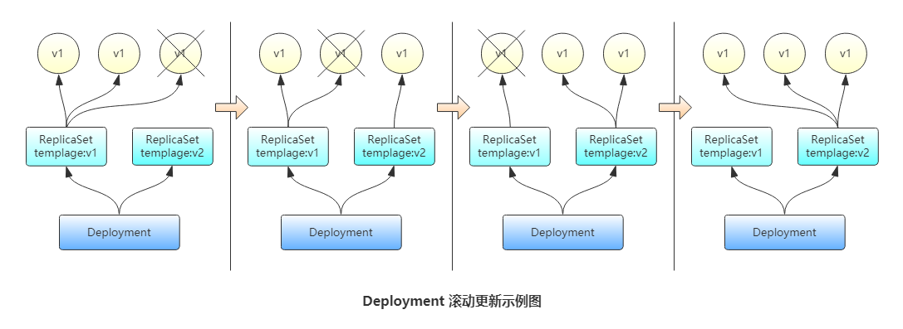

> 滚动更新时，应用还要确保可用的Pod对象数量不低于某阀值以确保可以持续处理客户端的服务请求，变动的方式和Pod对象的数量范围将通过`kubectl explain deployment.spec.strategy.rollingUpdate.maxSurge`和`kubectl explain deployment.spec.strategy.rollingUpdate.maxUnavailable`两个属性同时进行定义。其功能如下：
>
> - maxSurge：指定升级期间存在的总`Pod`对象数量最多可超出期望值的个数，其值可以是`0`或正整数，也可以是一个期望值的百分比；例如，如果期望值为`3`，当前的属性值为`1`，则表示`Pod`对象的总数不能超过`4`个。
>
>
> - maxUnavailable：升级期间正常可用的`Pod`副本数（包括新旧版本）最多不能低于期望值的个数，其值可以是`0`或正整数，也可以是期望值的百分比；默认值为`1`，该值意味着如果期望值是`3`，则升级期间至少要有两个`Pod`对象处于正常提供服务的状态。

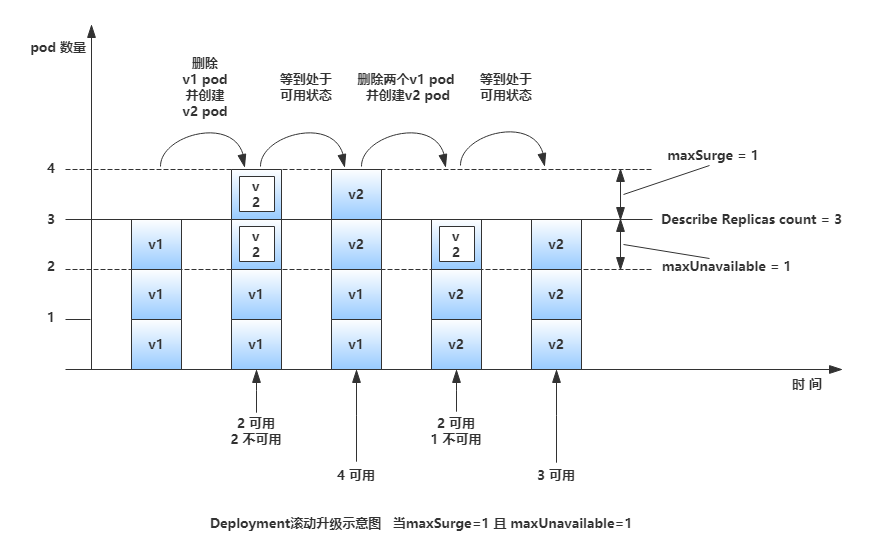


> `maxSurge`和`maxUnavailable`属性的值不可同时为`0`，否则`Pod`对象的副本数量在符合用户期望的数量后无法做出合理变动以进行滚动更新操作

>  Deployment控制器可以保留其更新历史中的旧ReplicaSet对象版本，所保存的历史版本数量由`kubectl explain deployment.spec.revisionHistoryLimit`参数指定。只有保存于`revision`历史中的`ReplicaSet`版本可用于回滚。
>
>  注：为了保存版本升级的历史，需要在创建`Deployment`对象时于命令中使用`“--record”`选项。


### 3.4 Deployment更新升级

> 修改`Pod`模板相关的配置参数便能完成`Deployment`控制器资源的更新。由于是声明式配置，因此对`Deployment`控制器资源的修改尤其适合使用`apply`和`patch`命令来进行；如果仅只是修改容器镜像，`“set image”`命令更为易用。


## 4. DaemonSet控制器

### 4.1 DaemonSet概述

> `DaemonSet`用于在集群中的全部节点上同时运行一份指定`Pod`资源副本，后续新加入集群的工作节点也会自动创建一个相关的`Pod`对象，当从集群移除借点时，此类`Pod`对象也将被自动回收而无需重建。管理员也可以使用节点选择器及节点标签指定仅在具有特定特征的节点上运行指定的`Pod`对象。

**应用场景**

> - 运行集群存储的守护进程，如在各个节点上运行`glusterd`或`ceph`。
>
>
> - 在各个节点上运行日志收集守护进程，如`fluentd`和`logstash`。
>
>
> - 在各个节点上运行监控系统的代理守护进程，如`Prometheus Node Exporter`、`collectd`、`Datadog agent`、`New Relic agent`和`Ganglia gmond`等。


### 4.2 创建DaemonSet

> `DaemonSet`控制器的`spec`字段中嵌套使用的相同字段`selector`、`template`和`minReadySeconds`，并且功能和用法基本相同，但它不支持`replicas`，因为毕竟不能通过期望值来确定`Pod`资源的数量，而是基于节点数量。


`nginx` 示例

```shell
vim daemonset-demo.yaml

apiVersion: apps/v1    #api版本定义
kind: DaemonSet    #定义资源类型为DaemonSet
metadata:    #元数据定义
  name: daemset-nginx    #daemonset控制器名称
  namespace: default    #名称空间
  labels:    #设置daemonset的标签
    app: daem-nginx    
spec:    #DaemonSet控制器的规格定义
  selector:    #指定匹配pod的标签
    matchLabels:    #指定匹配pod的标签
      app: daem-nginx    #注意：这里需要和template中定义的标签一样
  template:    #Pod的模板定义
    metadata:    #Pod的元数据定义
      name: nginx  
      labels:    #定义Pod的标签，需要和上面的标签选择器内匹配规则中定义的标签一致，可以多出其他标签
        app: daem-nginx
    spec:    #Pod的规格定义
      containers:    #容器定义
      - name: nginx-pod    #容器名字
        image: nginx:1.12    #容器镜像
        ports:    #暴露端口
        - name: http    #端口名称
          containerPort: 80    #暴露的端口
          
          
kubectl apply -f daemonset-demo.yaml daemonset.apps/daemset-nginx created
```

**注意**

> 对于特殊的硬件的节点来说，可能有的运行程序只需要在某一些节点上运行，那么通过`Pod`模板的`spec`字段中嵌套使用`nodeSelector`字段，并确保其值定义的标签选择器与部分特定工作节点的标签匹配即可。


### 4.3 更新DaemonSet对象

> `DaemonSet`自`Kubernetes1.6`版本起也开始支持更新机制，相关配置嵌套在`kubectl explain daemonset.spec.updateStrategy`字段中。其支持`RollingUpdate（滚动更新）`和`OnDelete（删除时更新）`两种策略，滚动更新为默认的更新策略。


# Kubernetes服务发现

## 1. Service 概述

### 1.1 为什么要使用Service

> `Kubernetes Pod`是平凡的，由`Deployment`等控制器管理的`Pod`对象都是有生命周期的，它们会被创建，也会意外挂掉。虽然它们可以由控制器自动重建或者滚动更新，但是重建或更新之后的`Pod`对象的IP地址等都会发生新的变化。这样就会导致一个问题，如果一组`Pod`（称为`backend`）为其它`Pod`（称为 `frontend`）提供服务，那么那些`frontend`该如何发现，并连接到这组`Pod`中的哪些`backend`呢？  这时候就用到了：`Service`


### 1.2 Service实现原理

> `Service`资源基于标签选择器将一组`Pod`定义成一个逻辑组合，并通过自己的`IP`地址和端口调度代理请求至组内的`Pod`对象之上，如下图所示，它向客户端隐藏了真实的、处理用户请求的`Pod`资源，使得客户端的请求看上去就像是由`Service`直接处理并响应一样。
>
> 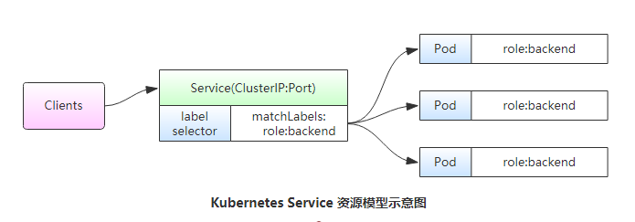	

> `Service`对象的`IP`地址也称为`Cluster IP`，它位于`Kubernetes`集群配置指定专用`IP`地址的范围之内，是一种虚拟`IP`地址，它在`Service`对象创建后既保持不变，并且能够被同一集群中的`Pod`资源所访问。
>
> `Service`端口用于接收客户端请求并将其转发至其后端的`Pod`中的相应端口之上，因此，这种代理机构也称为“端口代理”(`port proxy`)或四层代理，工作于`TCP/IP`协议栈的传输层。

> `Service`资源会通过`API Server`持续监视着（`watch`）标签选择器匹配到的后端`Pod`对象，并实时跟踪各对象的变动，例如，`IP`地址变动、对象增加或减少等。`Service`并不直接链接至`Pod`对象，它们之间还有一个中间层——`Endpoints`资源对象，它是一个由`IP`地址和端口组成的列表，这些`IP`地址和端口则来自由`Service`的标签选择器匹配到的`Pod`资源。当创建`service`对象时，其关联的`Endpoints`对象会自动创建。


### 1.3 虚拟IP和服务代理

> 一个`Service`对象就是工作节点上的一些`iptables`或`ipvs`规则，用于将到达`Service`对象`IP`地址的流量调度转发至相应的`Endpoints`对象指定的`IP`地址和端口之上。`kube-proxy`组件通过`API Server`持续监控着各`Service`及其关联的`Pod`对象，并将其创建或变动实时反映到当前工作节点上的`iptables`规则或`ipvs`规则上。

> `ipvs`是借助于`Netfilter`实现的网络请求报文调度框架，支持`rr`、`wrr`、`lc`、`wlc`、`sh`、`sed`和`nq`等十余种调度算法，用户空间的命令行工具是`ipvsadm`，用于管理工作与`ipvs`之上的调度规则。

> `Service IP`事实上是用于生成`iptables`或`ipvs`规则时使用的`IP`地址，仅用于实现`Kubernetes`集群网络的内部通信，并且能够将规则中定义的转发服务的请求作为目标地址予以相应，这也是将其称为虚拟`IP`的原因之一。

`kube-proxy`将请求代理至相应端点的方式有三种：**userspace（用户空间）**、**iptables**和**ipvs**。


#### 1.3.1 userspace代理模式

> `userspace`是`Linux`操作系统的用户空间。这种模式下，`kube-proxy`负责跟踪`API Server`上`Service`和`Endpoints`对象的变动（创建或移除），并据此调整`Service`资源的定义。对于每个`Service`对象，它会随机打开一个本地端口（运行于用户控件的`kube-proxy`进程负责监听），任何到达此端口的连接请求都将代理至当前`Service`资源后端的各`Pod`对象上，至于会挑选中哪个`Pod`对象则取决于当前`Service`资源的调度方式（通过`Service`的`SessionAffinity`来确定），默认的调度算法是轮循（`round-robin`）。
>
> 其代理的过程是：请求到达`service`后，其被转发至内核空间，经由套接字送往用户空间的`kube-proxy`，而后再由它送回内核空间，并调度至后端`Pod`。其传输效率太低，在`1.1`版本前是默认的转发策略。
>
> 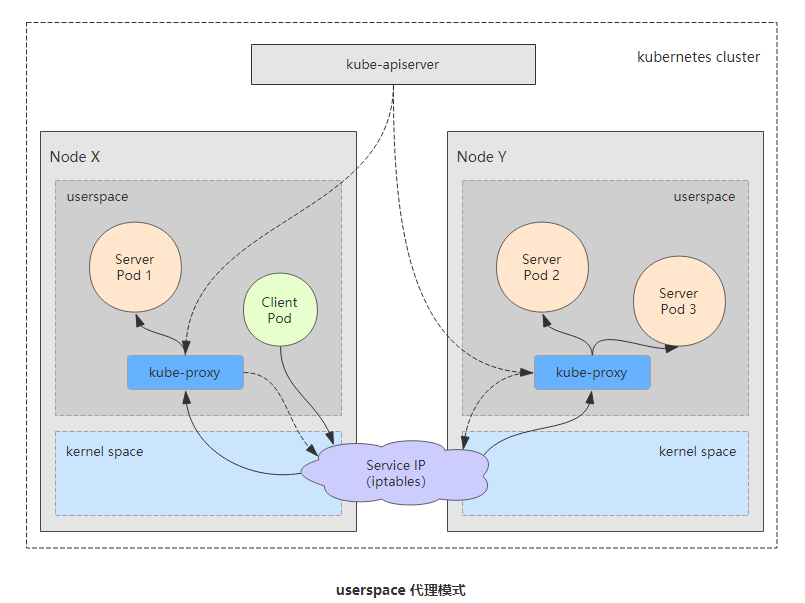


#### 1.3.2 iptables代理模式

> `iptables`代理模式中，`kube-proxy`负责跟踪`API Server`上`Service`和`Endpoints`对象的变动（创建或移除），并据此作出`Service`资源定义的变动。同时，对于每个`Service`对象，它都会创建`iptables`规则直接捕获到达`Cluster IP`（虚拟IP）和`Port`的流量，并将其重定向至当前`Service`的后端。对于每个`Endpoints`对象，`Service`资源会为其创建`iptables`规则并关联至挑选的后端`Pod`资源，默认的调度算法是随机调度（`random`）。实现基于客户端`IP`的会话亲和性（来自同一个用户的请求始终调度到后端固定的一个`Pod`），可将`service.spec.sessionAffinity`的值设置为`“ClientIP”`（默认值为`“None”`）。
>
> 其代理过程是：请求到达`service`后，其请求被相关`service`上的`iptables`规则进行调度和目标地址转换（`DNAT`）后再转发至集群内的`Pod`对象之上。
>
> 相对`userspace`模式来说，`iptables`模式无须将流量在用户空间和内核空间来回切换，因而更加高效和可靠。其缺点是`iptables`代理模型不会在被挑中的`Pod`资源无响应时自动进行重定向；而`userspace`模式则可以。
>
> 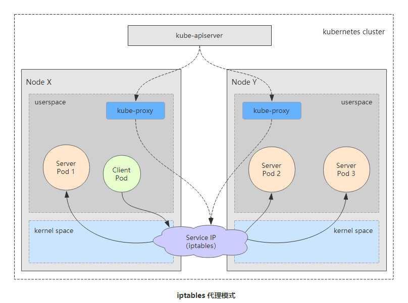


#### 1.3.3 ipvs代理模式

> `kube-proxy`跟踪`API Server`上`Service`的`Endpoints`对象的变动，据此来调用`netlink`接口创建`ipvs`规则，并确保与`API Server`中的变动保持同步，其请求流量的调度功能由`ipvs`实现，其余的功能由`iptables`实现。`ipvs`支持众多调度算法，如`rr`、`lc`、`dh`、`sh`、`sed`和`nq`等。
>
> 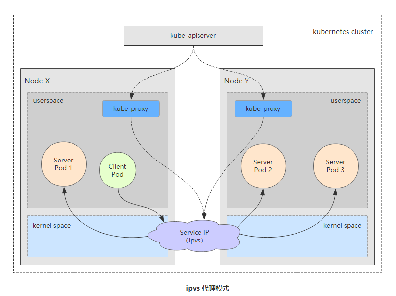


## 2. Service资源的基础应用

> 创建`Service`对象的常用方法有两种，一是直接使用命令`“kubectl expose”`命令，二是使用资源清单配置文件。定义`Service`资源清单文件时，`spec`的两个较为常用的内嵌字段分别是`selector`和`port`，分别用于定义使用的标签选择器和要暴露的端口


##  3. 服务发现-Ingress

### 3.1 什么是Ingress?

> 通常情况下，`service`和`pod`仅可在集群内部网络中通过`IP`地址访问。所有到达边界路由器的流量或被丢弃或被转发到其他地方。从概念上讲，可能像下面这样：
>
> Ingress是授权入站连接到达集群服务的规则集合。
>
> 你可以给`Ingress`配置提供外部可访问的`URL`、负载均衡、`SSL`、基于名称的虚拟主机等。用户通过`POST Ingress`资源到`API Server`的方式来请求`Ingress`。`Ingress controller`负责实现`Ingress`，通常使用负载平衡器，它还可以配置边界路由和其他前端，这有助于以`HA`方式处理流量


### 3.2 Ingress和Ingress Controller

> `Ingress`是`Kubernetes API`的标准资源类型之一，它其实就是一组基于`DNS`名称（`host`）或`URL`路径把请求转发至指定的`Service`资源的规则，用于将集群外部的请求流量转发至集群内部完成服务发布。然而，`Ingress`资源自身并不能进行“流量穿透”，它仅是一组路由规则的集合，这些规则要想真正发挥作用还需要其他功能的辅助，如监听某套接字，然后根据这些规则的匹配机制路由请求流量。这种能够为`Ingress`资源监听套接字并转发流量的组件称为`Ingress`控制器（`Ingress Controller`）。

> `Ingress`控制器并不直接运行为`kube-controller-manager`的一部分，它是`Kubernetes`集群的一个重要组件，类似`CoreDNS`，需要在集群上单独部署。


### 3.3 Ingress工作流程

> 如下图所示，流量到达外部负载均衡器（`externalLB`）后，首先转发至`Service`资源`Ingres-nginx`上，然后通过`Ingress`控制器基于`Ingress`资源定义的规则将客户端请求流量直接转发至与`Service`对应的后端`Pod`资源之上。这种转发机制会绕过`Service`资源(`app Service`；`api Service`)，从而省去了由`kube-proxy`实现的端口代理开销。`Ingress`规则需要由一个`Service`资源对象辅助识别相关的所有`Pod`资源。如下`Ingress`通过`app service`资源去匹配后端的`pod1`和`pod2`；这个`app service`只是起到一个辅助识别功能。
>
> 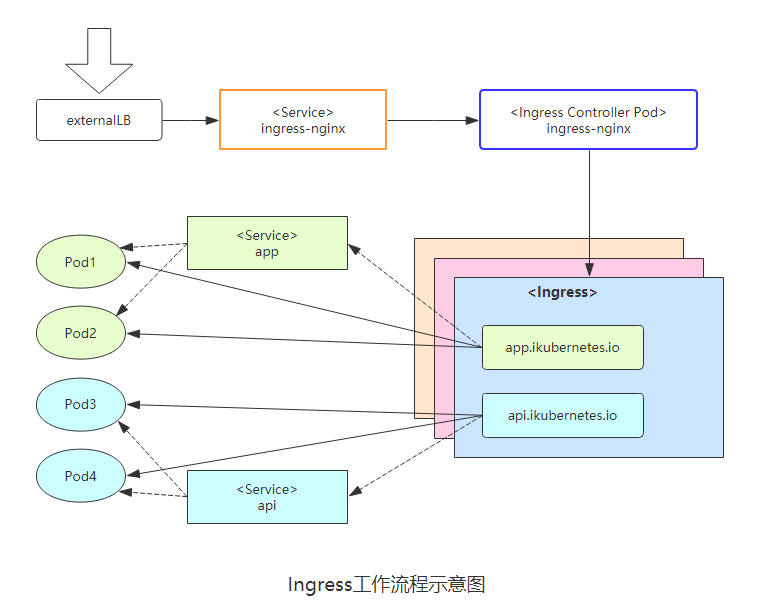


## 4 部署Ingress Controller（Nginx）

### 4.1 描述

> `Ingress` 控制器自身是运行于`Pod`中的容器应用，一般是`Nginx`或`Envoy`一类的具有代理及负载均衡功能的守护进程，它监视着来自`API Server`的`Ingress`对象状态，并根据规则生成相应的应用程序专有格式的配置文件并通过重载或重启守护进程而使新配置生效。
>
> `Ingress`控制器其实就是托管于`Kubernetes`系统之上的用于实现在应用层发布服务的`Pod`资源，跟踪`Ingress`资源并实时生成配置规则。

> 运行为`Pod`资源的`Ingress`控制器进程通过下面两种方式接入外部请求流量：
>
> 1. 以`Deployment`控制器管理`Ingress`控制器的`Pod`资源，通过`NodePort`或`LoadBalancer`类型的`Service`对象为其接入集群外部的请求流量，这就意味着，定义一个`Ingress`控制器时，必须在其前端定义一个专用的`Service`资源。
>
>    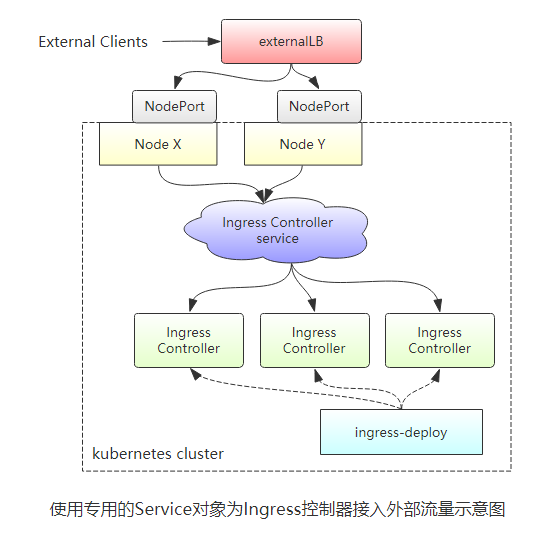
>
> 2.  借助于`DaemonSet`控制器，将`Ingress`控制器的`Pod`资源各自以单一实例的方式运行于集群的所有或部分工作节点之上，并配置这类`Pod`对象以`HostPort`（如下图中的a）或`HostNetwork`（如下图中的b）的方式在当前节点接入外部流量。
>
>    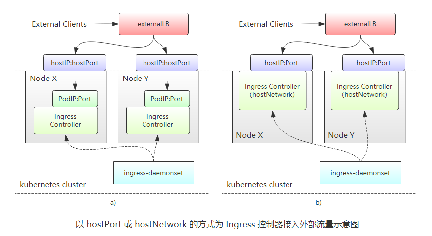

### 4.2 部署

[Ingress-nginx官网](https://kubernetes.github.io/ingress-nginx/)

[Ingress-nginx GitHub仓库地址](https://github.com/kubernetes/ingress-nginx)

[Ingress安装文档](https://kubernetes.github.io/ingress-nginx/deploy/)


**在`github`上下载配置清单`yaml`文件，并创建部署**

```shell
wget https://raw.githubusercontent.com/kubernetes/ingress-nginx/nginx-0.30.0/deploy/static/mandatory.yaml

# 裸机安装注意事项，Networker 模式下可以手动添加ingress-controller列表， 通过 --publish-status-address
https://kubernetes.github.io/ingress-nginx/deploy/baremetal/

# 拉取阿里镜像
# docker pull registry.cn-hangzhou.aliyuncs.com/google_containers/nginx-ingress-controller:0.30.0

# 阿里镜像打标签
# docker tag registry.cn-hangzhou.aliyuncs.com/google_containers/nginx-ingress-controller:0.30.0 quay.io/kubernetes-ingress-controller/nginx-ingress-controller:0.30.0

kubectl apply -f mandatory.yaml


```

#### 创建deployment模板并修改

```shell
# 创建common-service deployment
kubectl create deployment collector-service --image=registry.cn-shenzhen.aliyuncs.com/hqy-parent-all/collector-service:1.0 --dry-run -o yaml > collector-service-dep.yaml


apiVersion: apps/v1
kind: Deployment
metadata:
  creationTimestamp: null
  labels:
    app: collector-service
  name: collector-service
  namespace: default
spec:
  replicas: 1
  selector:
    matchLabels:
      app: collector-service
  strategy: {}
  template:
    metadata:
      creationTimestamp: null
      labels:
        app: collector-service
    spec:
      containers:
      - image: registry.cn-shenzhen.aliyuncs.com/hqy-parent-all/collector-service:1.0-dev
        name: collector-service
        ports:
        - name: http
          containerPort: 8888
        - name: rpc
          containerPort: 10001

```

**创建SVC**

```shell
kubectl expose deployment collector-service --port=8888 --target-port=8888 --type=ClusterIP  --dry-run -o yaml > collector-service-svc.yaml


apiVersion: v1
kind: Service
metadata:
  creationTimestamp: null
  labels:
    app: collector-service
  name: collector-service
spec:
  ports:
  - name: http
    port: 8888
    protocol: TCP
    targetPort: 8888
  - name: socket
    port: 10001
    protocol: TCP
    targetPort: 10001
  selector:
    app: collector-service
  type: ClusterIP
status:
  loadBalancer: {}
```

**创建ingress**

```shell
apiVersion: extensions/v1beta1
kind: Ingress
metadata:
  name: collector-service
  namespace: default
spec:
  rules:
  - host: www.hongqy.com
    http:
      paths:
      - path: /
        backend: 
          serviceName: collector-service 
          servicePort: 8888

```


### 4.3 配置Ingress处理TLS传输

1）创建证书

```shell
openssl genrsa -out www.hongqy.com.key 2048

openssl req -new -x509 -key www.hongqy.com.key -out www.hongqy.com.crt -subj /C=CN/ST=ShenZhen/L=ShenZhen/O=DevOps/CN=www.hongqy.com -days 3650
```

2）创建`secrte`

```shell
kubectl create secret tls hongqy-ingress-secret --cert=www.hongqy.com.crt --key=www.hongqy.com.key -n multisvc
```

3）编写带TLS的Ingress资源清单

```shell
cat > collector-service-tls-ingress.yaml <<EOF
apiVersion: extensions/v1beta1
kind: Ingress
metadata:
  name: hongqy-ingress-https
  annotations:
    kubernetes.io/ingress.class: "nginx"
spec:
  tls:
  - hosts:
    - www.hongqy.com
    secretName: hongqy-ingress-secret
  rules:
  - host: www.hongqy.com
    http:
      paths: 
      - path: /
        backend:
          serviceName: collector-service-svc
          servicePort: 8888
EOF

```


# ConfigMap

> 应用部署的一个最佳实践是将应用所需的配置信息与程序进行分离，这样可以使得应用程序被更好地复用，通过不同的配置也能实现更灵活的功能。
>
> 将应用打包为容器镜像后，可以通过环境变量或者外挂文件的方式在创建容器时进行配置注入，但在大规模容器集群的环境中，对多个容器进行不同的配置将变得非常复杂。
>
> 从Kubernetes v1.2开始提供了一种统一的应用配置管理方案——ConfigMap


## 1. configMap的创建

### 1.1 通过kubectl命令行方式创建

不使用yaml文件，直接通过`kubectl create configmap`也可以创建ConfigMap，可以使用参数`--from-file`或`--from-literal`指定内容，并且可以在一行命令中指定多个参数。

（1）通过`--from-file`参数`从文件中进行创建`，可以指定key的名称，也可以在一个命令行中创建包含多个key的ConfigMap，语法为：

```shel
kubectl create configmap NAME --from-file=[key=]source --from-file=[key=]source
```

（2）通过`--from-file`参数`从目录中进行创建`，该目录下的每个配置文件名称都被设置为key，文件的内容被设置为value，语法为：

```shell
kubectl create configmap NAME  --from-file=config-files-dir
```

（3）`--from-literal`从文本中进行创建，直接将指定的key-value对创建为ConfigMap的内容，语法为：

```shell
kubectl create configmap NAME --from-literal=key1=value1 --from-literal=key2=value2
```


### 1.2 通过yaml配置文件方式创建

```shell
#创建yaml
cat >  cm-appvars.yaml << EOF

apiVersion: v1
kind: ConfigMap
metadata:
  name: cm-appvars
data:
  apploglevel: info
  appdatadir: /var/data

EOF

# 使用yaml
kubectl create -f cm-appvars.yaml

查看创建好的ConfigMap:
# 查看ConfigMap列表
kubectl get configmap
# 查看ConfigMap cm-appvars
kubectl describe configmap cm-appvars
# 以yaml的形式输出cm-appvars
kubectl get configmap cm-appvars -o yaml
```


## 2. 使用ConfigMap

容器应用对ConfigMap的使用有以下两种方法：

- 通过环境变量获取ConfigMap
- 通过Volume挂载的方式将ConfigMap中的内容挂载为容器内部的文件或目录

### 2.1 在Pod中使用ConfigMap

1）通过环境变量方式使用ConfigMap

```shell
apiVersion: v1
kind: Pod
metadata:
  name: cm-test-pod
spec:
  containers:
  - name: cm-test
    image: busybox
    command: ["/bin/sh", "-c", "env | grep APP"]
    env:
    - name: APPLOGLEVEL
      valueFrom:
        configMapKeyRef:
          name: cm-appvars
          key: apploglevel
    - name: APPDATADIR
      valueFrom:
        configMapKeyRef:
          name: cm-appvars
          key: appdatadir
    restartPolicy: Never
```

从Kubernetes v1.6开始，引入了一个新的字段 `envFrom` ，实现在Pod环境内将ConfigMap（也可用于Secret资源对象）中所定义的key=value自动生成为环境变量：

```shell
apiVersion: v1
kind: Pod
metadata:
  name: cm-test-pod
spec:
  containers:
    - name: test-container
      image: busybox
      command: [ "/bin/sh", "-c", "env" ]
      envFrom:
      - configMapRef:
          name: cm-appvars
  restartPolicy: Never
```


### 2.2 在 Pod 命令里使用 ConfigMap 定义的环境变量

我们可以利用`$(VAR_NAME)`这个 Kubernetes 替换变量

```shell
apiVersion: v1
kind: Pod
metadata:
  name: cm-test-pod
spec:
  containers:
    - name: test-container
      image: busybox
      command: [ "/bin/sh", "-c", "echo $(APPLOGLEVEL) $(APPDATADIR)" ]
      env:
        - name: APPLOGLEVEL
          valueFrom:
            configMapKeyRef:
              name: cm-appvars
              key: apploglevel
        - name: APPDATADIR
          valueFrom:
            configMapKeyRef:
              name: cm-appvars
              key: appdatadir
  restartPolicy: Never
```


### 2.3 通过volumeMount使用ConfigMap

```shell
apiVersion: v1
kind: Pod
metadata:
  name: dapi-test-pod
spec:
  containers:
    - name: test-container
      image: gcr.io/google_containers/busybox
      command: [ "/bin/sh", "-c", "ls /etc/config/" ]
      volumeMounts:
      - name: config-volume
        mountPath: /etc/config
  volumes:
    - name: config-volume
      configMap:
        # Provide the name of the ConfigMap containing the files you want
        # to add to the container
        name: special-config
  restartPolicy: Never
```

 

## 3. 使用ConfigMap的限制条件

使用ConfigMap的限制条件如下：

- `ConfigMap必须在Pod之前创建`（除非您把 ConfigMap 标志成”optional”）。如果您引用了一个不存在的 ConfigMap， 那这个Pod是无法启动的。就像引用了不存在的 Key 会导致 Pod 无法启动一样。
- `ConfigMap受Namespace限制`，只有处于相同的Namespace中的Pod可以引用它；
- ConfigMap中的配额管理还未能实现；
- kubelet值支持可以被API Server管理的Pod使用ConfigMap。kubelet在当前Node上通过 `--manifest-url` 或 `--config` 自动创建的静态Pod将无法引用ConfigMap；
- 在Pod对ConfigMap进行挂载（volumeMount）操作是，容器内部`只能挂载为目录，无法挂载为文件`。
- 在挂载到容器内部后，目录中将包含ConfigMap定义的每个item，`如果该目录下原理还有其他文件，则容器内的该目录会被挂载的ConfigMap覆盖`。


# Secret

> k8s secrets用于存储和管理一些敏感数据，比如密码，token，密钥等敏感信息。它把 Pod 想要访问的加密数据存放到 Etcd 中。然后用户就可以通过在 Pod 的容器里挂载 Volume 的方式或者环境变量的方式访问到这些 Secret 里保存的信息了。

Secret有三种类型

- Opaque：base64 编码格式的 Secret，用来存储密码、密钥等；但数据也可以通过base64 –decode解码得到原始数据，所有加密性很弱。
- Service Account：用来访问Kubernetes API，由Kubernetes自动创建，并且会自动挂载到Pod的 /run/secrets/kubernetes.io/serviceaccount 目录中。
- kubernetes.io/dockerconfigjson ： 用来存储私有docker registry的认证信息。


## 1. **Opaque类型**

Opaque 类型的数据是一个 `map` 类型，要求value是base64编码。

```shell
echo -n 'admin' | base64
YWRtaW4=

echo -n '1f2d1e2e67df' | base64
MWYyZDFlMmU2N2Rm
```


# 存储卷

## 1. 简介

> `Pod`本身具有生命周期，这就带了一系列的问题，第一，当一个容器损坏之后，`kubelet`会重启这个容器，但是文件会丢失-这个容器会是一个全新的状态；第二，当很多容器在同一`Pod`中运行的时候，很多时候需要数据文件的共享。`Docker`支持配置容器使用存储卷将数据持久存储于容器自身文件系统之外的存储空间之中，它们可以是节点文件系统或网络文件系统之上的存储空间。相应的，`kubernetes`也支持类似的存储卷功能，不过，其存储卷是与`Pod`资源绑定而非容器。
>
> 简单来说，存储卷是定义在`Pod`资源之上、可被其内部的所有容器挂载的共享目录，它关联至某外部的存储设备之上的存储空间，从而独立于容器自身的文件系统，而数据是否具有持久能力取决于存储卷自身是否支持持久机制。`Pod`、容器与存储卷的关系图如下。
>
> 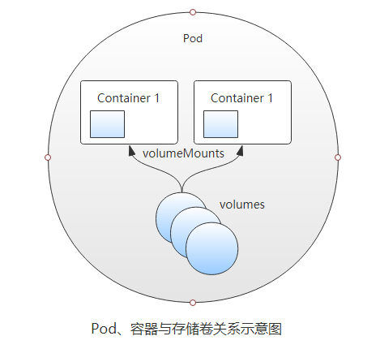


## 2. Kubernetes支持的存储卷类型

> `Kubernetes`支持非常丰富的存储卷类型，包括本地存储（节点）和网络存储系统中的诸多存储机制，还支持`Secret`和`ConfigMap`这样的特殊存储资源。例如，关联节点本地的存储目录与关联`GlusterFS`存储系统所需要的配置参数差异巨大，因此指定存储卷类型时也就限定了其关联到的后端存储设备。通过命令`# kubectl explain pod.spec`可以查看当前`kubernetes`版本支持的存储卷类型。常用类型如下：
>
> - 非持久性存储
>
>
> - emptyDir
>
>
> - hostPath
>
>
> - 网络连接性存储
>
>
> - SAN：iscsi
>
>
> - NFS：nfs、cfs
>
>
> - 分布式存储
>
>
> - glusterfs、cephfs、rbd
>
>
> - 云端存储
>
>
> - awsElasticBlockStore、azureDisk、gitRepo


## 3. 存储卷的使用方式

> 在Pod中定义使用存储卷的配置由两部分组成：一是通过`.spec.volumes`字段定义在`Pod`之上的存储卷列表，其支持使用多种不同类型的存储卷且配置参数差别很大；另一个是通过`.spce.containers.volumeMounts`字段在容器上定义的存储卷挂载列表，它只能挂载当前`Pod`资源中定义的具体存储卷，当然，也可以不挂载任何存储卷。

在Pod级别定义存储卷时，`.spec.volumes`字段的值为对象列表格式，每个对象为一个存储卷的定义，由存储卷名称（`.spec.volumes.name <string>`）或存储卷对象（`.spec.volumes.VOL_TYPE <Object>`）组成，其中VOL_TYPE是使用的存储卷类型名称，它的内嵌字段随类型的不同而不同。下面示例定义了由两个存储卷组成的卷列表，一个为`emptyDir`类型，一个是`gitRepo`类型。

```shell
......
volumes:
- name: data
  emptyDir: {}
- name: example
  gitRepo:
    repository: https://github.com/ikubernetes/k8s_book.git
    revision: master
    directory:
```

无论何种类型的存储卷，挂载格式基本上都是相同的，通过命令`# kubectl explain pod.spec.containers.volumeMounts` 可以进行查看。在容器中顶一个挂载卷时的通用语法形式如下：

```
......
volumeMounts:
- name	<string> -required-      #指定要挂载的存储卷的名称，必选字段
  mountPath	<string> -required-  #挂载点路径，容器文件系统的路径，必选字段
  readOnly	<boolean>            #是否挂载为只读卷
  subPath	<string>             #挂载存储卷时使用的子路径，及mountPath指定的路径下使用一个子路径作为其挂载点。
```

示例，容器`myapp`将上面定义的`data`存储卷挂载于`/var/log/myapp`，将`examply`挂载到`/webdata/example`目录。

```shell
spec:
  containers:
  - name: myapp
    image: ikubernetes/myapp:v1
    volumeMounts:
    - name: data
      mountPath: /var/log/myapp/
    - name: example
      mountPath: /webdata/example/
```


## 4. EmptyDir 存储卷

> `emptyDir`存储卷是`Pod`对象生命周期中的一个临时目录，类似于`Docker`上的`“docker 挂载卷”`，在`Pod`对象启动时即被创建，而在`Pod`对象被移除时会被一并删除（永久删除）。`Pod`中的容器都可以读写这个目录，这个目录可以被挂载到各个容器相同或者不相同的路径下。注意：一个容器崩溃了不会导致数据的丢失，因为容器的崩溃并不移除`Pod`。
>
> **emptyDir的作用：**
>
> 1. 普通空间，基于磁盘的数据存储
> 2. 作为从崩溃中恢复的备份点
> 3. 存储那些需要长久保存的数据，例如`web`服务中的数据

**emptyDir字段说明：**

```shell
kubectl explain pod.spec.volumes.emptyDir
medium	<string>：    #此目录所在的存储介质的类型，可取值为“default”或“Memory”，默认为default，表示使用节点的的默认存储介质；Memory表示使用基于RAM的临时的文件系统temfs，空间受限于内存，但性能非常好，通常用于为容器中的应用提供缓存空间。
sizeLimit	<string>    #当前存储卷的空间限额，默认值为nil，表示不限制；不过，在medium字段值为“Memory”时建议务必定义此限额。
```

**emptyDir示例：**

```shell
vim vol-emptydir.yaml

apiVersion: v1
kind: Pod
metadata:
  name: vol-emptydir-pod
spec:
  volumes:    #定义存储卷
  - name: html    #定义存储卷的名称
    emptyDir: {}    #定义存储卷的类型
  containers:
  - name: nginx
    image: nginx:1.12
    volumeMounts:    #在容器中定义挂载存储卷的名和路径
    - name: html
      mountPath: /usr/share/nginx/html
  - name: sidecar
    image: alpine
    volumeMounts:    #在容器中定义挂载存储卷的名和路径
    - name: html
      mountPath: /html
    command: ["/bin/sh", "-c"]
    args:
    - while true; do
        echo $(hostname) $(date) >> /html/index.html;
      sleep 10;
      done
```


## 5. hostPath 存储卷

> `hostPath`类型的存储卷是指将工作节点上的某文件系统的目录或文件挂载于`Pod`中的一种存储卷，独立于`Pod`资源的生命周期，具有持久性。在`Pod`删除时，数据不会丢失。
>
> 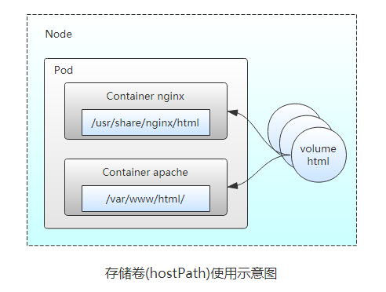

**hostPath字段说明：**

```shell
kubectl explain pod.spec.volumes.hostPath
path	<string> -required-    #指定工作节点上的目录路径
type	<string>    #指定存储卷类型
```


**type类型如下：**

- DirectoryOrCreate    指定的路径不存在时自动创建其权限为0755的空目录,属主和属组为kubelet
- Directory            必须存在的目录路径
- FileOrCreate         指定的路径不存在时自动创建其权限为0644的空文件，属主和属组为kubelet
- File                 必须存在的文件路径
- Socket               必须存在的Socket文件路径
- CharDevice           必须存在的字符设备文件路径
- BlockDevice          必须存在的块设备文件路径


**hostPath示例：**

```shell
vim vol-hostpath.yaml
apiVersion: v1
kind: Pod
metadata:
  name: pod-vol-hostpath
  namespace: default
spec:
  containers:
  - name: myapp
    image: nginx:1.15
    imagePullPolicy: IfNotPresent
    volumeMounts:
    - name: html
      mountPath: /usr/share/nginx/html
  volumes:
  - name: html
    hostPath:
      path: /data/pod/volume1
      type: DirectoryOrCreate
```


## 6. nfs 存储卷

> `nfs`存储卷用于将事先存在的`NFS`服务器上导出的存储空间挂载到`Pod`中供容器使用。与`emptyDir`不同的是，当`pod`资源删除时`emptyDir`也会被删除，而`NFS`在`Pod`对象删除时仅是被卸载而非删除。这就意味`NFS`能够允许我们提前对数据进行处理，而且这些数据可以在`Pod`之间相互传递，并且`NFS`可以同时被多个`Pod`挂载并进行读写。


**nfs字段说明：**

```shell
server	<string> -required-    #NFS服务器的IP地址或主机名，必选字段
path	<string> -required-    #NFS服务器导出（共享）的文件系统路径，必选字段
readOnly	<boolean>          #是否以只读方式挂载，默认为false
```


**nfs示例：**

1）首先准备一个nfs服务器

```shell
#安装软件
yum -y install nfs-utils rpcbind nfs-common
#创建共享目录
mkdir -p /nfs/data
#编辑配置文件配置共享目录
vim /etc/exports 
/nfs/data  192.168.191.0/24(rw,no_root_squash)
#启动rpcbind服务（nfs依赖服务）
systemctl start rpcbind
#启动nfs
  systemctl start nfs
```

2) 编辑资源清单文件

```shell
vim vol-nfs.yaml
```


# PV-PVC

## 1. 介绍

> 前面提到`Kubernetes`提供那么多存储接口，但是首先`Kubernetes`的各个`Node`节点能管理这些存储，但是各种存储参数也需要专业的存储工程师才能了解，由此我们的`Kubernetes`管理变的更加复杂。由此`kubernetes`提出了`PV`和`PVC`的概念，这样开发人员和使用者就不需要关注后端存储是什么，使用什么参数等问题。如下图：
>
> 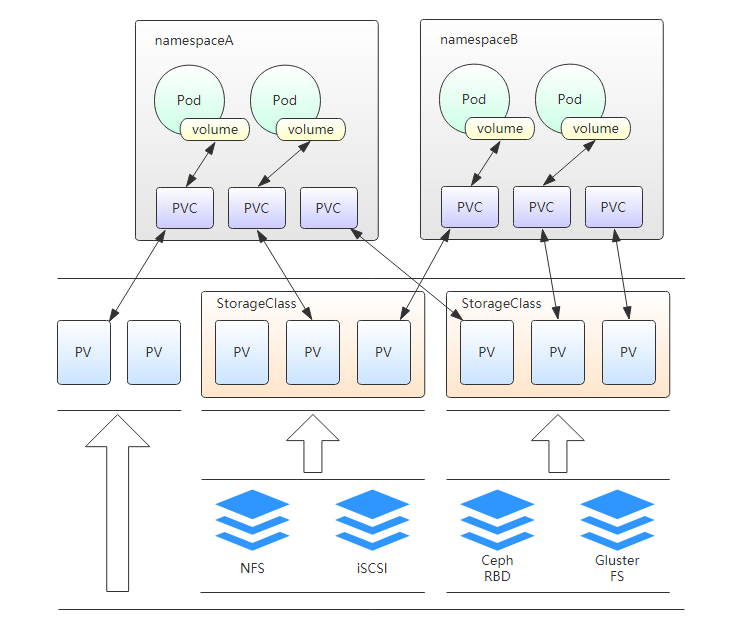

**PV：**

> `PersistentVolume`（`PV`）是集群中已由管理员配置的一段网络存储。集群中的资源就像一个节点是一个集群资源。`PV`是诸如卷之类的卷插件，但是具有独立于使用`PV`的任何单个`Pod`的生命周期。该`API`对象捕获存储的实现细节，即`NFS`，`ISCSI`或云提供商特定的存储系统。

**PVC：**

> `PersistentVolumeClaim`（`PVC`）是用户存储的请求。它类似于`Pod`。`Pod`消耗节点资源，`PVC`消耗存储资源。`Pod`可以请求特定级别的资源（`CPU`和内存）。权限要求可以请求特定的大小和访问模式。

> 虽然`PersistentVolumeClaims`允许用户使用抽象存储资源，但是常见的是，用户需要具有不同属性（如性能）的`PersistentVolumes`，用于不同的问题。集群管理员需要能够提供多种不同于`PersistentVolumes`的`PersistentVolumes`，而不仅仅是大小和访问模式，而不会使用户了解这些卷的实现细节。对于这些需求，存在`StorageClass`资源。

> `StorageClass`为管理员提供了一种描述他们提供的存储的“类”的方法。不同的类可能映射到服务质量级别，或备份策略，或者由集群管理员确定的任意策略。`Kubernetes`本身对于什么类别代表是不言而喻的。这个概念有时在其它存储系统中称为“配置文件”


## 2. 生命周期

> `PV`是集群中的资源。`PVC`是对这些资源的请求，也是对资源的索赔检查。`PV`和`PVC`之间的相互作用遵循这个生命周期：
>
> `Provisioning—>Binding—>Using—>Releasing—>Recycling`

**供应准备Provisioning**

> `PV`有两种提供方式：静态或者动态
>
> - Static：集群管理员创建多个`PV`。它们携带可供集群用户使用的真实存储的详细信息。它们存在于`Kubernetes API`中，可用于消费。
>
>
> - Dynamic：当管理员创建的静态`PV`都不匹配用户的`PersistentVolumesClaim`时，集群可能会尝试为`PVC`动态配置卷。此配置基于`StorageClasses：PVC`必须请求一个类，并且管理员必须已经创建并配置该类才能进行动态配置。要求该类的声明有效地位自己禁用动态配置。

**绑定Binding**

> 用户创建`PVC`并指定需要的资源和访问模式。在找到可用`PV`之前，`PVC`会保持未绑定状态。

**使用Using**

> 用户可在`Pod`中像`volume`一样使用`PVC`。

**释放Releasing**

> 用户删除`PVC`来回收存储资源，`PV`将变成`“released”`状态。由于还保留着之前的数据，这些数据要根据不同的策略来处理，否则这些存储资源无法被其它`PVC`使用

**回收Recycling**

> `PV`可以设置三种回收策略：保留（`Retain`）、回收（`Recycle`）和删除（`Delete`）。


## 3. 创建PV

**字段说明：**

`PersistentVolume Spec`主要支持以下几个通用字段，用于定义`PV`的容量、访问模式、和回收策略

```shell
capacity	<map[string]string>    #当前PV的容量；目前，capacity仅支持空间设定，将来应该还可以指定IOPS和throughput。
accessModes	<[]string>    #访问模式；尽管在PV层看起来并无差异，但存储设备支持及启用的功能特性却可能不尽相同。例如NFS存储支持多客户端同时挂载及读写操作，但也可能是在共享时仅启用了只读操作，其他存储系统也存在类似的可配置特性。因此，PV底层的设备或许存在其特有的访问模式，用户使用时必须在其特性范围内设定其功能。参考：https://kubernetes.io/docs/concepts/storage/persistent-volumes/#access-modes
    - ReadWriteOnce：仅可被单个节点读写挂载；命令行中简写为RWO。
    - ReadOnlyMany：可被多个节点同时只读挂载；命令行中简写为ROX。
    - ReadWriteMany：可被多个节点同时读写挂载；命令行中简写为RWX。
    
persistentVolumeReclaimPolicy	<string>    #PV空间被释放时的处理机制；可用类型仅为Retain（默认）、Recycle或Delete，具体说明如下。
    - Retain：保持不动，由管理员随后手动回收。
    - Recycle：空间回收，即删除存储卷目录下的所有文件（包括子目录和隐藏文件），目前仅NFS和hostPath支持此操作。
    - Delete：删除存储卷，仅部分云端存储系统支持，如AWS EBS、GCE PD、Azure Disk和Cinder

volumeMode	<string>    #卷模型，用于指定此卷可被用作文件系统还是裸格式的块设备；默认为Filesystem。

storageClassName	<string>    #当前PV所属的StorageClass的名称；默认为空值，即不属于任何StorageClass。

mountOptions	<[]string>    #挂载选项组成的列表，如ro、soft和hard等。
```


## 4. 创建PVC

**字段说明：**

`PersistentVolumeClaim`是存储卷类型的资源，它通过申请占用某个`PersistentVolume`而创建，它与`PV`是一对一的关系，用户无须关系其底层实现细节。申请时，用户只需要指定目标空间的大小、访问模式、`PV`标签选择器和`StorageClass`等相关信息即可。`PVC`的`Spec`字段的可嵌套字段具体如下：

```shell
# kubectl explain pvc.spec
accessModes	<[]string>    #当前PVC的访问模式，其可用模式与PV相同

resources	<Object>    #当前PVC存储卷需要占用的资源量最小值；目前，PVC的资源限定仅指其空间大小

selector	<Object>    #绑定时对PV应用的标签选择器（matchLabels）或匹配条件表达式（matchEx-pressions），用于挑选要绑定的PV；如果同时指定了两种挑选机制，则必须同时满足两种选择机制的PV才能被选出

storageClassName	<string>    #所依赖的存储卷的名称

volumeMode	<string>    #卷模型，用于指定此卷可被用作于文件系统还是裸格式的块设备；默认为“Filesystem”

volumeName	<string>    #用于直接指定要绑定的PV的卷名
```

### 4.1 在Pod中使用PVC

在`Pod`资源中调用`PVC`资源，只需要在定义`volumes`时使用`persistentVolumeClaims`字段嵌套指定两个字段即可。具体如下：

```shell
kubectl explain pod.spec.volumes.persistentVolumeClaim

claimName	<string> -required-    #要调用的PVC存储卷的名称，PVC卷要与Pod在同一名称空间中
readOnly	<boolean>    #是否将存储卷挂载为只读模式，默认为false。
```


# 集群调度


# Helm

## 1. 简介

> Helm是一个 [Kubernetes](https://so.csdn.net/so/search?q=Kubernetes&spm=1001.2101.3001.7020) 应用的包管理工具，helm 类似于Linux系统下的包管理器，如yum/apt等，python中pip，node中的npm，可以方便快捷的将之前打包好的yaml文件快速部署进kubernetes内，方便管理维护。


**Helm主要包括以下组件**

- Chart：Chart是一个Helm的程序包，软件包，包含了运行一个K8S应用程序所需的镜像、依赖关系和资源定义等，也就是包含了一个应用所需资源对象的YAML文件，通常以.tgz压缩包形式提供，也可以是文件夹形式。
- Repository（仓库）：是Helm的软件仓库，Repository本质上是一个Web服务器，该服务器保存了一系列的Chart软件包供用户下载，并且提供了该Repository的Chart包的清单文件便于查询。

- Config（配置数据）：部署时设置到Chart中的配置数据。

- Release：基于Chart和Config部署到K8S集群中运行的一个实例。一个Chart可以被部署多次，每次的Release都不相同。


## 2. helm安装

```shell
wget https://storage.googleapis.com/kubernetes-helm/helm-v3.8.2-linux-amd64.tar.gz

wget https://get.helm.sh/helm-v2.13.1-linux-amd64.tar.gz

tar -zxvf helm-v2.13.1-linux-amd64.tar.gz
cp linux-amd64/helm /usr/local/bin/
chmod a+x /usr/local/bin/helm 
```


另外一个值得注意的问题是`RBAC`，我们需要为`Tiller`创建一个`ServiceAccount`，让他拥有执行的权限，详细内容可以查看 Helm 文档中的[Role-based Access Control](https://docs.helm.sh/using_helm/#role-based-access-control)。 创建`rbac.yaml`

```yaml
apiVersion: v1
kind: ServiceAccount
metadata:
  name: tiller
  namespace: kube-system
---
apiVersion: rbac.authorization.k8s.io/v1beta1
kind: ClusterRoleBinding
metadata:
  name: tiller
roleRef:
  apiGroup: rbac.authorization.k8s.io
  kind: ClusterRole
  name: cluster-admin
subjects:
  - kind: ServiceAccount
    name: tiller
    namespace: kube-system
```

```shell
kubectl create -f rbac-config.yaml
helm init --service-account tiller --skip-refresh

docker pull sapcc/tiller:v2.13.1

docker tag sapcc/tiller:v2.13.1 gcr.io/kubernetes-helm/tiller:v2.13.1
 
```


##  3. helm安装Dashboard

**1) 拉取helm kubernetes-dashboard Chart** 

```shell
helm repo add k8s-dashboard https://kubernetes.github.io/dashboard

helm fetch  k8s-dashboard/kubernetes-dashboard --version 2.0.1
```

**2) 解压后指定yaml启动**

`vim kubernetes-dashboard.yaml`

```yaml
image:
  repository: registry.cn-hangzhou.aliyuncs.com/google_containers/kubernetes-dashboard-amd64
  tag: v1.10.1
  pullPolicy: IfNotPresent
ingress:
  enabled: true
  hosts:
    - dashboard.nauyiq.com
  annotations:
    kubernetes.io/ingress.class: nginx
    kubernetes.io/tls-acme: 'true'
    nginx.ingress.kubernetes.io/backend-protocol: "HTTPS"
  tls:
        - secretName: nauyiq.com.tls.secret
      hosts:
        - dashboard.xiaofu.com
  rbac:
  clusterAdminRole: true

  serviceAccount:
  name: dashboard-admin
```

```shell
helm install k8s-dashboard/kubernetes-dashboard -n kubernetes-dashboard --namespace kube-system -f kubernetes-dashboard.yaml
```


