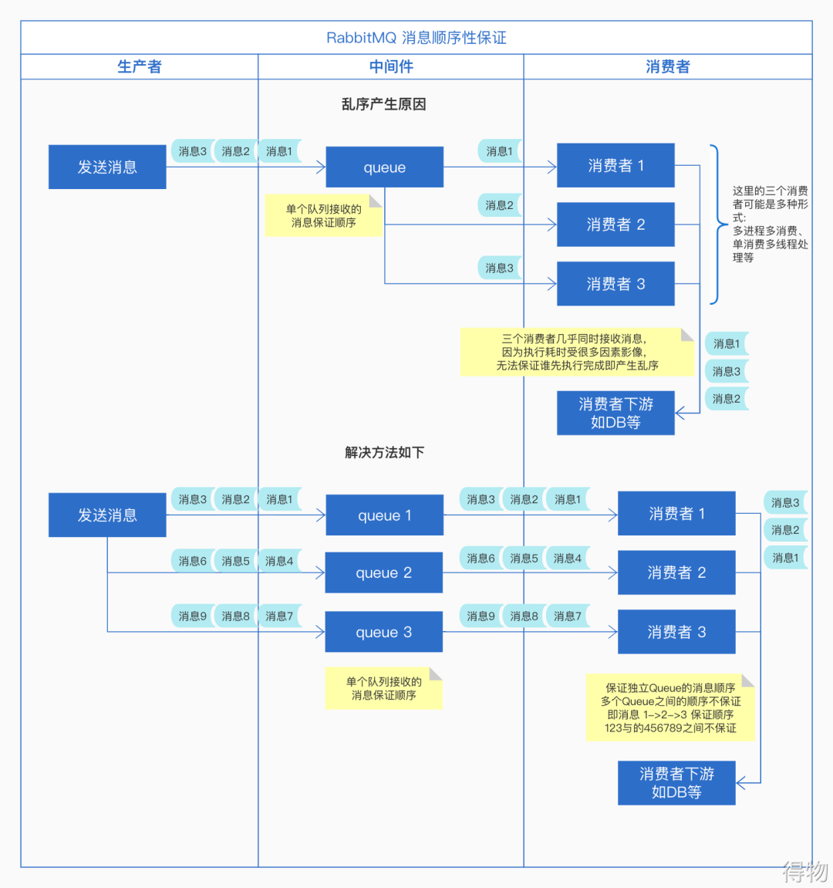

# 消息中间件应用常见问题及优化方案

## 1. 消息中间件应用场景及可能引发的问题

### 1.1 应用场景

* 异步通讯： 可以用于业务系统内部的异步通信，也可以用于分布式系统信息交互。
* 系统解耦：将不同性质的业务进行隔离切分，提升性能，主附流程分层，按照重要性进行隔离，减少异常影响。
* 流量削峰：间歇性突刺流量分散处理，减少系统压力，提升系统可用性。
* 分布式事务一致性：RocketMQ提供的事务消息功能可以处理分布式事务一致性（如电商订单场景）。当然，也可以使用分布式事务中间件。
* 消息顺序收发：这是最基础的功能，先进先出，消息队列必备。
* 延时消息：延迟触发的业务场景，如下单后延迟取消未支付订单等。
* 大数据处理：日志处理，kafka。
* 分布式缓存同步：消费MySQLbinlog日志进行缓存同步，或者业务变动直接推送到MQ消费。

### 1.2 存在的常见问题

* 引入消息中间件增加了系统复杂度，怎么使用维护；
* 消息发送失败怎么办（消息丢失）
* 为了确保能发成功，消息重复发送了怎么办（消息重复）；
* 消息在中间件流转出现异常怎么处理；
* 消息消费时候，如果消费流程失败了怎么处理，还能不能重新从中间件获取到这条消息；
* 消费失败如果还能获取，那会不会出现失败情况下，一直重复消费同一条消息，从而流程卡死；
* 消费失败如果不能再获取，那么我们该怎么确保这条消息能再次被处理；
* 重复消费到相同的消息流程怎么处理，会不会导致业务异常；
* 那么我们该怎么确保消费流程只成功执行一次；
* 对于那些有顺序的消息我们应该怎么保证发送和消费的顺序一致；
* 消息太多了，怎么保证消费脚本消费速度，以便更得上业务的处理需求，避免消息无限积压；
* 我想要发送的消息，等上几秒钟的时间再消费到，该怎么做；

针对以上问题其实可以概括为：

> 消息顺序性保证
> 避免消息丢失
> 消息的重复问题
> 消息积压处理
> 延迟消息处理

## 2. 解决方案

### 2.1 消息顺序性

> 常规的消息中间件大多数基于队列的数据结构（FIFO），本身设计一般都能支持顺序消息。但是针对不同的中间件的不同设计结构，存在不同的针对性处理。

**常见的消息顺序错乱的场景**

* 一个queue有多个消费者消费
* 一个queue值对应一个消费者消费，但是消费者在业务逻辑中采用了多线程消费

#### 2.1.1 Rabbitmq解决方案

**解决思路**

> 保证消息的强制顺序，针对单个队列值采用开启一个消费者（消费保证并发处理时候的顺序性，多线程同理）。由此引发的单个队列吞吐下降的问题，可以采取kafka的设计思想，针对单一任务（业务）开启一组多个队列，将需要顺序的消息按照其固定标识（例如：ID）进行路由，分散到这一组队列中，相同标识的消息进入到相同的队列，单个队列使用单个消费者消费，这样即可以保证消息的顺序与吞吐。

