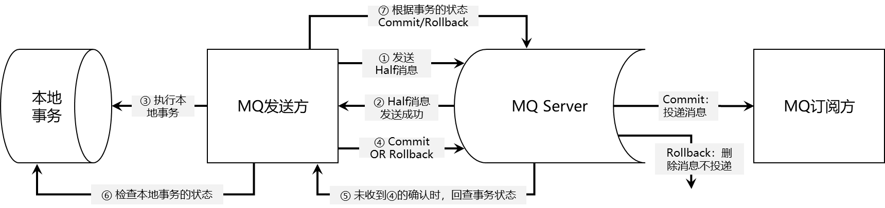

# 消息中间件


## 1. Rabbitmq

### 1.1 架构图


> - **生产者**（producer）：创建消息，发布到代理服务器（Message Broker）。
> - **消费者**（consumer）：连接到代理服务器，并订阅到队列（queue）上，代理服务器将发送消息给一个订阅的/监听的消费者。
> - **消息**（Message）：包含消息头（即附属的配置信息）和消息体（即消息的实体内容）。消息体也可以称为payLoad ，消息体是不透明的，而消息头则由一系列的可选属性组成，这些属性包括routing-key（路由键）、priority（相对于其他消息的优先权）、delivery-mode（指出该消息可能需要持久性存储）等。生产者把消息交由RabbitMQ后，RabbitMQ会根据消息头把消息发送给感兴趣的Consumer(消费者)。
> - **队列**（queue）：用来保存消息直到发送给消费者。它是消息的容器，也是消息的终点。一个消息可投入一个或多个队列。消息一直在队列里面，等待消费者连接到这个队列将其取走。RabbitMQ中消息只能存储在队列 中，这一点和Kafka相反。Kafka将消息存储在topic(主题)这个逻辑层面，而相对应的队列逻辑只是topic实际存储文件中的位移标识。 RabbitMQ的生产者生产消息并最终投递到队列中，消费者可以从队列中获取消息并消费。多个消费者可以订阅同一个队列，这时队列中的消息会被平均分摊（Round-Robin，即轮询）给多个消费者进行处理，而不是每个消费者都收到所有的消息并处理，这样避免的消息被重复消费。RabbitMQ 不支持队列层面的广播消费，如果有广播消费的需求，需要在其上进行二次开发。
> - **路由键**（routing key）：消息头的一个属性（默认为空），交换器根据这个路由键将消息发送到匹配的队列中。
> - **绑定键**（binding key）：绑定就是基于Binding Key将Exchange和Queue连接起来的路由规则，所以可以将交换器理解成一个由Binding构成的路由表。队列需要通过绑定键（默认为空）绑定到交换器上，交换器将消息的路由键与所绑定队列的绑定键进行匹配，正确匹配的消息将发送到队列中。路由键是偏向生产的概念，而绑定键是偏向消费的概念。
> - **代理服务器**（Message Broker）：对于RabbitMQ来说，一个RabbitMQ Broker 可以简单地看作一个RabbitMQ 服务节点，或者RabbitMQ服务实例。大多数情况下也可以将一个RabbitMQ Broker看作一台RabbitMQ服务器。
> - **虚拟主机**（vhost）：AMQP概念的基础，其本质上就是一个mini版的代理服务器（拥有自己的队列、交换器和绑定，更重要的是，拥有自己的权限机制），RabbitMQ默认的vhost：“/”（类似于网络中的namespace），每个用户只能访问自己的vhost（通常会被指派至少一个vhost），进而用户只能访问自己的队列、交换器和绑定，所以vhost之间是绝对隔离的。
> - **信道**（channel）: 应用程序（生产与/或消费）和代理服务器之间TCP连接内的虚拟连接，解决TCP连接数量限制及降低TCP连接代价。每个信道有一个ID，其概念与“频分多路复用”类似。


### 1.2 路由策略

#### 1.2.1 Direct 策略

> Direct是Exchange的**默认模式**。
>
> 当消息的Routing Key与 Exchange和Queue 之间的Binding Key完全匹配，才会将消息分发到该Queue。
>
> RabbitMQ默认提供了一个Exchange，名字是空字符串，类型是Direct，绑定到所有的Queue（每一个Queue和这个无名Exchange之间的Binding Key是Queue的名字）。所以有时候我们感觉不需要交换器也可以发送和接收消息，但是实际上是使用了RabbitMQ默认提供的Exchange。


#### 1.2.2 Fanout 策略

> 与Binding Key和Routing Key无关，交换器会把所有发送到该交换器的消息路由到所有与该交换器绑定的消息队列中。订阅模式。类似于子网广播，子网内的每台主机都获得了一份复制的消息。Fanout交换机转发消息是最快的。


#### 1.2.3 Topic 策略

> 用消息的Routing Key与 Exchange和Queue 之间的Binding Key进行模糊匹配，如果匹配成功，将消息分发到该Queue。
>
> Binding Key中可以存在两种特殊字符用于做模糊匹配：
>
> - `*`：用于匹配一个单词
> - `#`：用于匹配多个单词（可以是零个）


#### 1.2.2 Headers 策略

> 不依赖于Routing Key与Binding Key，而是通过消息头的Headers属性来进行匹配转发的，类似HTTP请求的Headers。
>
> 在绑定Queue与Exchange时指定一组键值对，键值对的Hash结构中要求携带一个键“x-match”，这个键的Value可以是any或all，代表消息携带的Hash是需要全部匹配(all)，还是仅匹配一个键(any)。
>
> 当消息发送到Exchange时，交换器会取到该消息的headers，对比其中的键值对是否完全匹配Queue与Exchange绑定时指定的键值对；如果完全匹配则消息会路由到该Queue，否则不会路由到该Queue。Headers交换机的优势是匹配的规则不被限定为字符串(String)，而是Object类型。


### 1.3 HA

> broker有2种类型节点：**磁盘节点**和**内存节点**。顾名思义，磁盘节点的broker把元数据存储在磁盘中，内存节点把元数据存储在内存中，很明显，磁盘节点的broker在重启后元数据可以通过读取磁盘进行重建，保证了元数据不丢失，内存节点的broker可以获得更高的性能，但在重启后元数据就都丢了。
>
> 如果唯一磁盘的磁盘节点崩溃，**集群是可以保持运行的，但不能更改任何东西**。为了增加可靠性，一般会在集群中设置两个磁盘节点，只要任何一个处于工作状态，就可以保障集群的正常服务。
>
> RabbitMQ的集群模式分为两种：**普通模式**与**镜像模式**。

#### 1.3.1  普通模式

普通模式，也是默认的集群模式

> 对于Queue来说，**消息实体只存在于其中一个节点**，A、B两个节点仅有相同的元数据，即队列结构。当消息进入A节点的Queue中后，consumer从B节点拉取时，RabbitMQ会临时在A、B间进行消息传输，把A中的消息实体取出并经过B发送给consumer。所以consumer应尽量连接每一个节点，从中取消息。即对于同一个逻辑队列，要在多个节点建立物理Queue。否则无论consumer连A或B，出口总在A，会产生瓶颈。
>
> 
>
> 

> 但该方案也有显著的缺陷，那就是**不能保证消息不会丢失**。当集群中某一节点崩溃时，崩溃节点所在的队列进程和关联的绑定都会消失，附加在那些队列上的消费者也会丢失其订阅信息，匹配该队列的新消息也会丢失。比如A为宿主节点，当A节点故障后，B节点无法取到A节点中还未消费的消息实体。如果做了消息持久化，那么得等A节点恢复，然后才可被消费；如果没有持久化的话，然后就没有然后了……

#### 1.3.2 镜像模式

可以将队列镜像到集群中的其他Broker节点之上，如果集群中的一个节点失效了，队列能够自动切换到镜像中的另一个节点上以保证服务的可用性

一个镜像队列中包含有1个主节点master和若干个从节点slave。其主从节点包含如下几个特点：

> - 消息的读写都是在master上进行，并不是读写分离
> - master接收命令后会向salve进行组播，salve会命令执行顺序执行
> - master失效，根据节点加入的时间，最老的slave会被提升为master
> - 互为镜像的是队列，并非节点，集群中可以不同节点可以互为镜像队列，也就是说队列的master可以分布在不同的节点上
>
> 

> 该模式和普通模式不同之处在于，消息实体会主动在镜像节点间同步，而不是在consumer取数据时临时拉取。该模式带来的副作用也很明显，除了降低系统性能外，如果镜像队列数量过多，加之大量的消息进入，集群内部的网络带宽将会被这种同步通讯大大消耗掉。所以在对可靠性要求较高的场合中适用。


## 2. Kafka

#### 2.1 架构图


> * **broker:** kafka集群包含一个或多个服务器，每个服务器节点称为一个broker。
> * **topic:** 每条发布到kafka集群的消息都有一个类别，这个类别称为topic，其实就是将消息按照topic来分类，topic就是逻辑上的分类，同一个topic的数据既可以在同一个broker上也可以在不同的broker结点上。
> * **partition:** 每个topic被物理划分为一个或多个分区，每个分区在物理上对应一个文件夹，该文件夹里面存储了这个分区的所有消息和索引文件。在创建topic时可指定parition数量，生产者将消息发送到topic时，消息会根据 分区策略 追加到分区文件的末尾，属于顺序写磁盘，因此效率非常高（经验证，顺序写磁盘效率比随机写内存还要高，这是Kafka高吞吐率的一个很重要的保证）。
>
>         
>
> * **offset:**  partition中的每条消息都被标记了一个序号，这个序号表示消息在partition中的偏移量，称为offset，每一条消息在partition都有唯一的offset，消息者通过指定offset来指定要消费的消息。
>
>   正常情况下，消费者在消费完一条消息后会递增offset，准备去消费下一条消息，但也可以将offset设成一个较小的值，重新消费一些消费过的消息，可见offset是由consumer控制的，consumer想消费哪一条消息就消费哪一条消息，所以kafka broker是无状态的，它不需要标记哪些消息被消费过。
>
> * **producer:** 生产者，生产者发送消息到指定的topic下，消息再根据分配规则append到某个partition的末尾。
>
> * **consumer:** 消费者，消费者从topic中消费数据。
>
> * **consumer group:** 消费者组，每个consumer属于一个特定的consumer group，可为每个consumer指定consumer group，若不指定则属于默认的group。同一topic的一条消息只能被同一个consumer group内的一个consumer消费，但多个consumer group可同时消费这一消息。这也是kafka用来实现一个topic消息的广播和单播的手段，如果需要实现广播，一个consumer group内只放一个消费者即可，要实现单播，将所有的消费者放到同一个consumer group即可。用consumer group还可以将consumer进行自由的分组而不需要多次发送消息到不同的topic。
>
> * **leader:** 每个partition有多个副本，其中有且仅有一个作为leader，leader会负责所有的客户端读写操作。
>
> * **follower:** follower不对外提供服务，只与leader保持数据同步，如果leader失效，则选举一个follower来充当新的leader。当follower与leader挂掉、卡住或者同步太慢，leader会把这个follower从ISR列表中删除，重新创建一个follower。
>
> * **rebalance:** 同一个consumer group下的多个消费者互相协调消费工作，我们这样想，一个topic分为多个分区，一个consumer group里面的所有消费者合作，一起去消费所订阅的某个topic下的所有分区(每个消费者消费部分分区)，kafka会将该topic下的所有分区均匀的分配给consumer group下的每个消费者，如下图
>
>   .png)
>
>   rebalance表示"重平衡"，consumer group内某个消费者挂掉后，其他消费者自动重新分配订阅主题分区的过程，是 Kafka 消费者端实现高可用的重要手段。如下图Consumer Group A中的C2挂掉，C1会接收P1和P2，以达到重新平衡。同样的，当有新消费者加入consumer group，也会触发重平衡操作。

####  2.2 kafka吞吐量为什么这么高

> * 顺序读写磁盘
>
>   Kafka是将消息持久化到本地磁盘中的，一般人会认为磁盘读写性能差，可能会对Kafka性能提出质疑。实际上不管是内存还是磁盘，快或慢的关键在于寻址方式，磁盘分为顺序读写与随机读写，内存一样也分为顺序读写与随机读写。基于磁盘的随机读写确实很慢，但基于磁盘的顺序读写性能却很高，一般而言要高出磁盘的随机读写三个数量级，一些情况下磁盘顺序读写性能甚至要高于内存随机读写
>
> * page cache
>
>   为了优化读写性能，Kafka利用了操作系统本身的Page Cache，就是利用操作系统自身的内存而不是JVM空间内存。这样做是因为，
>
>   JVM中一切皆对象，对象的存储会带来额外的内存消耗；
>
>   使用JVM会受到GC的影响，随着数据的增多，垃圾回收也会变得复杂与缓慢，降低吞吐量；
>
>   另外操作系统本身对page cache做了大量优化，通过操作系统的Page Cache，Kafka的读写操作基本上是基于系统内存的，读写性能也得到了极大的提升。
>
> * 零拷贝
>
>   零拷贝是指Kafka利用 linux 操作系统的 "zero-copy" 机制在消费端做的优化。首先来看一下消费端在消费数据时，数据从broker磁盘通过网络传输到消费端的整个过程：
>
>   \> 操作系统从磁盘读取数据到内核空间（kernel space）的page cache；
>
>   \> 应用程序读取page cache的数据到用户空间（user space）的缓冲区；
>
>   \> 应用程序将用户空间缓冲区的数据写回内核空间的socket缓冲区（socket buffer）；
>
>   \> 操作系统将数据从socket缓冲区复制到硬件（如网卡）缓冲区；
>
>   .png)
>
>   这个过程包含4次copy操作和2次系统上下文切换，而上下文切换是CPU密集型的工作，数据拷贝是I/O密集型的工作，性能其实非常低效。
>
>   零拷贝就是使用了一个名为sendfile()的系统调用方法，将数据从page cache直接发送到Socket缓冲区，避免了系统上下文的切换，消除了从内核空间到用户空间的来回复制。从上图可以看出，"零拷贝"并不是说整个过程完全不发生拷贝，而是站在内核的角度来说的，避免了内核空间到用户空间的来回拷贝。
>
> * 分区分段
>
>   Kafka的message是按topic分类存储的，topic中的数据又是按照一个一个的partition即分区存储到不同broker节点。每个partition对应了操作系统上的一个文件夹，partition实际上又是按照segment分段存储的。这也非常符合分布式系统分区分桶的设计思想。
>
>   通过这种分区分段的设计，Kafka的message消息实际上是分布式存储在一个一个小的segment中的，每次文件操作也是直接操作的segment。为了进一步的查询优化，Kafka又默认为分段后的数据文件建立了索引文件，就是文件系统上的.index文件。这种分区分段+索引的设计，不仅提升了数据读取的效率，同时也提高了数据操作的并行度。


#### 2.3 Kafka名词解释

##### 2.3.1 AR、ISR、OSR

> **AR**：Assigned Replicas，某分区的所有副本（这里所说的副本包括leader和follower）统称为 AR。
>
> **ISR**：In Sync Replicas，所有与leader副本保持"一定程度同步"的副本（包括leader副本在内）组成 ISR 。生产者发送消息时，只有leader与客户端发生交互，follower只是同步备份leader的数据，以保障高可用，所以生产者的消息会先发送到leader，然后follower才能从leader中拉取消息进行同步，同步期间，follower的数据相对leader而言会有一定程度的滞后，前面所说的"一定程度同步"就是指可忍受的滞后范围，这个范围可以通过server.properties中的参数进行配置。
>
> **OSR** ：Out-of-Sync Replied，在上面的描述中，相对leader滞后过多的follower将组成OSR 。
>
> 由此可见，AR = ISR + OSR，理想情况下，所有的follower副本都应该与leader 保持一定程度的同步，即AR=ISR，OSR集合为空

##### 2.3.2 ISR 的伸缩性

> leader负责跟踪维护 ISR 集合中所有follower副本的滞后状态，当follower副本"落后太多" 或 "follower超过一定时间没有向leader发送同步请求"时，leader副本会把它从 ISR 集合中剔除。如果 OSR 集合中有follower副本"追上"了leader副本，那么leader副本会把它从 OSR 集合转移至 ISR 集合。
>
> 上面描述的"落后太多"是指follower复制的消息落后于leader的条数超过预定值，这个预定值可在server.properties中通过replica.lag.max.messages配置，其默认值是4000。"超过一定时间没有向leader发送同步请求"，这个"一定时间"可以在server.properties中通过replica.lag.time.max.ms来配置，其默认值是10000，默认情况下，当leader发生故障时，只有 ISR 集合中的follower副本才有资格被选举为新的leader，而在 OSR 集合中的副本则没有任何机会（不过这个可以通过配置来改变）。

##### 2.3.3 HW

> HW （High Watermark）俗称高水位，它标识了一个特定的消息偏移量（offset），消费者只能消费HW之前的消息。
>
> 下图表示一个日志文件，这个日志文件中有9条消息，第一条消息的offset为0，最后一条消息的offset为8，虚线表示的offset为9的消息，代表下一条待写入的消息。日志文件的 HW 为6，表示消费者只能拉取offset在 0 到 5 之间的消息，offset为6的消息对消费者而言是不可见的。
>
> .png)

##### 2.3.4 LEO

> LEO （Log End Offset），标识当前日志文件中下一条待写入的消息的offset。上图中offset为9的位置即为当前日志文件的 LEO，分区 ISR 集合中的每个副本都会维护自身的 LEO ，而 ISR 集合中最小的 LEO 即为分区的 HW，对消费者而言只能消费 HW 之前的消息。

##### 2.3.5 ISR 集合和 HW、LEO的关系

> producer在发布消息到partition时，只会与该partition的leader发生交互将消息发送给leader，leader会将该消息写入其本地log，每个follower都从leader上pull数据做同步备份，follower在pull到该消息并写入其log后，会向leader发送ack，一旦leader收到了ISR中的所有follower的ack（只关注ISR中的所有follower，不考虑OSR，一定程度上提升了吞吐），该消息就被认为已经commit了，leader将增加HW，然后向producer发送ack。
>
> 也就是说，在ISR中所有的follower还没有完成数据备份之前，leader不会增加HW，也就是这条消息暂时还不能被消费者消费，只有当ISR中所有的follower都备份完成后，leader才会将HW后移。
>
> ISR集合中LEO最小的副本，即同步数据同步的最慢的一个，这个最慢副本的LEO即leader的HW，消费者只能消费HW之前的消息。


#### 2.4  HA

##### 2.4.1 partition副本的分配策略

> * 将所有的broker（假设总共n个broker）和 待分配的partition排序；
> * 将第i个partition分配到第（i mod n）个broker上；
> * 第i个partition的第j个副本分配到第（(i+j) mod n）个broker上；

##### 2.4.2 kafka的消息传递备份策略

> 生产者将消息发送给分区的leader，leader会将该消息写入其本地log，然后每个follower都会从leader pull数据，follower pull到该消息并将其写入log后，会向leader发送ack，当leader收到了ISR集合中所有follower的ack后，就认为这条消息已经commit了，leader将增加HW并且向生产者返回ack。在整个流程中，follower也可以批量的从leader复制数据，以提升复制性能。
>
> producer在发送消息的时候，可指定参数acks，表示"在生产者认为发送请求完成之前，有多少分区副本必须接收到数据"，有三个可选值，0、1、all(或-1)，默认为1，
>
> - acks=0，表示producer只管发，只要发出去就认为发发送请求完成了，不管leader有没有收到，更不管follower有没有备份完成。
> - acks=1，表示只要leader收到消息，并将其写入自己log后，就会返回给producer ack，不考虑follower有没有备份完成。
> - acks=all(或-1)，表示不仅要leader收到消息写入本地log，还要等所有ISR集合中的follower都备份完成后，producer才认为发送成功。
>
> .jpg)
>
> 实际上，为了提高性能，follower在pull到消息将其保存到内存中而尚未写入磁盘时，就会向leader发送ack，所以也就不能完全保证异常发生后该条消息一定能被Consumer消费。

##### 2.4.3 kafka中的Leader选举

> - cotroller选举  (broker主节点选举)
>
>   controller的选举是通过broker在zookeeper的"/controller"节点下创建临时节点来实现的，并在该节点中写入当前broker的信息 {“version”:1,”brokerid”:1,”timestamp”:”1512018424988”} ，利用zookeeper的强一致性特性，一个节点只能被一个客户端创建成功，创建成功的broker即为controller，即"先到先得"。 
>
>   当controller宕机或者和zookeeper失去连接时，zookeeper检测不到心跳，zookeeper上的临时节点会被删除，而其它broker会监听临时节点的变化，当节点被删除时，其它broker会收到通知，重新发起controller选举。
>
> - 分区leader选举  
>
>   分区leader的选举由 controller 负责管理和实施，当leader发生故障时，controller会将leader的改变直接通过RPC的方式通知需要为此作出响应的broker，需要为此作出响应的broker即该分区的ISR集合中follower所在的broker，kafka在zookeeper中动态维护了一个ISR，只有ISR里的follower才有被选为Leader的可能。
>
>   具体过程是这样的：按照AR集合中副本的顺序 查找到 第一个 存活的、并且属于ISR集合的 副本作为新的leader。一个分区的AR集合在创建分区副本的时候就被指定，只要不发生重分配的情况，AR集合内部副本的顺序是保持不变的，而分区的ISR集合上面说过因为同步滞后等原因可能会改变，所以注意这里是根据AR的顺序而不是ISR的顺序找。
>
>   ※ 对于上面描述的过程我们假设一种极端的情况，如果partition的所有副本都不可用时，怎么办？这种情况下kafka提供了两种可行的方案：
>
>   1、选择 ISR中 第一个活过来的副本作为Leader；
>
>   2、选择第一个活过来的副本（不一定是ISR中的）作为Leader；
>
>   这就需要在可用性和数据一致性当中做出选择，如果一定要等待ISR中的副本活过来，那不可用的时间可能会相对较长。选择第一个活过来的副本作为Leader，如果这个副本不在ISR中，那数据的一致性则难以保证。kafka支持用户通过配置选择，以根据业务场景在可用性和数据一致性之间做出权衡。
>
> - consumer group leader的选举
>
>   组协调器会为消费组（consumer group）内的所有消费者选举出一个leader，这个选举的算法也很简单，第一个加入consumer group的consumer即为leader，如果某一时刻leader消费者退出了消费组，那么会重新 随机 选举一个新的leader。
>
>   ​


## 3. Rocketmq

### 3.1 架构图


> **Producer**：消息发布的角色，支持分布式集群方式部署。Producer通过MQ的负载均衡模块选择相应的Broker集群队列进行消息投递，投递的过程支持快速失败并且低延迟。Producer与Name Server集群中的其中一个节点（随机选择）建立长连接，定期从Name Server取Topic路由信息，并向提供Topic服务的Master建立长连接，且定时向Master发送心跳。
>
> **Consumer**：消息消费的角色，支持分布式集群方式部署。支持以push推，pull拉两种模式对消息进行消费。同时也支持集群方式和广播方式的消费，它提供实时消息订阅机制，可以满足大多数用户的需求。Consumer与Name Server集群中的其中一个节点（随机选择）建立长连接，定期从Name Server取Topic路由信息，并向提供Topic服务的Master、Slave建立长连接，且定时向Master、Slave发送心跳。Consumer既可以从Master订阅消息，也可以从Slave订阅消息，订阅规则由Broker配置决定。
>
> NameServer
>
> - Broker管理，NameServer接受Broker集群的注册信息并且保存下来作为路由信息的基本数据。然后提供心跳检测机制，检查Broker是否还存活；
> - 路由信息管理，每个NameServer将保存关于Broker集群的整个路由信息和用于客户端查询的队列信息。然后Producer和Conumser通过NameServer就可以知道整个Broker集群的路由信息，从而进行消息的投递和消费。
>
> **BrokerServer**：Broker主要负责消息的存储、投递和查询以及服务高可用保证。Broker分为Master与Slave，一个Master可以对应多个Slave，但是一个Slave只能对应一个Master，Master与Slave的对应关系通过指定相同的BrokerName，不同的BrokerId来定义，BrokerId为0表示Master，非0表示Slave。Master也可以部署多个。每个Broker与Name Server集群中的所有节点建立长连接，定时注册Topic信息到所有Name Server。

### 3.2 基本概念

#### 3.2.1 生产者组（Producer Group）

用来表示一个发送消息应用，一个Producer Group下包含多个Producer实例，可以是多台机器，也可以是一台机器的多个进程，或者一个进程的多个Producer对象。一个Producer Group可以发送多个Topic消息，Producer Group作用如下：

* 标识一类Producer
* 可以通过运维工具查询这个发送消息应用下有多个Producer实例
* 发送分布式事务消息时，如果Producer中途意外宕机，Broker会主动回调Producer Group内的任意一台机器来确认事务状态。

#### 3.2.2 消费者组（Consumer Group）

用来表示一个消费消息应用，一个Consumer Group下包含多个Consumer实例，可以是多台机器，也可以是多个进程，或者是一个进程的多个Consumer对象。一个Consumer Group下的多个Consumer以均摊方式消费消息，如果设置为广播方式，那么这个Consumer Group下的每个实例都消费全量数据。

消费者组与生产者组类似，都是将相同角色的分组在一起并命名，分组是个很精妙的概念设计，RocketMQ 正是通过这种分组机制，实现了天然的消息负载均衡。消费消息时通过 Consumer Group 实现了将消息分发到多个消费者服务器实例，比如某个 Topic 有9条消息，其中一个 Consumer Group 有3个实例（3个进程或3台机器），那么每个实例将均摊3条消息，这也意味着我们可以很方便的通过加机器来实现水平扩展。

#### 3.2.3 消息（Message）

消息就是要传输的信息。一条消息必须有一个主题，主题可以看做是你的信件要邮寄的地址。一条消息也可以拥有一个可选的标签和额处的键值对，它们可以用于设置一个业务 key 并在 Broker 上查找此消息以便在开发期间查找问题。

#### 3.2.4 主题（Topic）

主题可以看做消息的规类，它是消息的第一级类型。比如一个电商系统可以分为：交易消息、物流消息等，一条消息必须有一个 Topic 。Topic 与生产者和消费者的关系非常松散，一个 Topic 可以有0个、1个、多个生产者向其发送消息，一个生产者也可以同时向不同的 Topic 发送消息。一个 Topic 也可以被 0个、1个、多个消费者订阅。

#### 3.2.5 标签（tag）

标签（Tag）可以看作子主题，它是消息的第二级类型，用于为用户提供额外的灵活性。使用标签，同一业务模块不同目的的消息就可以用相同 Topic 而不同的 Tag 来标识。比如交易消息又可以分为：交易创建消息、交易完成消息等，一条消息可以没有 Tag 。标签有助于保持您的代码干净和连贯，并且还可以为 RocketMQ 提供的查询系统提供帮助。

#### 3.2.6 消息队列（Message Queue）

主题被划分为一个或多个子主题，即消息队列。一个 Topic 下可以设置多个消息队列，发送消息时执行该消息的 Topic ，RocketMQ 会轮询该 Topic 下的所有队列将消息发出去。下图 Broker 内部消息情况：


### 3.3 HA

#### 3.3.1  单 master 模式


## 4. 三种消息中间件对比

|       功能        |       Rabbitmq        |    Kafka    |      Rocketmq      |
| :-------------: | :-------------------: | :---------: | :----------------: |
|      安全防护       |          支持           |     不支持     |        不支持         |
|       可靠性       |         同步刷盘          | 异步刷盘，丢数据概率高 |    同步刷盘 - 异步刷盘     |
|       可用性       |           好           |      好      |         好          |
|     横向扩展能力      | 集群扩容依赖前端 - LVS 负载均衡调度 |     支持      |         支持         |
|      消费模型       |      Push / Pull      |    Pull     |    Push / Pull     |
|      定时消息       |          支持           |     不支持     | 支持（只支持18个固定 Level） |
|      事务消息       |          支持           |     支持      |         支持         |
|      顺序消息       |          不支持          |     支持      |         支持         |
|     消息堆积能力      |         影响性能          |    影响性能     |     百亿级别 影响性能      |
|     消息堆积查询      |          不支持          |     不支持     |         支持         |
|      消息回溯       |          不支持          |     不支持     |         支持         |
|      消息重试       |          支持           |     不支持     |         支持         |
|      死信队列       |          支持           |     不支持     |         支持         |
|     性能（常规）      |       一般 万级 QPS       | 非常好 百万级 QPS |    非常好 十万级 QPS     |
| 性能（万级 Topic 场景） |           低           |      低      |    非常好 十万级 QPS     |
|  性能（海量消息堆积场景）   |           低           |      低      |    非常好 十万级 QPS     |


## 5. 消息中间件应用场景及可能引发的问题

### 5.1 应用场景

- 异步通讯： 可以用于业务系统内部的异步通信，也可以用于分布式系统信息交互。
- 系统解耦：将不同性质的业务进行隔离切分，提升性能，主附流程分层，按照重要性进行隔离，减少异常影响。
- 流量削峰：间歇性突刺流量分散处理，减少系统压力，提升系统可用性。
- 分布式事务一致性：RocketMQ提供的事务消息功能可以处理分布式事务一致性（如电商订单场景）。当然，也可以使用分布式事务中间件。
- 消息顺序收发：这是最基础的功能，先进先出，消息队列必备。
- 延时消息：延迟触发的业务场景，如下单后延迟取消未支付订单等。
- 大数据处理：日志处理，kafka。
- 分布式缓存同步：消费MySQLbinlog日志进行缓存同步，或者业务变动直接推送到MQ消费。

### 5.2 存在的常见问题

- 引入消息中间件增加了系统复杂度，怎么使用维护；
- 消息发送失败怎么办（消息丢失）
- 为了确保能发成功，消息重复发送了怎么办（消息重复）；
- 消息在中间件流转出现异常怎么处理；
- 消息消费时候，如果消费流程失败了怎么处理，还能不能重新从中间件获取到这条消息；
- 消费失败如果还能获取，那会不会出现失败情况下，一直重复消费同一条消息，从而流程卡死；
- 消费失败如果不能再获取，那么我们该怎么确保这条消息能再次被处理；
- 重复消费到相同的消息流程怎么处理，会不会导致业务异常；
- 那么我们该怎么确保消费流程只成功执行一次；
- 对于那些有顺序的消息我们应该怎么保证发送和消费的顺序一致；
- 消息太多了，怎么保证消费脚本消费速度，以便更得上业务的处理需求，避免消息无限积压；
- 我想要发送的消息，等上几秒钟的时间再消费到，该怎么做；

针对以上问题其实可以概括为：

> 消息顺序性保证
> 避免消息丢失
> 消息的重复问题
> 消息积压处理
> 延迟消息处理


## 6. 常见问题解决方案

### 6.1 消息顺序性

**顺序消费实际上有两个核心点，一个是生产者有序存储，另一个是消费者有序消费。**

常规的消息中间件大多数基于队列的数据结构（FIFO），本身设计一般都能支持顺序消息。但是针对不同的中间件的不同设计结构，存在不同的针对性处理。

常见的消息顺序错乱的场景

* 一个queue有多个消费者消费
* 一个queue值对应一个消费者消费，但是消费者在业务逻辑中采用了多线程消费

#### 6.1.1 Rabbitmq解决方案

> 拆分成多个`queue`，每个`queue`一个`consumer`，就是多一些`queue`而已，确实是麻烦点；这样也会造成吞吐量下降，可以在消费者内部采用多线程的方式取消费。


#### 6.1.2 Kafka解决方案

1. 1个Topic（主题）只创建1个Partition(分区)，这样生产者的所有数据都发送到了一个Partition(分区)，保证了消息的消费顺序。

2. 生产者在发送消息的时候指定要发送到哪个Partition(分区)。

   > 怎么指定呢？我们需要将 producer 发送的数据封装成一个 ProducerRecord 对象。
   >
   > （1）指明 partition 的情况下，直接将指明的值直接作为 partiton 值；
   >
   > （2）没有指明 partition 值但有 key 的情况下，将 key 的 hash 值与 topic 的 partition数进行[取余](https://so.csdn.net/so/search?q=%E5%8F%96%E4%BD%99&spm=1001.2101.3001.7020)得到 partition 值；
   >
   >  在Producer往Kafka插入数据时，控制同一Key分发到同一Partition，并且设置参数max.in.flight.requests.per.connection=1，也即同一个链接只能发送一条消息，如此便可严格保证Kafka消息的顺序
   >
   > （3）既没有 partition 值又没有 key 值的情况下，第一次调用时随机生成一个整数（后
   >
   > 面每次调用在这个整数上自增），将这个值与 topic 可用的 partition 总数取余得到 partition
   >
   > 值，也就是常说的 round-robin 算法。

3. 同上，对于消费者采用`多线程`消费时如何保证消息的顺序消费的解决方案

   > 写N个queue，将具有相同key的数据都存储在同一个queue，然后对于N个线程，每个线程分别消费一个queue即可。
   >
   > 但是以上消费线程模型，存在一个问题：
   >
   > 在消费过程中，如果 Kafka 消费组发生重平衡，此时的分区被分配给其它消费组了，如果拉取回来的消息没有被消费，虽然 Kakfa 可以实现 ConsumerRebalanceListener 接口，在新一轮重平衡前主动提交消费偏移量，但这貌似解决不了未消费的消息被打乱顺序的可能性？
   >
   > 因此在消费前，还需要主动进行判断此分区是否被分配给其它消费者处理，并且还需要锁定该分区在消费当中不能被分配到其它消费者中（但 kafka 目前做不到这一点）。
   >
   > `参考 RocketMQ 的做法`
   >
   > 在消费前主动调用 ProcessQueue#isDropped 方法判断队列是否已过期，并且对该队列进行加锁处理（向 broker 端请求该队列加锁）。
   >
   > 
   >
   > ​
   >
   > **总结**
   >
   > 1）多分区的情况下：
   >
   > 如果想要保证 Kafka 在消费时要保证消费的顺序性，可以使用每个线程维护一个 KafkaConsumer 实例的消费线程模型，并且是一条一条地去拉取消息并进行消费（防止重平衡时有可能打乱消费顺序）。（备注：每个 KafkaConsumer 会负责固定的分区，因此无法提升单个分区的消费能力，如果一个主题分区数量很多，只能通过增加 KafkaConsumer 实例提高消费能力，这样一来线程数量过多，导致项目 Socket 连接开销巨大，项目中一般不用该线程模型去消费。）
   >
   > 对于能容忍消息短暂乱序的业务（话说回来， Kafka 集群也不能保证严格的消息顺序），可以使用单 KafkaConsumer 实例 + 多 worker 线程 + 一条线程对应一个阻塞队列消费线程模型(以上两图就是对此消费线程模型的解释)。
   >
   > 1）单分区的情况下：
   >
   > 由于单分区不存在重平衡问题，以上所提到的线程模型都可以保证消费的顺序性。
   >
   > 另外如果是 RocketMQ，使用 MessageListenerOrderly 监听消费可保证消息消费顺序。
   >
   > 很多人也有这个疑问：既然 Kafka 和 RocketMQ 都不能保证严格的顺序消息，那么顺序消费还有意义吗？
   >
   > 一般来说普通的的顺序消息能够满足大部分业务场景，如果业务能够容忍集群异常状态下消息短暂不一致的情况，则不需要严格的顺序消息。

   ​

#### 6.1.3 Rokcetmq解决方案

 Rocketmq支持发送顺序消息的API

> - 局部有序：发送同一队列的消息有序，可以在发送消息时指定队列，在消费消息时按顺序消费。例如同一订单ID的消费要保证有序，不同订单ID的消费互不影响，并行处理
> - 全局有序：设置Topic只有一个队列实现全局有序，创建Topic时手动设置，这种性能差不推荐使用

有序消费模式MessageListenerOrderly和并发消费模式MessageListenerConcurrently。

可以通过`@RocketMQMessageListener` 中的`ConsumeMode.ORDERLY` 表示顺序消费

> 在消费的时候，还需要保证消费者注册MessageListenerOrderly类型的回调接口实现顺序消费，如果消费者采用Concurrently并行消费，则仍然不能保证消息消费顺序。
>
> 实际上，每一个消费者的的消费端都是采用线程池实现多线程消费的模式，即消费端是多线程消费。虽然MessageListenerOrderly被称为有序消费模式，但是仍然是使用的线程池去消费消息。
>
> MessageListenerConcurrently是拉取到新消息之后就提交到线程池去消费，而MessageListenerOrderly则是通过加分布式锁和本地锁保证同时只有一条线程去消费一个队列上的数据。
>
> 即顺序消费模式使用3把锁来保证消费的顺序性：
>
> **broker端的分布式锁：**
>
> 1. 在负载均衡的处理新分配队列的updateProcessQueueTableInRebalance方法，以及ConsumeMessageOrderlyService服务启动时的start方法中，都会尝试向broker申请当前消费者客户端分配到的messageQueue的分布式锁。
> 2. broker端的分布式锁存储结构为ConcurrentMap<String/* group */, ConcurrentHashMap<MessageQueue, LockEntry>>，该分布式锁保证同一个consumerGroup下同一个messageQueue只会被分配给一个consumerClient。
> 3. 获取到的broker端的分布式锁，在client端的表现形式为processQueue. locked属性为true，且该分布式锁在broker端默认60s过期，而在client端默认30s过期，因此ConsumeMessageOrderlyService#start会启动一个定时任务，每过20s向broker申请分布式锁，刷新过期时间。而负载均衡服务也是每20s进行一次负载均衡。
> 4. broker端的分布式锁最先被获取到，如果没有获取到，那么在负载均衡的时候就不会创建processQueue了也不会提交对应的消费请求了。
>
> **messageQueue的本地synchronized锁：**
>
> 1. 在执行消费任务的开头，便会获取该messageQueue的本地锁对象objLock，它是一个Object对象，然后通过synchronized实现锁定。
> 2. 这个锁的锁对象存储在MessageQueueLock.mqLockTable属性中，结构为ConcurrentMap<MessageQueue, Object>，所以说，一个MessageQueue对应一个锁，不同的MessageQueue有不同的锁。
> 3. 因为顺序消费也是通过线程池消费的，所以这个synchronized锁用来保证同一时刻对于同一个队列只有一个线程去消费它。
>
> **ProcessQueue的本地consumeLock：**
>
> 1. 在获取到broker端的分布式锁以及messageQueue的本地synchronized锁的之后，在执行真正的消息消费的逻辑messageListener#consumeMessage之前，会获取ProcessQueue的consumeLock，这个本地锁是一个ReentrantLock。
>
> 2. 那么这把锁有什么作用呢？
>
>    ​	1. 在负载均衡时，如果某个队列C被分配给了新的消费者，那么当前客户端消费者需要对该队列进行释放，它会调用removeUnnecessaryMessageQueue方法对该队列C请求broker端分布式锁的解锁。
>    ​	2. 而在请求broker分布式锁解锁的时候，一个重要的操作就是首先尝试获取这个messageQueue对应的ProcessQueue的本地consumeLock。只有获取了这个锁，才能尝试请求broker端对该messageQueue的分布式锁解锁。
>
>    ​	3. 如果consumeLock加锁失败，表示当前消息队列正在消息，不能解锁。那么本次就放弃解锁了，移除消息队列失败，只有等待下次重新分配消费队列时，再进行移除。
>
> 3. 如果没有这把锁，假设该消息队列因为负载均衡而被分配给其他客户端B，但是由于客户端A正在对于拉取的一批消费消息进行消费，还没有提交消费点位，如果此时客户端A能够直接请求broker对该messageQueue解锁，这将导致客户端B获取该messageQueue的分布式锁，进而消费消息，而这些没有commit的消息将会发送重复消费。
>
> 4. 所以说这把锁的作用，就是防止在消费消息的过程中，该消息队列因为发生负载均衡而被分配给其他客户端，进而导致的两个客户端重复消费消息的行为。


### 6.2 消息丢失

消息中间件一般都有消息发送确认机制（ACK）, 对于客户端来说，只要配置好消息发送需要ACK确认，就可以根据返回的结果来判断消息是否成功发送到中间件中，并且不同的消息中间件根据不同的结构设计实现消息。


#### 6.2.1 Rabbitmq解决方案

* **confirm模式**  

  生产者投递可以开启Confirm模式，所有消息是否发送成功会通知生产者

  > 1. 开启生产者确认模式
  >
  >    publisher-confirm-type: correlated
  >
  > 2. 打开消息返回,如果投递失败，会返回消息
  >
  >    publisher-returns: true  

* **重试机制**  

  Rabbitmq同样为生产者设置了重试机制默认是3次，同样可以修改重试次数，超过了最大重试次数限制采取人工补偿机制。 

  > spring.rabbitmq.template.retry.max-attempts=3

* **持久化机制**  

  消息到达mq之后，mq宕机了，然后消息又没有进行持久化，这时消息就会丢失。开启mq的持久化机制，消息队列，交换机、消息都要开启持久化。

* **ACK机制**

  消费者可以开启手动ACK来确保消息的消费，同样也可以控制重试次数

* **镜像队列**

  通过镜像队列来保证消息队列的高可用，但是镜像队列只有Master提供服务，其他slave只提供备份服务


#### 6.2.2 Kafka解决方案

* **producer的ACK机制**

  kafka的生产者确认机制有三种取值分别为0、1、-1（all）

  > 1. acks = 0 如果设置为零，则生产者将不会等待来自服务器的任何确认，该记录将立即添加到套接字缓冲区并视为已发送。在这种情况下，无法保证服务器已收到记录，并且重试配置将不会生效（因为客户端通常不会知道任何故障）。
  > 2. acks = 1 这意味着leader会将记录写入其本地日志，但无需等待所有follwer服务器的完全确认即可做出回应，在这种情况下，当leader还没有将数据同步到Follwer宕机，存在丢失数据的可能性。
  > 3. acks = -1代表所有的所有的分区副本备份完成，不会丢失数据这是最强有力的保证。但是这种模式往往效率相对较低。

* **Partition副本机制**

  kafka的broker使用副本机制保证数据的可靠性。每个broker中的partition我们一般都会设置有replication（副本）的个数，生产者写入的时候首先根据分发策略（有partition按partition，有key按key，都没有轮询）写入到leader中，follower（副本）再跟leader同步数据，这样有了备份，也可以保证消息数据的不丢失。

* **Consumer的ACK机制**

  同理Kafka消费者可以开启手动ACK，手动提交offset

* **offset commit**

  消费者通过offset commit 来保证数据的不丢失，kafka自己记录了每次消费的offset数值，下次继续消费的时候，会接着上次的offset进行消费。kafka并不像其他消息队列，消费完消息之后，会将数据从队列中删除，而是维护了一个日志文件，通过时间和储存大小进行日志删除策略。如果offset没有提交，程序启动之后，会从上次消费的位置继续消费，有可能存在重复消费的情况。

  > **Offset Reset 三种模式**
  >
  > 1. earliest（最早）：当各分区下有已提交的offset时，从提交的offset开始消费；无提交的offset时，从头开始消费。
  > 2. latest(最新的)：当各分区下有已提交的offset时，从提交的offset开始消费；无提交的offset时，消费新产生的该分区下的数据。
  > 3. none(没有)：topic各分区都存在已提交的offset时，从offset后开始消费；只要有一个分区不存在已提交的offset，则抛出异常。


#### 6.2.3 Rocketmq解决方案

* **生产者发送模式**

  RocketMQ发送消息有三种模式，即同步发送，异步发送、单向发送

  > 1. 同步发送消息时会同步阻塞等待Broker返回发送结果，如果发送失败不会收到发送结果SendResult,这种是最可靠的发送方式。
  > 2. 异步发送消息可以在回调方法中得知发送结果。
  > 3. 单向发送是消息发送完之后就不管了，不管发送成功没成功，是最不可靠的一种方式

* **生产者的重试机制** 

   Rocketmq生产者提供了失败重试机制，同步发送和异步发送默认都是失败重试两次当然可以修改重试次数，如果多次还是失败，那么可以采取记录这条信息，然后人工采取补偿机制。 

* **消息刷盘策略**

  RocketMq持久化消息有两种策略即同步刷盘和异步刷盘。

  > ASYNC_FLUSH=异步刷盘，SYNC_FLUSH=同步刷盘
  >
  > 默认情况下是异步刷盘，此模式下当生产者把消息发送到broker，消息存到内存之后就认为消息发送成功了，就会返回给生产者消息发送成功的结果。但是如果消息还没持久化到硬盘，服务器宕机了，那么消息就会丢失。同步刷盘是当Broker接收到消息并且持久化到硬盘之后才会返回消息发送成功的结果，这样就会保证消息不会丢失，但是同步刷盘相对于异步刷盘来说效率上有所降低，大概降低10%

  rocketmq的集群模式保证可rocketMQ高可用。利用多master多slave节点保证rocketmq的高可用。 

  > 1. 主从复制方式ASYNC_MASTER异步复制，SYNC_MASTER同步复制
  >
  >    brokerRole=SYNC_MASTER
  >
  > 2. 刷盘方式，ASYNC_FLUSH=异步刷盘，SYNC_FLUSH=同步刷盘
  >
  >    flushDiskType=SYNC_FLUSH 

* **消费者手动ACK和重试机制**

  > 1. 消费者可以实现 `MessageListenerConcurrently` 接口，实现ACK的返回
  > 2. 消费者消费失败会自动重试，如果消费失败没有手动ack则会自动重试15次。


### 6.3 死信队列

为了保证消息的正常消费，当消息消费异常时可以将消息投递到死信队列中

#### 6.3.1 Rabbitmq

* 消息进入死信队列的条件

> 1. 消息被否定确认，使用 `channel.basicNack` 或 `channel.basicReject` ，并且此时`requeue` 属性被设置为`false`。
> 2. 消息在队列的存活时间超过设置的生存时间（TTL)时间。
> 3. 消息队列的消息数量已经超过最大队列长度。

* 如何配置死信队列

> 1. 配置业务队列，绑定到业务交换机上
> 2. 为业务队列配置死信交换机(x-dead-letter-exchange)和路由key(x-dead-letter-routing-key)
> 3. 为死信交换机配置死信队列

* 死信消息的变化

|          字段名           |                    解释                    |
| :--------------------: | :--------------------------------------: |
| x-first-death-exchange |             第一次被抛入的死信交换机的名称              |
|  x-first-death-reason  | 第一次成为死信的原因，`rejected`：消息在重新进入队列时被队列拒绝，由于`default-requeue-rejected` 参数被设置为`false`。`expired` ：消息过期。`maxlen` ： 队列内消息数量超过队列最大容量 |
|  x-first-death-queue   |              第一次成为死信前所在队列名称              |
|        x-death         | 历次被投入死信交换机的信息列表，同一个消息每次进入一个死信交换机，这个数组的信息就会被更新 |


#### 6.3.2 Rocketmq

当一条消息初次消费失败，消息队列 RocketMQ 会自动进行消息重试；达到最大重试次数后，若消费依然失败，则表明消费者在正常情况下无法正确地消费该消息，此时，消息队列 RocketMQ 不会立刻将消息丢弃，而是将其发送到该消费者对应的特殊队列中。

* **死信队列的特征**

  > 1. 一个死信队列对应一个ConsumGroup，而不是对应某个消费者实例。
  > 2. 如果一个ConsumeGroup没有产生死信队列，RocketMQ就不会为其创建相应的死信队列。
  > 3. 一个死信队列包含了这个ConsumeGroup里的所有死信消息，而不区分该消息属于哪个Topic。
  > 4. 死信队列中的消息不会再被消费者正常消费。
  > 5. 死信队列的有效期跟正常消息相同。默认3天，对应broker.conf中的fileReservedTime属性。超过这个最长时间的消息都会被删除，而不管消息是否消费过。
  > 6. 死信队列的名称是%DLQ%+ConsumGroup

* **死信队列默认权限**

  默认创建出来的死信队列，他里面的消息是无法读取的，在控制台和消费者中都无法读取。这是因为这些默认的死信队列，他们的权限perm被设置成了2

  > 1. 2 = 禁读，
  > 2. 4 = 禁写,
  > 3. 6 = 可读可写

#### 6.3.3 kafka

Kafka 中的死信队列独立于使用的框架，即kakfa本身不提供死信队列，但我们可以手动去实现死信的功能。

> 在延时队列的基础上实现重试队列就比较简单了，当某个消息处理失败时，就把这个消息发送到 延时队列。等时间到了就会重试处理。如果处理成功，则结束。如果处理失败则重试次数加1，再一次进入延时队列。而如果超过了重试次数，则写入死信队列

其中Springboot提供了Kafka的死信实现，主要思路为

> 成功处理，
>
> 处理失败，发送到DLQ主题，
>
> 处理失败，没有发送到DLQ主题(由于意外问题)所以会再次被监听器消费。

死信队列的Topic的规则是，业务Topic名字+“.DLT

```java

@Configuration
public class KafkaConfig {

  @Bean
  public ConcurrentKafkaListenerContainerFactory<?, ?> kafkaListenerContainerFactory(
          ConcurrentKafkaListenerContainerFactoryConfigurer configurer,
          ConsumerFactory<Object, Object> kafkaConsumerFactory,
          KafkaTemplate<Object, Object> template) {
      ConcurrentKafkaListenerContainerFactory<Object, Object> factory = new ConcurrentKafkaListenerContainerFactory<>();
      configurer.configure(factory, kafkaConsumerFactory);
      //最大重试三次
      factory.setErrorHandler(new SeekToCurrentErrorHandler(new DeadLetterPublishingRecoverer(template), 3));
      return factory;
  }

 
  @KafkaListener(id = "webGroup", topics = "topic-kl")
  public String listen(String input) {
      logger.info("input value: {}", input);
      throw new RuntimeException("dlt");
  }
 
  @KafkaListener(id = "dltGroup", topics = "topic-kl.DLT")
  public void dltListen(String input) {
      logger.info("Received from DLT: " + input);

 }	
}
```


### 6.4 延迟队列

#### 6.4.1 Rabbitmq实现方案

* 基于TTL + 死信队列实现
* 延时插件 (rabbitmq-delayed-message-exchange)

#### 6.4.2 Kafka实现方案

kafka本身不支持延迟队列的方案

可以通过程序代码去实现 具体看https://www.modb.pro/db/106264

#### 6.4.3 Rocketmq

RocketMQ定时消息不支持任意的时间精度(出于性能考量)。只支持特定级别的延迟消息。消息延迟级别在broker端通过messageDelayLevel配置。其内部对每一个延迟级别创建对应的消息消费队列，然后创建对应延迟级别的定时任务，从消息消费队列中将消息拉取并恢复消息的原主题和原消息消费队列。

messageDelayLevel配置项确定的，如下：

```properties
messageDelayLevel=1s 5s 10s 30s 1m 2m 3m 4m 5m 6m 7m 8m 9m 10m 20m 30m 1h 2h
```


### 6.5 消息积压

消息积压是很多中间件无法避免的情况，一般出现消息积压基本上分为几种情况：

* 消费者消费消息的速度赶不上生产速度，这种问题主要是业务逻辑没设计好消费者和生产者之间的平衡，需要改业务流程或逻辑已保证消费度跟上生产消息的速，譬如增加消费者的数量等。
* 消费者出现异常，导致一直无法接收新的消息，这种问题需要排查消费的逻辑是不是又问题，需要优化程序。


#### 6.5.1 Rabbitmq

总结起来解决方案大体包括：

* 增加消费者的处理能力，或减少发布频率，**增加消费端实例**。说白了就是增加机器。
* 如果申请机器行不通，毕竟公司的机器是有限的，此时可以增加消费端的消费能力。在MQ的配置中配置"**最大消费者数量**"与"**每次从队列中获取的消息数量**"
* 考虑使用队列最大长度限制，RabbitMQ 3.1支持
* 给消息设置年龄，超时就丢弃
* 发送者发送流量太大上线更多的消费者，**紧急上线专门用于记录消息的队列**，将消息先批量取出来，记录数据库，离线慢慢处理

这也是实现了**柔性事务-可靠消息+最终一致性解决方案**


#### 6.5.2 Kafka

加强监控报警以及完善重新拉起任务机制

* 实时/消费任务挂掉导致的消费积压的解决方法

  > 在积压数据不多和影响较小的情况下，重新启动消费任务，排查宕机原因。
  >
  > 如果消费任务宕机时间过长导致积压数据量很大，除了重新启动消费任务、排查问题原因，还需要解决消息积压问题。
  >
  > 解决消息积压可以采用下面方法。
  >
  > 1. 任务重新启动后直接消费最新的消息，对于"滞后"的历史数据采用离线程序进行"补漏"。
  > 2. 创建新的topic并配置更多数量的分区，将积压消息的topic消费者逻辑改为直接把消息打入新的topic，将消费逻辑写在新的topic的消费者中。
  > 3. 增大partion数量
  > 4. 消费者加并发，服务， 扩大消费线程
  > 5. 避免消费者消费消息时间过长，导致超时
  > 6. 增加消费组服务数量
  > 7. 使Kafka分区之间的数据均匀分布


### 6.6 事务消息

#### 6.6.1 Rabbitmq

RabbitMQ中与事务机制有关的方法有三个：txSelect(), txCommit()以及txRollback(), txSelect用于将当前channel设置成transaction模式，txCommit用于提交事务，txRollback用于回滚事务，在通过txSelect开启事务之后，我们便可以发布消息给broker代理服务器了，如果txCommit提交成功了，则消息一定到达了broker了，如果在txCommit执行之前broker异常崩溃或者由于其他原因抛出异常，这个时候我们便可以捕获异常通过txRollback回滚事务了。

```java
try {
    channel.txSelect();
    channel.basicPublish(exchange, routingKey, MessageProperties.PERSISTENT_TEXT_PLAIN, msg.getBytes());
    int result = 1 / 0;
    channel.txCommit();
} catch (Exception e) {
    e.printStackTrace();
    channel.txRollback();
}    
```


#### 6.6.2 Kafka

Kafka的事务不同于Rocketmq，Rocketmq是保障本地事务(比如数据库)与mq消息发送的事务一致性，Kafka的事务主要是保障一次发送多条消息的事务一致性(要么同时成功要么同时失败)。

```java
kafkaTemplate.executeInTransaction(t -> {
            t.send(....)
        })
```


#### 6.6.3 Rocketmq

RocketMQ 的事务消息，是指Producer端消息发送事件和本地事务事件，同时成功或同时失败
RocketMQ实现事务主要分为两个阶段: 正常事务的发送及提交、事务信息的补偿流程(都是针对生产者 因为事务只出现在DataBase中 有些情况需要将消息存储在数据库中 如果发生事务问题…)

##### 6.6.3.1 整体流程

> * 正常事务发送与提交阶段
>   1. 生产者发送一个半消息给broker(半消息是指的暂时不能消费的消息)
>   2. 服务端响应
>   3. 开始执行本地事务
>   4. 根据本地事务的执行情况执行Commit或者Rollback
> * 事务信息的补偿流程
>   1. 如果broker长时间没有收到本地事务的执行状态,会向生产者发起一个确认回查的操作请求
>   2. 生产者收到确认回查请求后,检查本地事务的执行状态
>   3. 根据检查后的结果执行Commit或者Rollback操作 补偿阶段主要是用于解决生产者在发送Commit或者Rollbacke操作时发生超时或失败的情况
>
> 


##### 6.6.3.2 Rocketmq事务流程关键

> * 事务消息在一阶段对用户不可见
>
>   事务消息相对普通消息最大的特点就是一阶段发送的消息对用户是不可见的,也就是说消费者不能直接消费.这里RocketMQ实现方法是原消息的主题与消息消费队列,然后把主题改成RMQ_SYS_TRANS_HALF_TOPIC.这样由于消费者没有订阅这个主题,所以不会消费.
>
> * 如何处理第二阶段的发送消息?
>
>   在本地事务执行完成后回向Broker发送Commit或者Rollback操作,此时如果在发送消息的时候生产者出故障了,要保证这条消息最终被消费,broker就会向服务端发送回查请求,确认本地事务的执行状态.当然RocketMQ并不会无休止的发送事务状态回查请求,默认是15次,如果15次回查还是无法得知事务的状态,RocketMQ默认回滚消息(broker就会将这条半消息删除)
>
> * 事务的三种状态
>
>   1. TransactionStatus.CommitTransaction：提交事务消息，消费者可以消费此消息
>   2. TransactionStatus.RollbackTransaction：回滚事务，它代表该消息将被删除，不允许被消费。
>   3. TransactionStatus.Unknown ：中间状态，它代表需要检查消息队列来确定状态。


##### 6.6.3.3 Rocketmq-spring事务代码

**事务消息生产者**

```java
public class ProducerMsg {
    @Autowired
    private RocketMQTemplate rocketMQTemplate;
    
     /**
     * 发事务消息
     * @param msg
     * @return
     */
    public boolean sendTransactionMsg(String msg) {
        try {
            Message message = new Message();
            message.setBody(msg.getBytes());
            System.out.println("========sending message=========");
            TransactionSendResult transactionSendResult = rocketMQTemplate.sendMessageInTransaction("tx-group", "topic-tx", MessageBuilder.withPayload(message).build(), null);
            System.out.println("========finish send =========");
            return true;
        } catch (MessagingException e) {
            e.printStackTrace();
            return false;
        }
    }
  } 
```


**本地事务状态监听器**

```java
@RocketMQTransactionListener(txProducerGroup = "tx-group")
public class TransactionMsgListener implements RocketMQLocalTransactionListener {

    /**
     * 执行本地事务
     * 如果本地事务返回UNKNOWN，会进行事务补偿，自动执行下面的checkLocalTransaction方法
     * @param msg
     * @param arg
     * @return
     */
    @Override
    public RocketMQLocalTransactionState executeLocalTransaction(Message msg, Object arg) {
        System.out.println("执行本地事务=====");
        //模拟提交事务
        //return RocketMQLocalTransactionState.COMMIT;
        //模拟回滚事务
        //return RocketMQLocalTransactionState.ROLLBACK;
        //让去check本地事务状态 进行事务补偿
        return RocketMQLocalTransactionState.UNKNOWN;
    }

    /**
     * 检测本地事务状态
     * 事务补偿过程
     * 当消息服务器没有收到消息生产者的事务提交或者回滚确认时，会主动要求消息生产者进行确认，
     * 消息生产者便会去检测本地事务状态，该过程称为事务补偿过程
     * 默认最高15次
     * @param msg
     * @return
     */
    @Override
    public RocketMQLocalTransactionState checkLocalTransaction(Message msg) {
        System.out.println("执行事务补偿======");
        //事务补偿提交
        return RocketMQLocalTransactionState.COMMIT;
        //事务补偿回滚
        //return RocketMQLocalTransactionState.ROLLBACK;
        //如果事务补偿过程还是UNKNOWN 就会一直进行事务补偿，60s一次
        //return RocketMQLocalTransactionState.UNKNOWN;
    }
}
```


##### 6.6.3.4 事务消息的使用约束

> 1. 事务消息不支持定时和批量
> 2. 为了避免一个消息被多次检查，导致半数队列消息堆积，RocketMQ限制了单个消息的默认检查次数为15次，通过修改broker配置文件中的transactionCheckMax参数进行调整
> 3. 特定的时间段之后才检查事务，通过broker配置文件参数transactionTimeout或用户配置CHECK_IMMUNITY_TIME_IN_SECONDS调整时间
> 4. 一个事务消息可能被检查或消费多次
> 5. 提交过的消息重新放到用户目标主题可能会失败
> 6. 事务消息的生产者ID不能与其他类型消息的生产者ID共享


### 6.7 消息幂等

消息的幂等性：就是即使多次收到了消息，也不会重复消费。所以保证消息的幂等性就是保证消息不会重复消费，这在开发中是很重要的。比如客户点击付款，如果点击了多次，那也只能扣一次费。

**消息投递的几种语义**

> - At most once
>
>   消息在传递时，最多会被送达一次，在这种场景下，消息可能会丢，但绝不会重复传输，一般用于对消息可靠性没有太高要求的场景，比如一些允许数据丢失的日志报表、监控信息等。
>
> - At least once
>
>   消息在传递时，至少会被送达一次，在这种情况下，消息绝不会丢，但可能会出现重复传输。
>
>   绝大多数应用中，都是使用至少投递一次这种方式，同时，大部分消息队列都支持到这个级别，应用最广泛。
>
> - Exactly once
>
>   每条消息肯定会被传输一次且仅传输一次，并且保证送达，因为涉及发送端和生产端的各种协同机制，绝对的 Exactly once 级别是很难实现的，通用的 Exactly once 方案几乎不可能存在，可以参考分布式系统的「FLP 不可能定理」。
>
>   我觉得消息投递的语义，和数据库的隔离级别很像，不同语义的实现，付出的成本也不一样。上面定义的消息投递语义，主要在消息发送端，在消费端也可以定义类似的消费语义，比如消费端保证最多被消费一次，至少被消费一次等，这两种语义是相对应的，可以认为是同一个级别的两种描述。

**业务上如何处理幂等**

> * 天然幂等不需要额外设计
>
>   有部分业务是天然幂等的，这部分业务，允许重复调用，即允许重试，在配置消息队列时，还可以通过合理的重试，来提高请求的成功率。
>
> * 利用数据库进行去重
>
>   业务上的幂等操作可以添加一个过滤的数据库，比如设置一个去重表，也可以在数据库中通过唯一索引来去重。
>
>   举一个例子，现在要根据订单流转的消息在数据库中写一张订单 Log 表，我们可以把订单 ID 和修改时间戳做一个唯一索引进行约束。
>
>   当消费端消费消息出现重复投递时，会多次去订单 Log 表中进行写入，由于我们添加了唯一索引，除了第一条之外，后面的都会失败，这就从业务上保证了幂等，即使消费多次，也不会影响最终的数据结果。
>
> * 设置全局唯一消息 ID 或者任务 ID
>
>   我们在消息投递时，给每条业务消息附加一个唯一的消息 ID，然后就可以在消费端利用类似分布式锁的机制，实现唯一性的消费。
>
>   还是用上面记录订单状态流转消息的例子，我们在每条消息中添加一个唯一 ID，消息被消费后，在缓存中设置一个 Key 为对应的唯一 ID，代表数据已经被消费，当其他的消费端去消费时，就可以根据这条记录，来判断是否已经处理过。


### 


